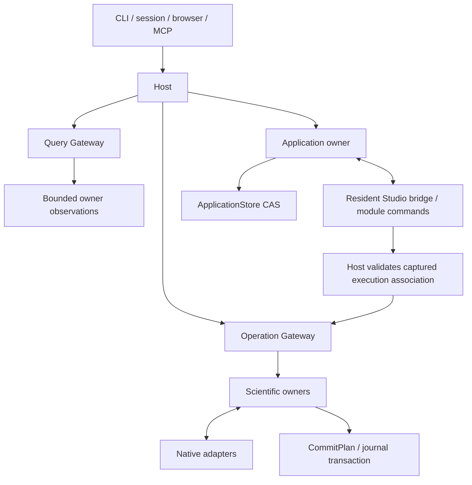

# Rho architecture

**Rho's scientific owners manage the operable workspace. External platforms or
the optional component assistant own Agent behavior.** Human and Agent requests reach the same domain owners and return
the same underlying facts. Current delivery and verification progress are recorded
in [Status](STATUS.md); protocol descriptions here are not acceptance results.

## Authority and ownership

### Authorized unified plugin boundary

The 2026-09-23 implementation scope replaces the fixed scientific workbench with
a general core and composable packages. This boundary is approved; the migration
is in progress, not complete. Status distinguishes implemented ordinary-plugin flows from remaining contract,
storage and interaction cleanup. Direct scientific Host composition is removed.

The core owns packages, immutable revisions/artifacts, dependency resolution,
instances, process/message lifetime, unique provider routing, identity/scope checks,
Operation admission/commit, generic evidence storage, windows/layout/drafts and
HTTP/CLI/MCP. Scientific semantics (including R/Ark, project/Git, execution,
environment, remote jobs, Agent, Help, outputs and annotations) belong to ordinary
plugins. Management and Plugin Studio are ordinary plugins too; core CLI remains
the recovery entry when they are absent. Default delivery imports the same package
format and never introduces source-based validation exceptions or silent reinstall.

Annotation records, frozen evidence, capture bytes, revision CAS and receipt transactions
now live in `plugins/annotations/api` and `backend/{owner,store}` without private
core or Agent dependencies. Fixed Application/SQLite annotation adapters and Host
source interpretation are removed. Opening generic application state never opens
or creates an annotation database; ordinary instances use their managed plugin
storage. Existing retired files are neither read nor removed. The ordinary native
adapter resolves exact public context providers, requires owner-supplied lineage/content versions, and
rechecks the original live caller before freezing bounded text. Its private
receipts do not settle the Host Operation. Note context retains frozen evidence
and leaves current source status unknown. The ordinary Editor text flow and
same-instance graceful Host recovery are verified. Agent uses optional public
grants and the same contributed context; its retained Send input survives restart
without resuming the source. Native Agent reads and writes use explicit Send tool
selections and retain the same original child Operations across restart. Capture
import reads an exact public resource in 64 KiB chunks under original `resources.read`
grants, verifies its digest and fully decodes bounded PNG/JPEG bytes. The owner stores
actual dimensions and image bytes separately, always with `original_media: false`;
a captured-view anchor does not certify scientific provenance or a source rendering.
Import replay uses the original receipt without rereading the provider. Exact capture
readback is bounded. The default note/text inclusion omits image bytes; explicit
`note_evidence_and_image` publishes the retained image through the ordinary resource
channel. Publishing the owner's evidence uses annotation read authority; consumers
separately need `resources.read` to read those immutable bytes.
Browser capture and annotation-editor interaction status is tracked in Status. Metadata authorization
reuses public application read/control scopes; it does not add a scientific
annotation branch to the generic Host.

Package transfer bytes have a native scoped owner independent of runtime resources.
`plugins.archive_*` stages aligned immutable chunks, observes or validates the
complete encoded archive, imports exact content, and exports explicit source and
artifact selections through the public ports. Caller paths and synthetic resource
owners are not accepted. Import/catalog and export/transfer receipts commit
atomically with their bytes; they attest only to that native transaction. The
original Operation journal still owns settlement. Unresolved original requests
retain captured transfer bytes and source protections, including across Host
reopen, without automatic replay. Reads neither install nor collect content.
[The public protocol](../sdk/plugin-protocol/README.md#archive-transfer-ports)
defines bounds, expiry, authority and recovery. Offline CLI remains the bootstrap
and filesystem recovery edge; ordinary plugins receive no special import privilege.

`NextHost::open_plugin_workspace` composes the generic package, presentation and
Operation ports without fixed Files/Git, process, R, Environment or Agent owners.
The canonical native project lease supplies project identity independently of a
scientific owner. All CLI, session, MCP and Workbench writer entries use this
path; `--plugins-only` is an explicit spelling of the default. Workbench opens the generic window, skips saved/discovered R settings and
does not fall back to scientific composition if opening fails. Packages remain
inactive until explicitly selected. This path is the foundation for disposable
backend-test projects. Legacy scientific contract dependencies remain pending cleanup. Fixed owner/adapter
crates and their runtime composition are removed.

Explicit backend development tests use `plugins.test_create/test_stop` and bounded
`plugins.test_project/test_projects` observations. Host owns each fresh canonical
project lease, separate ordinary package catalog and Operation journal; it calls
that child's existing activation/release ports with the original principal and
scopes. No existing path/session/provider or synthetic broader authority is
accepted. Exact source/artifact/configuration/dependency selections validate before
admission. Captured archives remain immutable; no toolchain is installed and no
nested test-project owner is composed. Limits are four live children, sixteen
selected instances per child and 256 MiB of captured package content.

The package repository retains only scoped lifecycle metadata, original activation
identities and source protections. Each child's ordinary journal remains the sole
scientific result owner. Versioned state and protections commit together. Reads
never recreate a child: a recorded ready state and native presence are distinct.
`plugins.test_operation` delegates to the ordinary Operation query owner with a
read-only original journal, including after stop or parent reopen. It checks both
parent test visibility and the child journal's project/principal scope.
Stop refuses open views until their ordinary state-saving close completes; it
fences new child calls, refuses retained connections or accepted work, then
requires confirmed native releases. Partial cleanup retains diagnostics, original
records and source protections. Creation/release failures preserve acknowledged
child Operation IDs in the original parent's recovery, even if a catalog write
fails. A current-process proof that no backend ever
started can also establish stopped state; a historical record alone cannot.
Confirmed stop releases parent source pins but preserves independent directories,
archives and journals as recovery evidence. Studio uses this native lifetime through ordinary declared public ports.
Public transport selection retains the same caller and five Host ports. Optional
`SessionFrame.test_project` selects an existing child for session/HTTP calls;
connected CLI `--test-project` supplies that field. Parent project-root checks
remain the transport precondition. MCP fixes `X-Rho-Test-Project` at initialization
and retains the selected Host until the session closes; RPC, GET and DELETE reject
changed or omitted selection. The generic browser shell retains `test-project` in
its credential-free URL, uses the child's layout/view/state owners and routes
immutable assets under `/view/plugin-test/{id}/…` so relative imports remain in
the same project. View messages also carry the shell's selection outside the
isolated iframe payload. View credentials still authorize only their original
instance/project/window. Invalid, unavailable or stopped selection never falls
back to analysis, starts a Host or recovers work. Fixed application endpoints are
unavailable to this shell. These are transport references, not native filesystem
sandboxing or additional authority.

An ordinary parent plugin view may explicitly select one existing test child in
`PluginViewMessage.test_project` for the five public ports. Original private view
credentials, sequence, principal, window and capability grants validate first.
Selection additionally requires an active non-preview view's declared
`plugins.test_project@1` grant and current parent `plugins.read`/`plugins.run`.
These selector scopes never broaden the actual capability grant. Intrinsic
presentation/state requests cannot retarget; child draft writes cannot use the
parent's close-time persistence exception. Original get/cancel requests remain
owned by the originating view in the selected journal. No child is created by a
read. Explicit `open_test_workspace` validates the existing child and original
window, then the focused browser shell alone constructs the credentialed URL.
Studio is an ordinary consumer; no Studio-specific routing or authority exists.

Host drain cancels and joins the plugin lifecycle publication task before returning;
a pending observation cannot retain the original journal lock across immediate reopen.

`rho-plugin-protocol` is an independently packageable public contract with no core
or scientific dependencies. Its generated language-neutral JSON Schemas and
TypeScript definitions are in `sdk/plugin-protocol`. `rho-plugins` owns package
storage in the new `catalog-v1.sqlite3` repository. Its transaction stores source,
artifact and reference metadata, not scientific results. No old project database
is read, migrated or deleted by this repository. Source and artifact digests are
independent; execution must use immutable artifact bytes, never a development
directory. Import verifies containment, source/lock/build declarations, schemas,
inventories and digests without running a build or loading code.

Development also uses public package ports. `plugins.source_tree/read_source`
observe exact immutable source identities; byte reads verify the complete file
while retaining only the requested bounded slice. `plugins.branches` reports the
recorded origin, leaving it unknown when no origin was recorded.
`plugins.check_source` validates an editing snapshot without storing it.
`plugins.checkpoint` uses the same validation, then atomically stores a source-only
child, source blobs, references and the expected branch head. A concurrent head
change cannot leave an imported losing child. Source restore copies selected
retained bytes into a new child; it cannot rewind a branch or scientific effects.
Neither path carries parent artifacts forward, executes a build or changes a
running instance. Invalid declaration drafts remain with the ordinary editor and
are not accepted as validated source checkpoints. These capabilities require
ordinary declared read/write grants and have no management-plugin exception.

`plugins.build` requires ordinary write and execution grants and names an exact
installed source revision. The package owner materializes only declared source in
a fresh original-Operation directory and runs the literal declared recipe using
existing toolchains. Rustup automatic installation is disabled and Cargo uses its
offline cache. Generic supervision in `crates/process-engine` owns native process
groups, bounded output, timeout and cancellation; scientific Process, Files,
Remote and Environment owners reuse the same mechanism through the public protocol.
A build cannot publish unless the process exits successfully, cleanup is confirmed,
source identity is unchanged and the resulting artifact validates. Artifact import
does not advance a branch, start an instance or change a scene. Source protections
outlive execution until the original journal commit; uncertain work retains them.
Working source, process reports and candidate artifact identities remain recovery
material, not a second authoritative outcome database. A build command is trusted
local code, not an OS filesystem or network sandbox.

The ordinary Studio's editing canvas receives declaration data and fixtures, not
a Host client or an action dispatcher. It treats custom components as opaque
source references and renders text without executing code or fetching media.
Declaration errors retain both the raw draft and last valid structure. Shared
source/canvas undo belongs to its synchronized document draft; native revision
history remains immutable. An executable preview is a separate, explicit lifecycle.

Studio's explicit development actions use the same build, fixture-instance,
window-view and release ports as any ordinary plugin. The synchronized draft
retains original request identities, configuration text, build diagnostics and
partly prepared preview identities. A missing receipt is inspected by its original
caller/request; reopening never silently repeats execution. Failed or uncertain
builds do not select a successful artifact. Preview closure cooperates with its
own view, and release follows confirmed closure. A disconnected view's retained
state can be used only through a separately explicit recovery action.

`plugins.preview` creates a fixture presentation instance of an exact immutable
artifact. `PluginInstance.purpose` and the corresponding view record distinguish
this from a runtime instance. It never starts or materializes a backend, creates
a native project/data environment, receives Host grants, or publishes providers.
Required and optional query fixtures match exact capabilities and JSON arguments;
a missing fixture returns unavailable, never a real Host query. The shared view
transport still enforces credentials, scope, sequence, quotas and close fences.
Only self view-state persistence, close cooperation and gesture-based text copy
reach presentation owners. Invocations, controls, operation reads/cancellation,
resource downloads and external navigation are refused before Host dispatch.
Fixture instances cannot satisfy scenario readiness, shadow provider contracts,
or change an existing runtime. They use normal revision retention and explicit
view closure/instance release; Host restart does not recreate their connections.
The containing shell labels executable fixture previews outside the iframe.
Normal instances omit the marker and retain their original initialization shape;
adding fixture preview does not require rebuilding existing native artifacts.
Runtime instance discovery excludes previews by default. Management tools request
`include_previews:true` to list every purpose with consistent counts/pagination;
scientific readers continue receiving normal instance records. New scientific
readers also reject preview candidates before requesting native observations.

The same repository owns immutable project/principal-scoped scenario checkpoints
and named heads through `scenarios.list/get/checkpoint`. Saving is a native
compare-and-swap transaction: content identity, head and all referenced plugin
revision protections commit together. Earlier checkpoints remain immutable and
retain their references, including resource-owner revisions and packages currently
missing from the catalog. A restored composition becomes another child of the
current head. Reads are bounded metadata and never create instances or change
windows. Checkpoint configuration contains public values and credential references,
never a capture of credential-owner state.

Storage validates structure and bounds, not availability or readiness. Optional
capability selections remain declarations, not activation authority. Applying a
scenario must separately validate exact artifacts, dependency bindings, view
schemas and caller grants before publishing a complete per-window composition.
`scenarios.prepare` observes exact prepared instances and views; `scenarios.apply`
repeats validation and atomically commits layout and selection against the native
window layout version. Ordinary management plugins prepare with the same activation
and view ports; application does not own their lifetime. The commit locks selected
native readiness and view availability through the catalog transaction. Reused
views keep their acknowledged and local state, and hidden views remain connected.
Manifest dependencies resolve only to their declared exact plugin revisions;
selected optional grants must match the frozen instance grants and fit the caller.
`windows.scenario` observes selection and layout together. `windows.resolve` returns
only that window's selected exact provider; missing owners never trigger fallback
or activation. Existing bindings and admitted operations never consult a later
window selection. Scene state is presentation metadata, not proof of a live provider
after disconnection. Manager/Studio orchestration and product acceptance remain
separate from these core ports.

Files/Git contracts and native provider ports now live in `plugins/files/api`;
the contained filesystem, text and Git implementation lives in
`plugins/files/backend/engine`. Shared native subprocess supervision and its public
reports live under `plugins/process`. These libraries have no private core imports.
`plugins/files/backend/owner` interprets bounded path searches, native patch
preconditions and before/after effects. The ordinary backend returns CommitPlans
through the public protocol; the core Operation journal commits the original records. A post-write observation failure remains an explicit possible effect
with its original snapshot and affected paths, never an inferred pre-write failure.
The fixed Git/process adapters and project handlers are removed. This does not relax canonical project roots, protected-path exclusions, symlink checks,
bounded reads or native file identity requirements.

The ordinary Process backend uses the public framed RPC, canonical Host project
environment and scoped resource channel. Preflight fixes its target and normalized
arguments before admission. Local execution retains original stdout/stderr bytes
and native termination evidence in a digest-bound resource; its result references
that resource and original Operation. Resource transfer failure after execution
is uncertainty, not absence of effects. Native scheduling remains fenced until
Host settlement of the exact binding; neither returning a candidate result nor
receiving a cancellation request proves committed completion. Activity queries
observe this native scheduling only. The backend owns no scientific result database.
Recovery preflight reads the original terminal Operation through a delegated
`operation.get` query under the active parent's project/principal scope. It retains
the source's exact admitted provider binding and native project; a later instance
of the same plugin may reconcile that source without retargeting it. Native cleanup
uses fresh same-user lifetime/tag evidence, never a caller-supplied PID. Its own
Operation records partial native visibility without changing the source outcome
or replaying its command. Transport loss abandons queued recovery before signalling;
an already-started bounded native inspection finishes with its real evidence.

The R engine's ordinary-provider recovery archive uses the initialized native
data root and exact project/principal/provider scope. It reads only the new
`r-recovery-v1` format; legacy Workspace manifests are not inputs. Original
operation IDs address immutable capture and control evidence. Artifact leases use
OS file locks across backend processes and keep stable directory/lock identities;
contention or replacement is a refusal, not authority to steal a lease. The owner
must qualify source records through the core Operation port and retain leases
through settlement. Capture files, pin/delete evidence and resource reads do not
constitute scientific result commits. Failed captures retain partial bytes and
original cancellation/transport evidence; they cannot claim absence of effects
when native payload bytes may remain. Physical deletion of a published copy
requires an explicitly qualified succeeded deletion and preserves metadata; adoption makes an independent
byte copy. The native restore accepts a locked, verified artifact rather than a
caller-supplied RDS path. Native runtime, package inventory and empty-candidate
checks still apply. Payload and metadata limits are independent of control-message
limits; bounded reads do not reduce the native 16 GiB graph limit. The ordinary
R owner publishes these references and manifests through public operations and
resources, qualifies their original records and control history, and serves pure
reads even after the original provider releases. Logical retirement and physical
payload cleanup are separate outcomes.

A terminal failed/cancelled/uncertain version-1 pin or deletion request may be
explicitly resolved through that same control's version-2 contract. The request
freezes its original Operation, copy and latest resolution attempt. Applying checks
the original control precondition against the current logical head; discarding
closes only that request and preserves the current head, pin and deletion state.
A resolution that loses acknowledgement requires another explicit attempt naming
the latest one. Only a Core-successful resolution closes uncertainty, and only an
applied deletion authorizes post-commit payload cleanup. Original outcomes are
never rewritten. `r.checkpoint_control@1` reports original status and qualified
resolution without starting R. Existing readers reject version-2 pin/delete
history rather than silently ignoring a separately named resolution. Uncertain
capture material has a separate owner contract. `r.capture_attempt@1` qualifies the
original unsuccessful capture/reconciliation admission without requiring complete
payload metadata. It reads a fixed bounded set of native file identities, lengths
and timestamps, not full graph bytes. Its fingerprint is an exact preview
precondition, not a payload digest. Missing archives stay missing.

`r.discard_capture@1` requires the source provider to be confirmed released through
the public instance port and checks that preview again before removing only the
payload/staging files. Failed, disconnected or cleanup-failed lifecycle states do
not establish native writer absence. Successful published captures use the normal
logical deletion path. This explicit disposal may remove bytes before its own Core
outcome is confirmed; errors after possible removal retain uncertainty. The owner
keeps the artifact lease through settlement and preserves all original metadata.
A fresh explicit request can confirm native absence after a lost result, without
rewriting that result. The query exposes a committed disposal only when its original
admission, successful Core output and current absence agree. Old readers cannot
adopt a disposed payload; independently adopted copies remain intact.

Environment data, native pak/renv execution, staged materials and recovery now
live in `plugins/environment/api` and `backend/owner`, including the R helpers.
The native library returns possible effects, confirmed cancellation and recovery
material without committing records. The ordinary backend retains source
authorization and live-library retention decisions; CommitPlans settle through
the core Operation gateway.
An observation of a realization, stage or cleanup requires the original principal
throughout its source chain; missing and foreign references remain indistinguishable.
Reading cached native configuration or material never starts R, loads a namespace
or performs recovery. The ordinary Environment RPC backend uses explicitly granted
`operation.get` and `resources.read` Host observations, preserving original provider
bindings and verifying full report bytes against their retained digests. Report
resources from older instances are read through those grants, never through the
current instance's private resource channel. A cooperative lock prevents two native
owners from concurrently opening one material directory; separate directories can
coexist. Native execution keeps its lane until the matching core settlement.
The pure `environment.library@2` observation qualifies an original realization,
its full report and current material bytes without loading packages. An ordinary
R instance can explicitly select this provider and realization for
`r.create_session@2`, using optional Environment/resource grants fixed at activation.
Creation delegates `environment.verify@2` through the public Host port; the core
retains the child Operation under the original creation's causation. R verifies
the complete result resource and unchanged selection before launching Ark, then
checks the actual R installation. Existing sessions retain their original provider
and library binding. Failed or unconfirmed verification starts no session and is
never automatically replayed.

Ordinary Environment material operations qualify an original failed/cancelled
source and its exact native scope. Explicit optional Host reads cover project
visibility, original results and recorded provider instances; ordinary R session
and snapshot contracts expose idle native library and namespace usage. The scan
is bounded, compares journal observation positions and instance identities, and
retains material when coverage, grants, recovery contracts or native usage remain
unknown. It preserves original path references after quarantine. Each mutation
re-reads the source chain and checks the current fingerprint, owned directories
and native process absence; reports and original outcomes survive material removal.
An unconfirmed original quarantine can be inspected by its admitted source chain
without rewriting that outcome. Material operations do not confirm cancellation
or automatically replay changes. The backend imports only the public R API for
checkpoint references, results and manifests. Successful capture/reconciliation
records are checked against the original admitted binding, then qualified by an
active R reader through `r.checkpoint@1`. R owns the native archive and control
chain; Environment reads no private recovery files. Live copies protect complete
library, namespace and selected Environment paths from the digest-verified public
manifest. Logical deletion removes graph dependencies even if physical cleanup is
pending; missing bytes alone do not. Unknown dependencies remain protected.
Unsuccessful captures require an optional `r.capture_attempt@1` observation proving
an exact committed disposal, confirmed source-provider release and current absence
of both graph and staging files. Failed or cancelled captures are also excluded
when the owner explicitly confirmed no capture started. Uncertain pin/delete requests and
resolution attempts retain material until the optional `r.checkpoint_control@1`
read confirms a committed resolution for the exact original request. Successful
captures are still checked independently for live graph dependencies. Environment
uses only public R observations for both decisions.

An exact configured `checkpoint_reader` takes precedence; otherwise the original
active reader is preferred, followed by a unique active replacement. Ambiguity or
unavailability retains material. Reader selection never activates a provider or
starts R, and does not retarget previously admitted work.

`operation.project_coverage@1` and `plugins.project_coverage@1` expose one bit of
current read coverage for the normalized project and authenticated principal.
They require `project.references.read` plus the corresponding normal read scope;
plugins must declare and receive those grants through the usual lifecycle.
`all_visible:false` means the caller's record/instance pages cannot prove complete
project coverage. Foreign identities, counts, configuration and content remain
hidden. Recorded instance states include failed and released owners because their
recovery references may remain relevant. These pure queries neither start nor
recover providers. Coverage is not a lease, an atomic cross-owner snapshot or
proof of unused material; scientific owners must still read and validate their
own references and native preconditions before changes.

The public `workspace.paths@1` query exposes the normalized Host project root and
bounded protected storage paths under `project.read`. These boundaries come from
Host composition, including future sidecars and the project lease; plugin
configuration and query arguments cannot alter them. A backend declares the query
as a requirement and reads it through an active parent's delegated authority.
Initialization wire fields remain unchanged. These paths are containment metadata
for trusted native code, not OS sandbox permissions.

Generic document drafts store opaque bytes and metadata separately from the
256 KiB view presentation record. Project, principal, window and the exact source
revision/contribution scope each draft. Saving checks the expected document
version, verifies every 64 KiB chunk and the assembled digest, and commits content,
metadata and the source revision reference together. Each captured save has its
own staging lease; publishing one capture cannot consume another capture's bytes.
Core admission can pin the original upload's bytes and source revision until the
Operation owner establishes settlement. Those leases survive expiry, reopening
and successor saves; they record retention rather than another execution result.
Pending settlement also prevents explicit discard. Unaccepted, unreferenced staged
bytes expire after ten minutes; ordinary reads do not collect or create state.
A current draft protects its source revision independently of
the view and backend lifetime. Explicit discard releases its content/reference
but retains an identity tombstone so delayed writes cannot recreate it.

These versions describe synchronized current drafts, not historical document
captures, saved files or scientific execution. Reading a changed version fails;
it never substitutes newer content. Content encoding, editable size, file paths,
saved-base hashes, selection and execution bindings remain with the plugin. The
storage limits are 8 MiB per draft, 32 KiB metadata, and per project/principal
128 MiB of chunks, 256 live drafts, 4096 identities, 8192 staging references and
256 accepted captures awaiting original settlement.
Exhaustion is an explicit failure that leaves the acknowledged draft intact.

The public `documents.list`, `documents.inspect` and `documents.read` queries require
`documents.read`. `documents.stage` is a bounded transient Control;
`documents.save` and `documents.discard` are caller-scoped Operations under
`documents.write`. Host derives project/principal and fences view callers to
their original window. Admission retains the captured upload before execution;
accepted work does not depend on the requesting view staying open. Only an
authoritative successful, failed-before-effect or cancelled original result
releases that capture. Commit recovery uses the original Operation candidate,
including after a Host restart and successor edits. Explicit
`plugins.reconcile_references` can retry failed retention cleanup using original
authority. An uncertain outcome without a durable candidate keeps its material;
current matching text is not evidence of the original save's outcome.

Listing returns at most 20 non-discarded metadata summaries in one explicit window,
optionally filtered to an exact source revision/contribution. Its exclusive draft
identity cursor survives discard; each page observes current state, without
freezing subsequent pages. A content consumer must inspect/read the returned
version and digest. Enumeration neither reads content nor collects staging leases,
and does not claim that the renderer's latest input has synchronized. A closing
view's listing is limited to its own encoding source; listing is not part of an
inactive instance's persistence exception.

Close-time synchronization uses those same declared draft ports. While a view is
preparing to close, only staging and saving its own exact revision/contribution's
drafts can continue; discard and unrelated new actions stay fenced. After all
renderers have acknowledged the synchronized view-state version, further staging
and saves are refused. An instance that has stopped accepting calls can still let
its existing view read and synchronize its own drafts under the original grants
and parent scopes. This does not finish instance release: open views still prevent
that lifecycle step, and accepted work retains its original ownership.

The R domain contracts now live in `plugins/r/api`; the native Ark/R implementation
and its R bridge live in `plugins/r/backend/engine`. They depend only on public
plugin contracts and third-party libraries, not Host or Operation implementation.
The native owner receives an opaque original Operation identity and returns bounded
observations, output evidence and recovery material. It never receives a journal
handle. Fixed Host scientific owners and their transitional native adapters have
been removed; only the ordinary package owns scientific execution. The `rho-r-backend`
entry now uses the public SDK for explicit session creation, bounded snapshots and
original-Operation execution. Its own lane freezes native session identity and
keeps cancellation reception independent of execution. Original reports, bounded
output logs and verified HTML/image bytes go through the shared resource owner.
Retention failure after native execution remains uncertain with recovery material;
a failed native launch cannot be silently retried in the same instance. Full
Console, recovery and full Viewer interaction migration remains in progress.
The R package owns its public TypeScript/schema data package under `plugins/r/sdk`.
Its versioned execution input retains source labels and Console output mode through
the same native lane and original Operation. Labels are caller-supplied metadata,
not verified document captures. Live output-event queries read only the original
native log; bounded pages preserve gaps and never establish terminal truth.
Code completeness uses the idle native parser and cannot bypass queued work.

The R owner exposes cheap inspection readiness separately from native content
queries. Its cache key changes around native execution and is scoped to the exact
instance/session, so a view can invalidate observations after a run missed between
polls. Read-only inspections do not advance it. It is neither a global scientific
revision nor an execution result or mutation precondition; the original Operation
and native observation references retain those responsibilities.

The public Rust transport SDK is `rho-plugin-sdk`. Backend RPC uses a four-byte
big-endian length followed by at most 1 MiB of JSON, with one ordered writer and
one dedicated reader per direction. A cancelled partial write fences the channel.
Reverse calls name an active parent request and inherit its project/principal,
the declared grant's scopes, and whether only queries are allowed. They receive
no generic Host credential. The Host service still enforces capability kind and
native preconditions before delegating work.

Initialization carries native paths separately from configuration: a normalized
Host project root and a persistent data directory for the exact instance.
New activation refuses existing per-instance directories and
symlinked data parents; it never derives the project from the artifact directory.
Release and failed activation preserve these bytes for owner recovery. Paths
do not constitute an OS sandbox or grant another owner’s Host capabilities.

`rho-plugins` publishes all contributions of a backend instance only after the
exact revision/artifact acknowledges readiness. Instance admission leases survive
draining until their Operation owner releases them after commit. Generic lifecycle
records and protecting references are durable; historical records alone do not
prove that a native process is alive. Cleanup requires both an owner acknowledgement
and successful process exit before its instance reference can be released.

Normal Host shutdown drains accepted work, detaches runtime views and suspends
instances after the same acknowledged native cleanup. Suspension retains the
instance/revision references, original activation grants and acknowledged view
state/layout. Disposable test-project teardown still permanently releases its
instances. `plugins.resume` is an explicit Operation consuming the exact confirmed
suspension token; a later suspension has another token. It reuses the original
identity, revision, artifact, project, principal, configuration and grants, and
checks the contained existing data directory and its retained ownership marker.
Missing/replaced data, released identities and unconfirmed cleanup cannot become
fresh activation. Queries never resume a provider. Other providers may remain
suspended; resume does not start dependencies, and subsequent calls still validate
their exact available provider and contract. Native scientific sessions and
unfinished work do not resume merely because their owning backend reopens.
If a resumed process is ready but its contracts cannot be published, confirmed
cleanup suspends it again with a new token rather than releasing the original
identity. Cleanup failure remains unavailable with its references retained.

Every accepted operation must freeze capability, plugin revision, artifact,
instance, project, principal and native target before dispatch. Provider choice
cannot change with later scenario selection. Plugins return validated commit
plans to the one core Operation owner; no adapter or plugin commits scientific
truth through an independent result database. Active work, documents, scenarios,
branches and checkpoints protect their referenced revisions from removal.

The execution lease receives terminal completion asynchronously, after the single
journal commit. A plugin lease sends the original ID, binding and terminal outcome
as a Host-only `OperationSettled`, then awaits bounded native acknowledgement.
This lets native queues fence their next item until authoritative commit. For a
live owner, only an exact `SettlementAcknowledged` releases that operation's
revision reference. For a disconnected or historical instance, original journal
proof can retire the operation reference; instance and failure references remain.
Lost acknowledgement leaves the result committed and the reference retained;
explicit reconciliation rereads the original scoped journal and resends settlement,
never execution. A disconnected/historical owner is not restarted for cleanup.
No public capability, reverse call or resource-transfer grant can manufacture a
settlement. Synchronous scientific owners retain their existing completion behavior
inside the same async lease hook.

Conditional cancellation uses an owner-owned atomic start fence, not a query
followed by an interrupt. A backend may negotiate `pending_cancellation_v1` in
its exact readiness reply without changing the frozen capability contract.
Host-only preparation carries the accepted binding and original Operation ID;
the owner refuses an already-running call. After preparation, the single journal
records the cancellation request and its existing signal performs cancellation.
A lost acknowledgement or journal failure preserves the waiting fence and exposes
an explicit same-operation retry. Preparation alone cannot return a cancelled
result; queue resume cannot clear it. Cancellation work stays owned by the Host
across edge/view disconnect. All edges route contributed and core-owned Control
requests through the same Host ports and original principal/project/scope checks.

The R package owns its bounded FIFO and transient pause state. Accepted entries
retain original bindings through native return and Host settlement; a pause or
resume control cannot supply a terminal outcome. Failure, cancellation and
uncertainty pause following work without undoing native effects. Cancellation of
an item that has not acquired the native lane cannot start R code. Queries and
controls observe the owner even before R creation, using its explicit queue target,
and remain reachable for existing work while draining. They do not start a runtime.
The session edge reserves independent execution, query and control capacity and
never waits for an owner call on its frame reader; it has no scientific command
names or second scheduling policy.

The Operation registry publishes owner-scoped contribution batches by
compare-and-swap. Queries and invocations keep one immutable handler/schema
snapshot through response validation and commit. Unregistering a provider removes
new admission routes, not accepted work. Reusing a capability version cannot
change its schema, authority or effect contract. An optional read-only owner
preflight fixes normalized arguments, native target and qualification before
admission; the registered contract still bounds that qualified handler.

The generic plugin bridge receives a public `PluginRequest` with an exact binding,
scientific arguments and native preconditions. Project and principal are derived
from Host context, not supplied authority. The original raw request digest and
registered descriptor are captured by Operation, so the same request can return
its record after provider removal without another preflight or execution.
Bounded Agent history may omit the admission snapshot with an explicit field
omission marker while retaining the operation identity and scientific result;
the original journal record remains complete and independently readable.
Backend recovery is namespaced separately from Host boundary failures. Facts are
qualified by instance; resource evidence requires the authoritative resource
owner's verification. A completion acknowledgement lost after journal commit can
release its lifecycle reference only by reading that original terminal record.

The generic resource owner retains immutable bytes in `resources-v1.sqlite3`
inside the protected plugin repository. A separate per-instance Unix socket
carries raw data; control/stdout remains available for calls and cancellation.
Its ephemeral credential and an active parent request fix the exact instance,
project and principal. The backend supplies a declaration and bytes, never a
local path to read or a claimed owner. Complete bytes, length and SHA-256 must
agree before atomic retention; partial staging is anonymous and disposable.
Retention is not a scientific commit. Only the original Operation's validated
commit plan can publish its evidence and facts.

Resource transfer leases prevent release while accepted data is still being
stored. Each Host permits four transfers, and the store enforces bounded object,
instance, total-byte and record-count quotas. Complete identical uploads resolve
to the same identity without overwriting corruption. Failed acknowledgement does
not delete complete stored bytes; `resources.list` exposes scoped, bounded
references for inspection. `resources.inspect` verifies content, and
`resources.read` returns bounded chunks through the common Query port using
`resources.read` scope plus original project/principal visibility. Native data
channels read only their own instance's resources. Bytes outlive backend release
and Host restart; reads do not activate code, recover work or fetch external URLs.

Active Host composition exposes the same `rho-plugins` repository and lifecycle
owner through the ordinary Query/Operation ports. The repository is `plugins-v1`
beside the configured journal; the recovery CLI derives the same location unless
`--store` is explicit. Startup neither imports packages nor activates recorded
instances. Instance observations filter project/principal before pagination and
separate current-Host ownership from historical state and recorded process IDs.
Lifecycle admission retains managed revisions until the original terminal commit.

Capability requirements are explicit activation declarations. `requires` supplies
mandatory grants; `optional_requires` supplies only entries named in that original
activation's `optional_capabilities`. Both share the same declaration bounds,
contract/version validation and caller-scope checks. Missing optional selections
do not consult or start providers. Selected grants remain fixed in the live
instance; new provider availability, configuration or opening another view cannot
expand them. View preparation and connections use those actual grants, and require
the opening caller to delegate their scopes. This is a generic package rule,
independent of any scientific language or panel.

Native reverse calls use the same gateways with the original principal, a plugin
actor, the manifest's existing-authority grants and the original parent Operation
as causation. Query parents cannot delegate mutations or controls. Delegated work
is owned by the Host task tracker and retains the Host lifetime across disconnect.
Core result reconciliation can retire original plugin protections; failure to
retire one does not replace the already committed scientific result.
The public SDK's bounded reverse-call pump keeps the task owner's request identity
and active parent unchanged. Abandoning an await retains the pending slot; closing
the transport reports uncertainty and never retries, commits or claims rollback.
The core remains authoritative for delegated grants, scope and original Operation
idempotency. The pump cannot turn a query parent into effectful authority.

`plugins.delegated_operation` resolves an original reverse-call request from its
retained parent admission. Only the native backend caller for that exact instance,
project and principal may observe it, with `operation.read`; caller/provider/path
selectors are not accepted. It returns the original Operation identity for the
existing `operation.get` read. No durable match is a partial observation, never
proof of no dispatch or permission to replay. The bounded journal read requires
no live provider, reconnect, activation or recovery, and keeps the native request
key derivation in the same core owner as dispatch.

`host.core_contract` exposes a native startup port's exact kind, input schema,
description and required scopes through public, language-neutral DTOs. It requires
`plugins.read` for metadata; it does not confer the described port's scopes or
dispatch it. Project identity comes from the Host. Registry ownership and the
descriptor are observed together, excluding dynamic contributions even when their
names or domains resemble core ports. Ordinary contributed tools instead inspect
their exact immutable manifest and retain the selected provider binding. Neither
inspection path starts a runtime or recovers an Operation.

Agent Send records explicitly distinguish ordinary provider targets from native
Host targets. A Host target freezes its project, exact capability and caller-chosen
argument fields before model submission. The model's schema excludes frozen
fields; admission rejects their presence in model input and composes the full
request before durable retention. Native owners still validate full input and
compare-and-swap conditions. Host results may contain normalized arguments, so
Agent correlates their original Operation through the retained reverse-request
mapping and verifies caller, parent, project and capability. It does not duplicate
a private core digest or use returned result identity as its own evidence.

Agent metadata composition uses its package-owned task/store libraries behind an
ordinary native backend. Native initialization supplies its normalized project and
per-instance store directory; task arguments cannot choose a database, principal
or controller. Each caller mutation reads `views.caller` through its original
active parent and consumes that observation synchronously in one owner admission.
View controllers retain both native view and connection identities; direct callers
use a separate instance/incarnation namespace. Changing controllers requires the
owner's explicit versioned takeover. A result candidate retains its original
Operation until Host settlement. This metadata path does not start model, native
Agent or scientific work and never opens the core journal.

Native task resource attachments use a separate scoped Control. An exact public
resource reference and optional `resources.read` grant permit bounded reads under
the original project/principal. The Agent backend verifies complete ready chunks,
exact references/ranges, total length and digest before revalidating the live
caller and task control. The task owner atomically retains resource input and
controller correlation with the original receipt; raw bytes live only in the
existing Agent asset store. Repeated admissions read their original result without
another resource read or native launch. Interrupted admissions remain unconfirmed,
including after backend reopen; a reference is never a replay credential. This
path neither puts attachments into scientific Operations nor raises RPC limits.

Explicit ordinary model runs use that same owner/store plus the public Rig engine.
The containing backend captures the original native Operation, request and exact
provider binding in the run's admission transaction. Those fields are immutable
on later writes. An identical task request from a later admission can observe the
original run; it cannot reparent, reclaim or restart it. Native parent identities
never come from model arguments. Tool intents already persist a unique request ID
before dispatch, which is the identity for original reverse-call observation;
there is no second dispatch database. The parent remains active through the model
loop and then retains its result candidate until native settlement. Stop/disable
and explicit takeover fence the original loop. Reads project interrupted ownership
without changing stored state or contacting a model.

Optional scientific tools capture the caller-selected exact R binding with the
original native admission. Explain permits only a read of that session; Run also
permits `r.execute@2`. Initialization grants and original caller scopes must both
cover the selected capabilities. Model arguments cannot choose a provider,
revision, session, source provenance or native request identity. The owner validates
and persists each bounded tool intent before the public reverse-call pump dispatches
it. The real R owner still performs its preflight and the core commits its result.
Returned scientific records must agree with the captured binding, original parent,
plugin caller and normalized project. Native stdin is excluded from model context.
Stopping a model wait does not cancel R. The containing Operation retains pending
native children until their correlated replies return; late receipts remain on the
original task. Disconnect retains uncertainty. `agent.model.tool.operation` reads
the original delegated request and Operation through public queries, without
restarting work or rewriting task storage. An absent match is partial evidence.
Explicit contributed text and up to two PNG/JPEG resources are checked before
admission. Each image must belong to its exact context provider, hold at most 2 MiB,
match every bounded chunk and digest, and fully decode within the image budget.
The Agent store retains immutable bytes separately (64 MiB/4096 images per project),
while Native/Rho admissions retain original references and content identities.
Caller revalidation precedes storage and admission; corrupt/missing resources do
not consume drafts. Rho shares its two-image limit with explicit attachments and
requires the current connection's image diagnostic. Original retries observe saved
input without source/model replay; history and Continue do not automatically resend
pixels. The existing picker previews validated resource bytes and saves only the
explicit source/inclusion in its draft. Ordinary
Continue rechecks the selected recovery digest through original-owner queries,
then retains the same Agent and R provider/artifact/session under the owner's
admission gate. Explain may narrow to observation without changing the target.
Its history keeps up to eight turns from a bounded 32-run ancestry, the full checked
recovery report, compact original tool results and prior source snapshots within
48 KiB; combined context remains limited to 64 KiB. Labeled omission does not alter
the stored original input. A repeated confirmed mutation reads its original
correlated Operation through the current parent's query grants. It cannot dispatch
another scientific mutation. Attachments are captured by the Agent-owned upload
ports before admission; original history reads retained bytes and source snapshots.

File context belongs to the Files provider and uses its existing contained text
reader. References retain path, digest, native file identity, size and encoding;
preview rechecks all of them before returning metadata or bounded text. The search
catalog contains only this principal's previously read text files. Binary/skipped,
protected, changed or replaced files do not become a fresh source implicitly.

Installed-package context retains the original native session, observation, package,
library and version. Its bounded search catalog holds only previously inspected
copy identities for the calling principal. Preview pages through that same native
observation, never a fresh inventory; busy/expired/missing copies remain unavailable.
Source, delivery and project-link fields keep their owner-defined meanings.

Console context belongs to the R provider. It fixes a terminal original execution,
native session and retained event resource. Preview reads original code or complete
digest-verified event text (up to 2 MiB), labels omitted media and refuses partial
transcripts. It does not capture the current Console buffer, stdin, panel rendering
or start a runtime. Oversized/partial output can use an explicit code-only inclusion.

Captured context data may declare up to eight `artifacts` entries, each with a
`label`, a full `resource` reference owned by the context provider, and its original
producing `operation` ID. These are optional owner-authored inspection links, not
commands or URLs. The ordinary Agent exposes explicit original-image and producing-
run reads through its declared `resources.read` / `operation.get` grants. It checks
resource bytes/digests and exact operation/provider identity, labels shortened
record display, and never starts a runtime or replays work. Missing grants or
unavailable originals remain explicit errors; the captured Send text stays intact.

An ordinary Agent view may receive `component_request` in its immutable configuration:
a request ID, a title and up to 16 contributed context selections. References retain
their exact source provider, revision, artifact, window and owner selector. They
carry no task, model, controller or tool authority. Opening and previewing do not
create tasks or send messages. Explicit insertion rechecks each current source and
appends unique references to the latest editable Native/Rho draft, preserving text,
attachments and tool selection. One view-state write retains the insertion and its
receipt; the existing task draft CAS and original-request recovery settle the owner
write. A task change during preview, unavailable source, partial text or unsupported
resources leave the draft unchanged. Sender components use ordinary view contracts;
core does not interpret this Agent-specific configuration.
Editor captures the acknowledged document/selection version before discovering an
active Agent instance. Its exact source and original `windows.open_view` request
live in outer view state, serialized alongside document synchronization, so they
do not change the source bytes or disappear during a later draft save. An accepted opening is briefly observed until it settles; slow or lost
replies retain that original Operation for explicit inspection. Window opening carries the
existing management contract's scopes for the target view; it grants no new
scientific call to Editor. The new Agent view still requires explicit task choice,
context insertion and Send.
Help and Viewer use the Agent plugin's public `sdk/component-input` source helper.
Help captures its displayed native session, installed-copy observation, topic and
index/help file identities; text and a first-twelve-lines excerpt are explicit
inclusions. Viewer captures the original Operation, output sequence, session and
saved resource identity. Text means the saved HTML source, never the iframe's live
interactive state; metadata is a separate inclusion. Background navigation or a
new output cannot replace a prepared reference. Both serialize the opening request
alongside their own reading choices and use the owner's existing preview queries.

`views.caller` exposes only the original native view/window/connection identity
captured at authenticated ingress. Backend delegation retains that private capture;
neither public RPC arguments nor selectors can supply or replace it. Non-view
calls return an explicit null identity. A stale, closing, closed or unavailable
captured view fails instead of becoming a non-view call. The observation grants
no authority, contains no connection credentials and does not prove future
liveness. It reads existing state without opening or reconnecting a view.
`views.presence` separately observes one known, project/principal-visible view's
native attachment. Attached, closing, detached and closed remain distinct; absence
of a browser close-handler registration or an unresponsive browser does not establish
native detachment. Unknown/foreign identities fail instead of returning absence.
The response has no view content, configuration, renderer IDs or credentials.
It creates no connection and does not authorize future work. Native Agent takeover
uses this observation for the original controller and then reobserves the requesting
caller before its synchronous owner admission. The owner still checks generation,
original request identity and confirmed native quiet before transferring control.

An owner can contribute an ephemeral Control handler through the same atomic
registry. Host, CLI, MCP and scoped view requests validate the exact contract,
provider, principal and existing authority. Controls do not create an Operation,
receipt, event, result candidate or data-channel parent; each argument/result is
bounded to 256 KiB. Input and native error diagnostics are redacted. The owner
validates the original native request and duplicate-submission state. A lost
acknowledgement requires observing that request, never automatic replay. Host
task ownership keeps dispatched controls alive across caller disconnect. Native
reverse calls from Control parents are limited to reads.

Registry publication notifications are catalog metadata, never scientific
preconditions. MCP caches only projections of current scoped descriptors, sends
tool-list changes on publication, and binds pagination to the descriptor content.
Capabilities too long for a readable MCP name receive a stable hash name in a
separate namespace; their original Host identity and dispatch remain unchanged.
Native lifecycle failure withdraws new routes through an event-driven owner
observation; this does not reconnect, restart or replay a provider.

UI-only packages use the same immutable instance repository and lifecycle without
creating a placeholder process. `views.open`, `views.update` and `views.close`
are ordinary Operations; state updates compare the view's own version and schema.
Open views retain their exact revision independently of native operation leases.
Stored view state survives closure and Host restart, but a read never recreates
its connection. `views.reconnect` requires the retained open view's exact state
version and an already active original instance. It preserves view/window/state
identity, creates fresh private transport credentials and returns only the public
record. An already connected view keeps its existing credentials. Explicit
release can retire a confirmed suspended instance, or a historical UI-only instance because
its exact manifest establishes that no native backend was created; native failure
still requires established cleanup. Closing a view never releases its backend.
The generic window durably saves each resume/reconnect invocation before dispatch.
After a missing reply, inspection checks that original Operation and does not
advance to the next action; explicit retry keeps the same request identity.

Ordinary view closure requests document cooperation. The view owner fences new
actions while each registered document flushes its own draft and acknowledges
the original close Operation and exact state version. All acknowledgements must
match the same final version; sealing prevents a subsequent state write from
racing closure. Preparation releases the service gate while waiting, and refusal,
timeout or interruption clears the fence without cancelling accepted science.
The final native transaction closes the retained record, removes its exact tab
and releases its view revision reference together. Failed writes cannot partially
close the view. Browser disposal is not a flush acknowledgement. The containing
shell gives each document's SDK handler a separate private native identity. After
destroying the document, it uses `views.release_renderer` Control with the original
view credential to retire only its acknowledged registration; this neither changes
state nor closes a view. The notification uses bounded keepalive delivery without
allocating a view message sequence. A cached or hidden document remains registered.
Release during preparation refuses the original close, including after all handlers
acknowledge but before native closure. Lost notifications or registration receipts
retain uncertainty and require explicit `retain_acknowledged` recovery with the observed state version; no
automatic fallback may claim that a disconnected buffer was saved. Host shutdown
keeps acknowledged state and layout placeholders without claiming a UI flush.
The containing window retains the original request and recovery version across
lost acknowledgements. It offers saved-state recovery only after a terminal close
failure or an exact correlated invalid-preparation rejection. Unstructured
transport errors, idempotency conflicts and uncertain outcomes cannot establish
that the original close failed.

`windows.layout` observes a retained arrangement of exact view identities, scoped
to the authenticated principal, normalized project and explicit window. Absent
layouts are empty observations and cause no write. `windows.update_layout` uses
that window's expected version and validates every view's original scope in the
same storage transaction. View callers can address only their containing window.
Saving layout cannot activate a package, reopen a view, change its saved state or
release a runtime. Closed or missing connections remain retained placeholders;
scenario definitions use separate reusable identities and do not reuse live view
IDs across windows. The layout ports alone do not apply a scenario or supply the
visual window shell.

`windows.open_view` freezes a new view identity at Operation admission and checks
the exact active instance, view schemas, caller/window scope, layout version and
explicit target tab group. One immediate repository transaction inserts the view
and its protecting revision reference, appends/selects it in that group, and saves
the layout. Private connection material is prepared before commit and published
only afterward. A failed write cannot leave a live view outside the saved layout.
An empty window can explicitly create its first group; existing windows never
infer scientific panel names or fall back to another group. Direct `views.open`
also confines a view caller to its original window. The opening capability grant
must explicitly include every scope delegated to the target view, intersected
with the containing parent's current authority; unrelated grants cannot supply
missing delegation scopes.

The generic docking adapter references only public view identities. Live iframe
elements stay in a fixed sibling layer: moving, selecting, hiding or restoring
layout updates their geometry and visibility without reparenting them into the
docking tree. A close gesture delegates to the view lifecycle owner before any
frame can be removed. Local presentation saves serialize acknowledged versions;
an unconfirmed response retains the original request and arguments for explicit
retry before a later edit is sent. This changes neither scientific routing nor
the lifetime of accepted work.

The public `sdk/plugin-ui` client uses an opaque sandboxed iframe per view and a
private MessagePort addressed to its exact document and bootstrap nonce. The
containing shell retains the call credential; the iframe receives only view
identity, configuration and state. Immutable asset access has a separate token,
16 MiB per-file quota and response sandbox, including direct navigation. Only
that scoped GET route admits null Origin; generic Host API access remains private.
`views.connection` refuses plugin callers even with an explicit grant, so a
generic query cannot transfer the containing shell's private credentials into an
iframe or backend package. Plugins use `views.inspect` for public metadata/state.
The core checks principal/window/connection/message ordering and declared grants,
then delegates to the same Host ports. HTTP arrival reordering has a bounded wait;
acceptance order does not serialize completion or block controls behind slow reads.
A view calling a capability of its own exact active backend retains the scopes
of its frozen activation grants, intersected with the authenticated caller. This
allows backend-owned context capture and explicitly selected tools. The binding
must match the view's project, instance, revision, artifact and contributed
capability. Every reverse call still needs its own selected grant; Query cannot
delegate a mutation. Calls to other providers, core capabilities and disposable
test projects retain only the addressed capability's scopes. Neither an unselected
optional grant nor authority removed from the current caller can be recovered.
The Host carries the originating window and any close-time draft-source restriction
through backend queries, controls, admission preflight and accepted execution.
These restrictions are pending-call state, outside the public RPC payload; reverse
calls and further backend hops inherit them without gaining authority. Closing a
view does not redirect or widen already accepted work. Backend caller identity and
original principal remain distinct for journal ownership and idempotency.
Self-state is limited to the connected
view. Result reads and cancellation are limited to that view's own Operations;
read authority comes from the original parent, and cancellation keeps its original
native scope rule. Closing revokes both credentials, while accepted operations
keep their fixed provider and original commit owner. Browser subresources are
restricted; neither iframe self-navigation nor trusted native code is claimed to
have an OS network sandbox.

Text copy is intrinsic view presentation cooperation through the same scoped
channel. The containing browser requires focus and a current user activation;
the Host validates each request's original view authority without recording text
or creating an Operation. A native `ClipboardItem` reserves the gesture before
bounded asynchronous content collection. The SDK reports success only after the
browser confirms writing. Unsubmitted reservations expire or are released on
failure/closure. Submitted native writes cannot be rolled back. The iframe keeps
direct clipboard access disabled, and the SDK has no clipboard-read operation.

External HTTP(S) links use the same intrinsic presentation channel. The Host
validates the original view/window/principal and existing run authority; it
retains no URL and creates no Operation. The containing browser independently
parses the bounded destination, rejects credentials and non-HTTP schemes, and
requires the focused frame's current user gesture. It requests a fresh tab with
no opener or referrer. A navigation acknowledgement is not evidence that the
remote page loaded; blocked or uncertain requests remain errors. Close preparation
fences new link actions. The opaque iframe itself gains no popup permission.

Original-file download is generic presentation cooperation over retained resource
references. The Host requires the view's declared `resources.read` grant,
intersection with its original parent's authority and a live unfenced connection.
It validates the exact retained resource through the existing Query port and
acknowledges authority only. The browser captures the focused view's explicit
gesture, permits one bounded collection per view, validates each chunk and the
complete digest, and rechecks Host authority after collection before requesting
a download. Filenames are bounded basenames; original bytes are not converted.
No scientific Operation, runtime startup or file-save claim is introduced.
Closure stops unsubmitted collection; an already-requested browser download is
not described as rolled back.

Package archive download follows the same presentation boundary with a native
`PluginArchiveReference` and the view's declared `plugins.archive_read` grant.
The archive owner checks project/principal visibility; a runtime resource owner
is never fabricated for package bytes. Archives and resources share one active
download per containing view, with their own byte bounds. Preparation is an
original archive-export Operation; downloading is a distinct user gesture and
does not repeat that Operation. Fixture previews and intrinsic child-project
selection cannot route this presentation action. The archive collection deadline
aborts late reads before any browser request.

The public UI SDK reads retained resources through the declared `resources.read`
query. It captures the exact reference, bounds allocation, validates every chunk's
owner/range/length and verifies the final SHA-256 before returning bytes. Stopping
presentation reads never cancels the original scientific Operation. The ordinary
`org.rho.viewer` package owns interpretation of R output records and fixes its
source instance/revision/artifact in each view. Saved HTML runs in a second opaque
`srcdoc` frame with scripts enabled and without same-origin access; it inherits
the existing container policy and receives no private channel. The generic
container does not parse R output semantics or add a Viewer-specific rendering route.

Backend isolation uses a process per activated service instance with bounded,
versioned bidirectional RPC and separate logs. Neither native code nor build
scripts have an OS filesystem/network sandbox. Registration becomes visible only
after successful initialization. Draining first revokes new scientific calls.
Explicitly bound queries and controls can still inspect and finish existing native
requests; automatic provider selection excludes the draining instance. Release cleans
owned subscriptions/handles/processes; failures remain observable. Disconnection
does not confirm cancellation or authorize replay.

See [approved interactions](RHO-DESIGN.md#21-unified-plugins-and-plugin-studio--approved)
and the [public protocol](../sdk/plugin-protocol/README.md). The old composition is
being removed in stages; retaining it as a second final architecture is outside
the authorized design.

| Owner | Responsibility |
| --- | --- |
| External Agent platform | Conversation/session lifecycle, intent, planning, tool choice, model/provider settings, permission decisions and continuation |
| Optional component assistant | Rig-driven model/tool execution within a user-initiated Application scope; engine dependencies stay in `rho-agent-engine` |
| Host | Compose domains and adapters, own runtime lifetime, bind trusted local context and expose shared ports |
| Operation foundation | Capability registration, schema/scope validation, idempotency, state transitions and atomic commit discipline |
| Scientific domains | Interpret observations, validate domain preconditions and describe results and effects |
| Application | Window/context identities, synchronized documents, application commands, captures, method bindings, assistant authorization and durable application receipts |
| Skills | Discover methods through declared sources, preserve resource identities and resolve explicit application bindings |
| Native adapters | Interact with R, files, Git, package tools, OS processes, SSH and Slurm |
| Studio | Present state and user controls; retain documents and layout independently of panel mounts |

Agent integration is a thin boundary. Scientific owners validate mechanical
constraints and respond to requested operations; they do not infer goals, plan
Agent work, call models or introduce a second approval decision. The optional
component assistant uses Rig's driver in `plugins/agent/backend/engine`, composed
by the ordinary Agent backend with explicit
model configuration and a user-initiated bounded request.
Conversation content is not a scientific authority source.
External scientific requests use MCP; built-in tools use the same Host gateways
directly. The optional local CLI client uses Codex app-server
or Kimi/DeepSeek Harness ACP to discover native models, open a native session, submit a user turn
and relay native output and permission choices. The Agent backend supplies its private
MCP connection for that session without editing the CLI's user configuration.
The CLI retains authentication, model execution, conversation history and Agent
behavior. The Agent-owned store retains stable task identities, per-task CAS drafts,
submission receipts and a bounded observation cache. The ordinary backend is its
single writer. These records are separate from the scientific Operation journal;
opening the panel only reads task metadata. Settings Test creates an independent
diagnostic session, and only an explicit Test sends its minimal prompt. Scientific capabilities remain discoverable through
the shared Host, with no Agent-specific handler bypass.

Native client actions bind the project and synchronized Studio window. Connection
and turn request identities survive lost HTTP acknowledgements; uncertainty does
not authorize replay. Native permission requests are shown to the user and their
selected native response is forwarded unchanged. ACP options preserve their order
up to a bounded 64-choice list; invalid/oversized lists fail explicitly. Stopping or disconnecting the
Agent does not prove that already accepted scientific work stopped or rolled back.
The local MCP credential is passed privately to the owned CLI process and excluded
from browser session snapshots and diagnostic output.

DeepSeek's older launcher lacks ACP. Explicit setup can add a versioned official
DSH/ACP runtime under Rho's application-data directory without replacing the
user's `dsh`. Discovery never installs it. Each launch uses a private temporary
home with bounded copies of native settings and credentials, because the newer
native credential provider may convert the old format on startup. Only the copy
may change; it is removed when the owned client closes. Native session, storage
and attachment providers point at separate persistent component data. Rho does
not import other products' profiles or implement a credential migration itself.

## Component assistant records and authority

The public Agent task owner owns component conversations, CAS drafts/controllers,
fixed run inputs, model configuration references, tool intents and bounded events.
Its AgentStore keeps separate native/component records in one Agent-owned database,
outside the science journal. Core Application no longer forwards these records.
The engine never opens SQLite or calls an R adapter. The Agent backend composes
the engine and its narrow public tool access port; all scientific reads/writes still use their real owner.
Current implementation and unimplemented integration stages are in Status.

Rho is another Agent in the shared task interface. Component entries supply initial
context; they do not select Explain/Edit/Run or restrict the task to that component.
New requests carry an independent Ask, Auto approval or Full access policy. The
executing Agent records its understanding once through `rho_task_intent`, quoting
the original user request and naming finite create/edit/save/execute actions with
exact document IDs or project-relative paths. Application freezes that record with
the request ID. Business tool arguments cannot change the policy or assert an
approval override. This is ordinary task interpretation by the executing Agent;
there is no separate approval model or keyword-based authorization parser.

Deterministic rules in `rho-agent-engine` consume the saved intent, policy and
owner-classified action. The ordinary backend projects admitted actions; model arguments cannot supply the classification. Ask reuses
explicit task authorization and asks about additional effectful actions. Auto also
permits its explicit catalog of document create/edit/save and execution in the
already bound R session; unmatched additional actions need a decision. Full access
allows supported actions within the same mechanical boundaries. Decisions are
persisted against the immutable action digest and controlling window. Scientific
owners continue schema, identity, containment, native-session and version checks;
they do not introduce another approval layer. Legacy mode fields remain readable
for currently supported records and their original recovery semantics.

Host supplies document Open/Create through the existing Application owner. Exact
owner acknowledgements register targets for later editing and saving, so a new task
or an Objects entry can work without preselected documents. Paths remain within the
project and execution retains the accepted window's explicit R-session binding.
Core Packages viewing and environment inspection keep their existing read-only
boundaries. Authorized R analysis may use installed packages; installation, updates,
removal and library/environment management remain outside the Agent tool scope.

New API keys use a `LocalFile` reference backed by the user's local Rho configuration,
outside the project. Configuration writes are locked and replaced atomically;
ordinary file permissions protect the file, rather than a new credential vault.
Project/principal settings and runs store references only. Environment references
remain optional; existing Session references retain their original Host-memory
semantics. Accepted requests retain their captured key across replacement/removal;
new requests resolve the current setting. See Operations for the actual paths.
Settings CAS does not garbage-collect credential versions: a different Host or
custom Application database can retain an existing reference. Only explicit removal
deletes the exact selected key ID, so a delayed settings writer cannot erase a
newer writer's current credential.

The fixed Host task, handoff, context, component and managed-MCP services and the
`rho-agents` adapter are removed, along with Application Agent/annotation interfaces
and SQLite forwarding stores. The generic Application owner and its fixed scientific
bridge remain for later removal. Legacy Agent/annotation/HTML-token DTOs and
Agent API re-exports are removed from core contracts and generated client bindings.
The ordinary backend connects the public `AgentModelRun` and `AgentModelPort` to
the package-owned Rig driver. Inputs, citations, grants and original receipts belong
to the captured plugin instance; core no longer imports the native Agent clients
or model engine; no Agent package occurs in the core dependency graph. No second
scientific commit path is introduced.
Model-facing schemas are derived from current descriptors without modifying the
registry. Host-bound identity fields are removed from that schema, injected from
the accepted run, then validated against the original native schema. Dispatch
reloads the original intent and refuses altered tickets. Owner observations retain
their status, completeness, timestamp and continuation rather than only their data.

The browser component client owns only bounded presentation caches, draft copies
and unresolved request identities. Local request identity must be saved before a
Start is dispatched. Lost acknowledgements are read back by that identity; reads
and lifecycle resets never replay commands. Conversation history is indexed in the
Agent-owned store and paginated by immutable creation time plus run ID, within
project/principal scope. Summaries do not become a second scientific result store.

Selected component context reuses the existing composer source readers. Preview
records owner observation metadata; submission revalidates the same file/document,
package-copy or object reference before capturing bounded context in the run.
Cross-window document sources and mismatched native-session sources are refused.
Captured text and evidence are durable application records. Scientific images use
original MediaReferences and preview digests; their model input bytes are transient.
User-uploaded attachments use Agent-owned immutable bytes and asset IDs scoped
to the project/principal/conversation. UTF-8 text, PNG and JPEG uploads are validated
and their hashes are rechecked at submission. Typed `Scientific` and `Attachment`
image origins keep uploaded files distinct from scientific outputs; attachment bytes
are not copied into run JSON or text-event history. Binary output-view fields and native input prompts
are explicitly omitted from model-facing text; projections identify that omission.

Browser-only component query/command routes observe and admit these application
records. A separate transient credential endpoint returns a reference and never
places key material in pending commands or synchronized drafts. Shared lazy HTTP
clients do not follow redirects or automatically retry model requests. Model work
retains its Host lifetime; native science and its receipts outlive dropped model
waits. Service closure participates in Workbench shutdown.

Explicit model diagnostics have their own idempotent Application records. They
use synthetic content and no scientific tool port, and retain the exact configuration
digest. Chat and Test share a total admission limit of 10 and execution concurrency
of 2. Test has a separate limit of one admitted request, including waiting work,
so two diagnostics cannot occupy both execution slots. An image diagnostic for a
different endpoint/model/credential reference does not authorize image input on
the selected configuration. Source search and diagnostic observation do not send
model requests; only the explicit Test action does.

A user request binds its project/principal, window incarnation, model configuration,
permission policy, source/asset identities and native targets. Task intent cannot
create a new credential, window or R-session identity. Application control remains
checked by action, document version and destination. Query text, Skills, attachments
and tool output are data, not authority. Current request budgets are independent of
entry and policy: 12 model calls, 16 serial tool calls and a 10-minute deadline.

Persist each request before scheduling and each tool intent before dispatch. Stable
request IDs cross lost acknowledgements; reusing an ID with different content fails.
Mutation deduplication also includes normalized action/target/preconditions within
the run, independent of provider call IDs. Original owner results and unresolved
intents remain durable even when text events are pruned. Receiving a tool result
does not imply scientific success. Stop fences later calls; accepted scientific
work retains its original identities and cancellation/reconciliation semantics.

Direct component R execution uses the existing accepted-operation path with the
fixed instance and native-session precondition. A Host-owned task retains the
operation even when the model future is dropped. It records acceptance, observes
the original operation, and requests cancellation only for that identity. Missing
acknowledgements are looked up by the original caller/request; they do not authorize
new code submission. Waiting for R and user input are application observations.
NeedsInput is associated with the exact original OperationId and native session.
An unrelated caller's input in the same queue cannot become the assistant's input
request. Direct R and captured-document tracking share this observation rule;
input prompts/answers remain with the native user interaction, not Agent records.

Application command receipts retain the exact document versions acknowledged by
that command. Later user changes cannot silently become the version attributed to
an earlier edit, which is necessary for subsequent authorized save/run steps.
Literal repairs can use `application_replace_text`. Application resolves one exact
match against the versioned editor text, normalizing editor line endings and
returning UTF-16 offsets for the existing EditDocument command. Missing, ambiguous
(including overlapping), read-only or stale targets never produce an edit. Model
call origins retain only tool names and argument digests; confirmed replacement
retries retain the original edit identity even after its old text is gone.
The resident bridge synchronizes the post-save draft and acknowledges the original
execution association. Application verifies its text, disk base, path and selection
against the successful capture before recording a successor document version.
Concurrent user input remains a different version; saving it does not extend the
assistant grant. Component runs retain their original request plus only these
owner-confirmed successor references.

Component document tools project the native control schema to fixed document IDs.
The Host injects versions, destinations and the original R instance/session; capture
admission checks that execution target atomically. Native application tracking
outlives the model wait and reconciles submitted SCI steps through the shared status
query. Stop cancels pending commands, fences unsubmitted steps and requests
cancellation only for accepted operations belonging to the original command.
Claimed local edits may already apply; cancellation never implies rollback.

Saved document successor references are normalized through their original save
receipts for mutation deduplication. A saved-base version change cannot turn a
duplicate failed Run File into another execution; an actual edit supplies a new
document identity for a subsequent repair.
Edit/save receipts retain exact acknowledged document summaries, including the
draft SHA-256 for subsequent reads. These summaries do not follow later edits;
the document version and saved base hash are not substitutes for that checksum.

Queue recovery remains an explicit model tool choice. Host binds Resume to this
run's confirmed failed R operation and observed native pause ID, injecting only
operation IDs already present in its durable receipts. Workspace checks that set
against the pause origin and every current, pending and reserved run under the
queue lock, including work hidden by principal filtering. Manual pauses, other
requests' failures and unconfirmed outcomes cannot be resumed by this path.
Before new component R work is admitted, Host observes the bound session's queue.
An existing pause yields bounded non-executable feedback. Application applies this
precondition after duplicate/ancestor identity resolution, so reading an original
receipt remains possible. No automatic Resume occurs. The observation does not
replace native checks or promise the queue cannot change before submission.
Model failures retain typed error categories or numeric HTTP status; provider
bodies, raw error strings and private message history are excluded.

Known-tool argument format failures produce non-executable application receipts
with an argument digest and bounded schema feedback. Rig's native Skip hook returns
that feedback to the model; neither the tool body nor a scientific owner is invoked.
These attempts consume tool/result budgets and survive reload.
Component persistence has a project-wide 64 MiB serialized-payload budget across
conversations, runs, tool receipts, settings, diagnostics and events. SQLite keeps
transactional byte/phase entries, not a second result store. Active runs, active
conversation records, pending diagnostics and unresolved tools retain bounded
completion capacity. Budget checks and event pruning occur in the same transaction
as writes; rejected admission rolls back its identities and counters. Only event
payloads are evicted. Existing oversized stores remain readable and may finish or
shrink already-accounted obligations, but cannot increase charged storage. The
limit measures UTF-8 payload and reserved receipt capacity, not SQLite page/WAL
size or the separate scientific owners' storage. Unknown tools,
attempts to override hidden targets, storage failures and exhausted budgets stop
the run instead of entering this correction path.

Run observation is serialized with service admission/finalization. A request from
a previous Host, or one with no live owning task, is reported as Interrupted
without launching a model or changing science. Explicit reconciliation persists
that interruption and records bounded, versioned owner observations alongside the
original tool receipts. Original caller/request IDs determine scientific lookups;
missing acknowledged records and unconfirmed application/SCI outcomes remain
uncertain. Repeated unchanged observations retain the same recovery version.
Reconciliation never submits, cancels or resumes a scientific step.

Explicit conversation takeover requires the observed conversation version and a
live authenticated destination window. It refuses live owning tasks. Orphan
interruption, controller replacement and clearing the stale active pointer share
one Application transaction; drafts and original run/window identities survive.
Old-window writes/stops and late model text remain fenced, while original native
facts can still be recorded. Continue must use these observations and fresh
target validation; the reconciliation/takeover commands alone do not continue work.

Explicit Continue uses `ComponentAgentStart.continuation` with the previous run ID
and observed recovery digest. Host rechecks the original owners; Application checks
the same conversation, terminal parent, unchanged digest and non-expanding grant.
Continuation revalidates the original window, document paths/versions and native
R instance/session, including dynamically recovered targets. A task's R binding is
independent of the Console currently selected in that window; its original session
must still be valid. Unresolved mutations prevent write continuation. A separate
read-only request may describe their recorded uncertainty without replaying them;
legacy Explain records retain their former narrowing behavior.

An ordinary next message in the same Rho conversation receives bounded recent
context: at most eight saved turns within 24 KiB, with up to 2 KiB of prior user text,
4 KiB of assistant text and eight/4 KiB of owner references per turn. Omitted text,
references and older turns are labeled. Raw tool-result JSON, binary content,
previous grants and frozen intents are not copied into this ordinary history. Its
new request starts with fresh authorization from the current user message.

Explicit continuation history retains user requests in a bounded ancestry (at most 32 runs),
plus labeled partial assistant text, compact tool results and recovery references.
Combined history and selected sources must fit the existing context limit; user
request constraints are not silently truncated. Matching confirmed ancestor actions
become non-executable previous-result reads. They use original owner identities and
cannot invoke a scientific operation, apply an edit or resume a queue again. Queue
resume can reference confirmed ancestor failures but retains its atomic operation
set fence. A fresh Start without a continuation reference is a new explicit action
and can intentionally repeat work.

Application settings persist non-secret configuration and LocalFile/environment/legacy
Session references. Raw LocalFile keys persist separately in the user configuration
file. Remote endpoints require HTTPS; loopback HTTP is explicit.
Endpoint credentials in URLs are rejected. A disabled or unconfigured assistant
does not dispatch models. Content telemetry is disabled and reasoning is not stored.

## Shared Agent task projection and scientific work

Project task navigation is a bounded read projection of the existing native task and
Rho conversation owners, identified by `ProjectAgentTaskRef::Native` or `Rho`. It does
not create a third lifecycle or result database. Project/principal filtering precedes
ordering, pagination and counts. The same observation provides active/archive rows,
attention and running/permission counts; a service-gated live-run snapshot prevents
new admissions being mistaken for interrupted work. Rho title/archive metadata and
full draft text, sources, attachment IDs and next-request grant share Application
CAS ownership. They do not modify an already accepted run. Archived tasks reject
new draft/send, configuration, connection and upload work; already accepted runs retain Stop and
pending-decision controls, and unarchiving remains a metadata action.

Native `scientific_work` reads recent Operation summaries for an exact attributable
task caller, with a caller index and bounded limit (1–20; Studio requests 8). Older
shared-caller tasks return unknown attribution instead of a guessed task history.
Studio resolves original Operation IDs through the existing Operations owner and
uses verified Outputs MediaReferences for plot links. Subsequent status updates
reuse the existing Studio event lane and Operations owner rather than a second
scientific-status polling loop. Rho includes only mutation receipts in its
produced-work view; reading an old operation does not claim it as a
new output. Agent Ready/response completion stays separate from scientific status.

Usage observations retain provider source and scope (session total, turn total or
context window), including any reported cache/reasoning counts. New totals replace
older observations of the same source/scope/session rather than being summed.
Missing fields remain unknown. Rho run counters and native provider observations do
not supply an invented cost estimate.

## Native Agent tasks and continuation

`AgentTask` binds project/principal, one runtime and one Rho-created native session.
`AgentAttachment` is a short-lived connection with a controller window and generation.
`AgentTaskDraft`, `AgentCommandReceipt` and `AgentTaskEvent` live in the
package-owned Agent store. No abandoned store or external CLI session is imported.
Native session IDs enter through the adapter, never arbitrary browser input.
The ordinary Agent backend exposes bounded queries and task/window/generation-bound
actions through its declared public capabilities. Workbench no longer constructs
Agent, handoff or annotation services and has no private `/api/agents/*`,
`/api/annotations/*`, `/api/html/token` or `/view/html/*` routes. Its public MCP edge
accepts only the Workbench credential and preserves project/test-project session
identity. Each ordinary Agent backend owns its separate private MCP endpoint;
Workbench does not resolve Agent-issued credentials or close Agent tasks itself.
HTML resources are presented by the ordinary Viewer through plugin resources.
Host/Application task and storage adapters and their private-route DTOs are removed.
Generic caller classification and public MCP connection observations remain core
transport concepts; they do not depend on the Agent package.

Persist a request and input digest before starting native creation or submission.
The same request identity/content returns its receipt; altered reuse is rejected.
An unconfirmed outcome retains the submitted draft separately from subsequent edits.
Receipt queries, rather than new submissions, reconcile missing acknowledgements.
Only the operating window may edit or act. Idle takeover uses CAS; stopping takeover
first freezes submissions and verifies native quiet. A detached or uncertain process
must pass PID/start/executable/ownership-marker checks before any replacement writer.
Disconnect is subject to that same proof. A resume cannot simply relabel an uncertain
live transport as ready. Old-generation/session/turn/item events are fenced.

The public native task owner's `admit_native` additionally captures the containing
backend's original Operation/request, exact provider binding, project/principal
and original scopes. Capture, task, draft and receipt commit in the same Agent
transaction. The retained pre-command input is independent of subsequent draft
and model-setting edits. Duplicate semantic requests return the original record;
new transport identities cannot replace it or transfer it to another instance.
Later native observations may update receipt outcomes but cannot change captured
input. Captures have per-record and per-project budgets and exclude raw attachment
bytes. They are inspection evidence, never reusable authority: the containing
backend must validate live caller/instance identity before accepting a command,
and native tools must retain the active original parent rather than reconstruct
permissions from stored observations. This substrate does not itself compose the
ordinary native scientific-tool dispatch. The ordinary backend now consumes this
admission for native commands and retains the original Send until its receipt
leaves prepared/submitted state. Attachment bytes enter only through ephemeral
Control; saving an asset does not select it in an editable draft.

Every active task owns a native process; at most eight connections share a Host.
Host restart leaves attachments disconnected until explicit Resume. Codex uses the
exact thread ID, verifies cwd/ID and native idle, and reads native turn/item pages.
Kimi uses session/load with new explicit MCP settings; its native replay replaces
the observed display generation and is labeled context history. Since Kimi 0.41
ignores cwd on load, bounded exact-ID metadata (including an exact-root workspace
alias) verifies containment first. DeepSeek uses session/resume; after interruption,
resume → close → resume clears its persisted Inbox before new input. No native
resume sends a prompt, replays a permission or changes an old scientific receipt.
New input carries fresh project/window/R-session context and unresolved-turn notices.
Agent continuation never restores R memory.

ACP `session/prompt` resolves at native turn completion, including inference, tools
and permission waits; it is not a short acknowledgement. Retain that correlated
reply until native completion or transport closure, with explicit Stop available.
Do not detach a live turn after a fixed total duration. Native thinking signals
produce bounded phase observations, not retained reasoning text. Phase observations
are fenced and persisted like other observations and are never model memory.
New input also carries a bounded live Studio context (or its unavailable reason)
and the existing document/execution/media entry points. Components remain owned by
their current modules; the Agent decides how to use them.

Commit terminal states/receipts immediately; coalesce other observations at 100 ms.
Only durable cursors are exposed. Cache at most 500 events / 1 MiB text per task and
64 MiB per project, preferring eviction of inactive older observations. Task indexes,
drafts, receipts and native histories are not evicted. Binary attachments are stored
separately (8 MiB each, 32 MiB/64 attachments per task); they are not copied into the
text cache. Studio reads summaries every second and visible history at 250 ms.
Window-local selection, filters and reading positions use ApplicationPersistence,
not layout configuration. Draft conflicts retain a local copy.

Native permission callback text/diffs and streamed tool input provide bounded,
credential-scrubbed request details. Preserve native option identities and order;
Studio discloses details at the composer without inventing an approval policy.

Composer context sources use the existing read-only Host query owners. Files and
editor selections retain hashes/captures; R objects retain native session/object
references; plots retain authoritative MediaReference identities. Preview and send
both validate scope. Plugin sources register search/preview/inclusion contracts
through `AgentContextProvider`; no illustrative analysis plugin is installed.
Native images and UTF-8 files are explicit inputs, not inferred output provenance.
The native process receives a dedicated MCP-only bearer credential, which cannot
access browser task-control endpoints. User credentials/global MCP settings stay
with their native providers.
New managed attachments bind Host-issued MCP credentials to `task:<task_id>`;
isolated tests use `diagnostic:<request_id>`. Controller generations fence commands
from an old window; changing a controller is not a transport replacement. Confirmed
idle takeover, including takeover after stopping, keeps the existing native session
and MCP lease. A connection identity/lease changes when the native transport is
actually created, replaced or disconnected; the task caller stays stable. HTTP MCP validates
that identity on every request, including session GET/DELETE and resources; replaced
or revoked attachments cannot reuse it. Existing tasks marked with the older
`local-mcp` namespace retain that caller when resumed so uncertain requests and
idempotency records remain discoverable. Historical shared-caller work is not
retroactively assigned to a task. Rho operations retain `component:<run_id>` callers.

MCP `workspace.run_r` submissions default to `return_after_acceptance=true`, using the existing
gateway acceptance path. An explicit false still requests the terminal result.
Nonterminal/failed Workspace records link to `workspace.console_state` so a paused
queue is distinguishable from a running operation. Rejections use MCP error content
without falsely claiming a structured owner result; native clients must receive the
original diagnostic instead of an output-schema error. Failed committed operations
still return their schema-valid record with `isError=true`.

## Request paths

The five shared scientific ports are `invoke`, `getOperation`, `requestCancellation`,
`querySnapshot` and cursor-based `subscribe`. A sibling `respond_input` control
replies only to an identified pending stdin request; it neither creates an
Operation nor acquires the ordinary execution lane. JSON session names use snake_case.
The browser's `/api/host` forwards them. Shared application control, bridge,
captured-execution and method-binding requests reach the Application owner through
Host dispatch. Browser-only bridge credentials do not become Agent authority.
HTTP hosting endpoints still manage project/R selection; they do not create
another scientific operation flow. CLI/session and official MCP use the same
composition root.

Workbench connection diagnostics are ephemeral transport observations owned by
the selected Host's MCP edge registry. They retain up to 64 recent protocol
sessions and 16 live window-context references per session, with explicit
truncation. The active-session count includes open sessions omitted from bounded
detail. Client names are bounded self-reported labels, never authority. Successful
overview/context responses record only their times and native window references;
they do not prove delivery, Agent comprehension or scientific correctness.
The authenticated hosting read does not start R, create an Operation, retain
credentials/conversations/results or recover work. Replacing the selected Host
creates a fresh registry; closing a protocol session retains bounded evidence
without claiming cancellation of accepted scientific work.

### Discovery and contracts

`host.overview`, `host.catalog` and `host.describe` use the shared registry.
Overview composes bounded owner observations; their individual sources, times and
completeness remain visible. It is not an atomic scientific snapshot. Catalog
filters caller scopes before pagination and reports module availability from known
Host/native configuration. Discovery does not start R, enumerate every binding,
load packages or recover incomplete work.

Each `CapabilityDescriptor` owns its purpose, native preconditions, effects,
idempotency, cancellation/retry rules, examples and related reads. Its input schema
and concrete domain output/recovery schemas feed gateway validation, MCP tool
schemas and generated TypeScript DTOs. Query payload schemas describe `data`;
operation payload schemas describe `output`, with shared helpers constructing
transport envelopes. Dynamic R values and uninterpreted host Skill metadata are
explicitly open; known records retain typed structures. Registry checks validate
schema references, examples and registered relationships.

`next_reads` contains only bounded reads, details, records or original evidence,
with known arguments and missing identity fields. It does not prescribe a research
workflow. Typed diagnostics distinguish busy, stale session, expired observation,
changed content, exhausted budget, unavailable capability, failed execution and
uncertain outcome. Uncertainty points to original receipts/records, not replay.
File, object and help contents cannot register capabilities or change scopes.

Overview payloads are bounded to 16 KiB, catalog pages to 64 KiB (20 entries by
default, at most 50), and descriptions to 256 KiB. Query and MCP replies retain
1 MiB and 8 MiB bounds. Counts measure UTF-8 bytes, entries or cells, not tokens.
Continuation or an explicit unavailable/limit reason accompanies incomplete data.

### Commands and results

An effectful request has one OperationId. Admission binds trusted caller/principal
identity, normalized arguments, capability, target and native preconditions.
The client supplies a client request ID; retrying the same action reuses it.
Reusing the key with different input is rejected. Project-specific operations bind
the actual project scope, rather than relying on the process working directory.

A domain handler returns a CommitPlan. The foundation commits the operation
transition, domain facts and outbox events in one transaction. Adapters do not
commit their own result databases. Terminal outcomes are immutable.

The gateway retains the checked candidate and native execution lease before a
storage write. The same journal stages that immutable candidate (including exact
raw fault evidence when present) separately from the terminal transaction; staging
does not publish scientific facts or terminal events. A failed stage remains
explicitly volatile, and a failed terminal transaction leaves a durable candidate.
Retention slots are reserved before admission; quota exhaustion cannot evict an
already-executed result. A live pending result prevents a clean Host quit.

`operation.commit_status` is a read-only, project/principal-scoped observation.
`operation.reconcile_commit` accepts only the original OperationId/digest/size,
checks the captured original scopes, and completes the already-validated candidate
without resolving a provider, taking a new native target or replaying execution.
Successful commit atomically retires pending payloads and keeps a digest receipt;
repeating an exact committed reference returns the original record without duplicate
facts or events. The execution lease receives completion once, after authoritative
terminal agreement. Startup preserves staged candidates as Reconciling instead of
overwriting them with a generic crash result. Unstaged interrupted work keeps its
existing uncertain/not-started recovery. Queries never stage or reconcile results.

A cancellation request is a request, not proof of termination. Errors and confirmed
cancellation do not imply rollback of assignments, files or remote effects. When
effects may have occurred but the outcome cannot be confirmed, retain uncertainty
and native recovery references. Reconciliation is an explicit operation; it does
not replay the original action or rewrite its terminal result.

### Workspace execution admission

The Workspace owner holds the serial R queue. Gateway admission/idempotency runs
before enqueueing; retries do not create another queue entry. Domain execution
leases keep a request Accepted while it waits, arbitrate pending cancellation with
start, and retain the native lane until the final commit finishes. A final commit
failure pauses following work. Queue controls also fence starts until their commit
finishes. They never introduce another analysis execution or approval path.

The optional Invoke transport acceptance reply preserves the default terminal
reply. Detached edge waits do not detach accepted work from the Host. Pending
requests are not replayed on restart; existing recovery distinguishes Accepted
from possibly started work. A before-start failed/cancelled commit cannot contain
scientific facts, output or effect observations.

Read/control capacity is reserved separately from waiting Invoke calls, so a full
transport queue cannot prevent observing or answering stdin.

Input replies bind the existing session, operation, native request and caller.
They bypass the execution queue, accept one answer, and carry no journal/draft
payload. Waiting for input suspends the runtime timeout, not cancellation.
The Jupyter reaper retains only its own pipe; inherited project/journal descriptors
and other reaper pipes must not keep another Host alive.

### Queries and observations

Queries perform bounded reads with source, observation time, status and completeness.
They do not create Operations, start R, or trigger crash recovery merely to read
recorded results. Read-only access to existing operation records is distinct from
opening a writer and recovering incomplete work.

Live Workspace queries respect the execution lane. A busy response leaves R alone;
the UI can retain the previous observation with its timestamp. Objects expose a
filtered directory, an observation and progressive reads through
`workspace.list_objects`, `workspace.observe_object` and `workspace.read_object`.
The shallow interfaces use the same binding/metadata implementation.

Object references bind project, principal, native session and observed paths;
directory references also bind filters and binding identities. Native requests
resolve bindings again without retaining large R object roots. Before scientific
code or tooling can execute, the bridge revokes the session's references. Failed,
cancelled and uncertain execution cannot restore them. Idle expiry is 60 seconds,
absolute expiry five minutes; metadata is bounded to 8 MiB, with at most four
directories and 32 object references per principal/session.

Ordinary vectors, atomic matrices, standard data frames/tibbles and lists support
bounded reads. Known base classes expose underlying values and attributes; other
classed/opaque values remain safe metadata unless a named native-storage reader
supports them. Structural size describes the exposed read space (including
formal parameters for functions and semantic members for S4 containers), without
dispatching class-defined length methods. Known S3 list storage and S4 container/sparse storage use primitive
attribute/subset access, not class accessors. Function/language source is bounded
and never evaluated. Directory samples contain at most four atomic values; named
color decoding uses already resident grDevices providers. Table sorting/filtering
is bounded to 1,000,000 rows, returns original row indices and retains the object
reference and structured slice/path. The client keeps at most 48 detail pages;
failed identity checks invalidate reuse. Queries do not force promises or active
bindings, or call user print, format, length, subset or conversion methods. Paths
contain exact names or one-based indices; duplicate names require indices. Pages
contain at most 200 entries/values, or 200 rows, 50 columns and 2,000 cells within
256 KiB. Long values and attributes retain text continuations. Object text positions
count one-based Unicode characters; byte budgets count UTF-8 bytes.

Live package inspection belongs to Workspace because the active R session owns
its library search order, loaded namespaces and attached packages. The bounded
`workspace.packages` query reads DESCRIPTION text and existing namespace metadata
through the same idle-only lane, without loading packages or recording an Operation.
It does not substitute a separate R process's inventory for the live session.
Grouped indexes and copy details share a bounded observation identity and original
timestamp. Continuation requests require the expected native session; the private
bridge retains only its last two observations, and expiry cannot silently resample
under an old identity. The flat query remains the default for existing callers.
Source/provenance belongs to an installed copy; repository and Remote metadata are
kept distinct from project URLs and currently configured repositories. Secret URL
components are removed before transport, and the UI validates navigation separately.
Environment retains management/realization ownership; Studio package viewing adds
no installation or environment-selection path.

`workspace.package_index` reads DESCRIPTION, static NAMESPACE declarations and help
indexes for an exact observed installation. Its file identities fence continuation;
conditional exports remain unresolved. `workspace.help` stays an explicit operation.
It locates a selected copy/topic, renders without dynamic Rd stages/examples once,
and stores a text artifact. Later pages use `output.read_text`; help documents do
not enter Plots.

`workspace.read_help` is the corresponding Query for read-only investigation.
It requires the observed copy, native session and package index file identities;
continued UTF-8 pages also require the returned help database identities. It uses
only resident utils/tools bindings and reports unavailable instead of loading a
provider. File changes reject continuation. It does not invalidate object handles,
execute dynamic Rd/examples, create scientific records or append output artifacts.

Project text observations bind content hashes and native file identity. Line and
long-line fragments from `project.read_text` cannot silently combine replacements.
`project.search_text` separates scanned bytes/entries from result budgets and
retains a cursor even when a scan page finds no matches. Directory/path searches
also continue explicitly. Search results describe individual file versions, not
one atomic directory-tree snapshot; binary, encoding, size and access skips remain
visible. Filesystem text cannot stand in for an unsaved Studio draft.

Paginated summaries come from the journal. Runtime output logs contain ordered,
bounded observations and media references; they do not determine execution outcome.
A missing output event is not itself execution failure. Ordinary R/Viewer owners
retain immutable output evidence and expose it through public provider/resource
contracts. The fixed Host Output owner, its storage reads and the dedicated MCP
`rho.output.view`/`rho-output://` presentation adapter are removed. The generic
MCP edge derives tools from the live registry and preserves provider payloads;
it does not open scientific output stores or special-case R execution.

## Native identities and concurrency

Git owns commits and index state; the filesystem owns current bytes; R owns its
live session; native environment locks describe dependencies; Slurm owns jobs.
Rho uses their identities and relevant digests instead of a global scientific
revision counter. Application-state version tokens only coordinate UI writes.

Host startup acquires an OS lease on the canonical project's `.rho/next-host.lock`
and an exclusive journal writer lock. A second database cannot create a second Host
for the same project. Lock-file existence does not prove liveness. Accepted work
retains the Host and project lease after an edge disconnects.
The last lease owner explicitly unlocks its file before closing it. A duplicated
descriptor, including a transient descriptor in a starting subprocess, cannot
extend a completed Host's ownership; live accepted work still retains the lease.

Host-managed Project, Environment and process operations share the Host execution
lane. Each managed R instance owns a separate lane, so a running instance blocks
only its own executions and observations; it never holds project file reads or
another instance. External editors/processes are not locked by any lane. MCP
sessions retain their selected Host; active work and MCP references prevent project
switching. A new project lease is reserved before ending the old session. Selecting
R records the default used by sessions created afterwards and never replaces a
managed Host or its running instances; a failed candidate is rejected before
anything is recorded, preserving file access without claiming memory was restored.

## Persistence and recovery

| Material | Meaning |
| --- | --- |
| Operation journal | Accepted requests, immutable outcomes, committed domain facts and outbox events |
| Application SQLite store | Drafts, layouts, view positions, recent projects, preferences and unconfirmed request identities; outside scientific history |
| Runtime output files | Bounded text/display observations and original media associated with an Operation |
| Native recovery material | Process markers, receipts, staging paths and job identities needed to reconcile uncertain effects |

Draft writes use version preconditions. Concurrent windows cannot silently overwrite
one another. Acknowledgement loss requires checking the original request/state.
Restart restores synchronized application state, not R memory or the previous
in-memory editor undo stack. Reopening a view never reruns an operation.

Environment realizations use isolated libraries, verification receipts and explicit
activation in a new R session. Cleanup is explicit and reference-aware. Successful,
uncertain, active or unobservable materials are protected; quarantine and restoration
are separate from permanent purge. Native process reconciliation checks current
ownership observations instead of trusting an old PID. Scheduler reconciliation
uses native job identity and never treats a lost connection as proof of job failure.

## Application context and captured actions

The fixed Application browser bridge, captured-action execution adapter and Host
method-binding handlers are removed. Legacy DTOs and storage types still await
cleanup; their presence does not advertise a callable capability. Generic
application state remains scoped and versioned. Ordinary Editor/Agent plugins
own document capture, drafts, context references, handoff and user actions through
the public plugin contracts. Only the shared Operation gateway commits scientific
results. Querying saved state does not submit or resume work.

## Skills and method sources

The fixed Skills owner/adapter and `--host-skills`, `skill.list`, `skill.read`,
`application.bind_method` and `host.resolve_context` implementation paths are removed.
Standard `.agents/skills` sources remain available to native external clients.
This does not introduce a replacement implicit catalog or a compatibility reader.
Any future ordinary Skill provider must preserve explicit source authority,
project/package containment and bounded resource reads; source text cannot grant
capabilities or widen the caller's scope. Method selection and task planning remain
with the user or their authorized Agent.

## Studio modules and information flow

`ui/src/app.ts` mounts the generic plugin workspace, or an explicitly requested
single contributed view. It does not select a scientific client from the Host
profile. The fixed Studio singleton, built-in panel registry, scientific client
owners and private Agent/R frontend routes have been removed. Workbench accepts
only a database/project configuration and constructs a generic plugin Host. The
`--fixed-workspace` CLI escape and default-R continuation calls are removed. Workbench has no
R configuration field, interpreter discovery/probe, saved runtime selection or
scientific fallback on open failure. Its former R settings and resident
application-bridge HTTP endpoints are removed; the shared Host port remains bounded
at 272 KiB. Ordinary contributed documents use the plugin draft/frame contracts.
All CLI writer/server entries now construct generic plugin Hosts. Fixed scientific
startup flags, implicit R invocation targeting and method-binding shortcuts are removed.
HostProfile contains only generic storage configuration; native project reservation
still precedes replacement of the current Host. Standalone observers use canonical
project scope for journal visibility, without constructing a Files owner or opening
R/output stores. Internal fixed Host constructors, native scientific registration, runtime-instance
management and Application/Skill handlers are removed. Scientific execution and
observation use ordinary provider bindings. Legacy request DTOs are refused pending
contract cleanup; Application storage types also remain.

The workspace owns window identity, saved generic layout, view connections,
cooperative closure and explicit suspended-instance recovery. Scientific UI,
observations, execution targets and document behavior belong to ordinary plugin
packages. Their views run in isolated frames through the public SDK, without
importing private client modules or sharing a Studio/Document singleton.

The generic layout adapter keeps connected frames alive while docking, hiding or
replacing layout models. Closing first synchronizes layout and asks the view owner
to flush and acknowledge closure. Moving or closing a view does not cancel accepted
operations or end a native R session. Saved layouts and recovery requests retain
exact instance/view identities; a lost reply is inspected or explicitly retried
with its original identity, never replaced by a new scientific request.

The generic HostClient supplies shared Host ports, bounded reads, project selection,
application-state persistence and plugin test-project access. Scientific writes do
not automatically retry. Plugin-owned documents and contexts use public draft,
resource and capability contracts; accepted execution captures its provider and
source identity independently of later window changes.

Operation history remains authoritative in the Operation owner.
`operation.events_checkpoint` and `subscribe` use the same canonical-project and
trusted-principal visibility predicate. An event checkpoint is not a scientific
state version. Exact operation lookup, recent summaries, original request identities
and output references preserve uncertain outcomes across reconnection; recovery
must not resubmit original code or infer success from a browser acknowledgement.

Vite produces embedded assets from `ui/`, without a frontend CDN. Rust contracts
and the public plugin protocol generate TypeScript DTOs. Dynamic styles use a CSP
nonce. Plugin HTML is isolated from the containing document. Shared theme tokens
and generic modal/FlexLayout styles live in `ui/src/style.css`; scientific styles
belong to their plugin packages.

The [frontend boundary checker](../scripts/check-frontend-boundaries.mjs) validates
imports, domain isolation and layout/transport boundaries; the plugin checker
separately rejects private core imports from ordinary packages. Visual approval and
scientific/interactive evidence remain separate from structural checks; see
[Design](RHO-DESIGN.md) and [Status](STATUS.md).

## Multiple R instances and recovery copies

The user accepted this extension direction on 2026-09-08. The instance foundation,
native object-graph recovery copies and automatic protection are now implemented in
the Host; the Studio surface for them is not. This section states the ownership and
routing rules those capabilities must keep, and separates what was verified from what
remains direction.

### Identities and ownership

| Identity | Meaning |
| --- | --- |
| Runtime definition | Selected interpreter installation and adapter, including actual paths, version and architecture |
| Environment binding | Dependency realization and library configuration bound to a launch |
| Workspace instance | Logical analysis session to which views and execution targets bind |
| Native session | One actual process lifetime; restart always creates a new identity |

One project Host owns multiple Workspace instances under the existing project lease
and the existing scientific journal. Host owns instance creation, shutdown, restart,
health and resource limits; each Workspace owner owns its execution queue, stdin,
objects and package observations. Project files, Environment management and the
Operation journal retain their original owners. Competing Hosts or independent
scientific journals for the same project are not a way to obtain more R processes.

Each R instance runs in a separate native process. Instances may share one
installation or bind different R versions. The selected R/Ark paths, R_HOME,
environment realization, library path and checkpoint helper are bound per launch, and
the actual runtime is verified through a startup handshake. A version/environment
combination is validated at launch; a writable package library is not assumed safe to
share across R versions.

### Routing, concurrency and views

- Every execution, query, cancellation and stdin reply resolves an explicit
  Workspace instance and the relevant native-session precondition through the
  shared Host ports. A missing or stale target is rejected; the Host never infers
  whichever R a window happens to select. UI selection is not an authority for an
  already submitted request. Editor execution captures its target with its code;
  MCP targets are explicit.
- Execution is serial within one instance and concurrent across instances. Each
  instance owns its execution/observation lane, so stopping or blocking one does not
  stop another instance's execution or controls, and project file observations stay
  available during a run. Blockers name their target and reason.
- Console, Objects and Packages models and caches are scoped to their instance.
  Views may follow a selected instance or remain pinned. Files/Documents stay
  project-owned; Plots may compare outputs across instances while retaining their
  producing operation and session identities. Switching a view does not restart R.
- Typed notifications, observations and lifecycle fences carry instance identity. An
  instance's execution invalidates its own live observations; shared file effects
  also invalidate relevant project observations. Project and principal visibility,
  event replay and deduplication remain on the common journal.

### Recovery copies

A recovery copy stores object state, not a process image: one capture boundary
holding the user object graph with its shared references, plus the source project,
logical instance, native session, continuation lineage, R/platform/serialization
versions, required packages, environment fingerprint, coverage report, size and
integrity hash. Calling stacks, live connections, queued code, stdin answers and
Agent instructions are not captured and not replayed.

The native classifier inspects object internals rather than names or outer classes.
It never forces a promise, triggers an active binding or calls an unknown
serialization extension; external pointers, connections, unknown ALTREP and external
file storage are excluded explicitly, and a root object containing an unsupported
part is excluded whole rather than truncated or partly nulled. Shared-reference groups
are captured in one serialization graph, not as separate files per object.

Data streams to a private staging file, then flushes, hashes and publishes atomically
on the same filesystem. The manifest is committed through the Operation journal, and
only a successful commit makes a copy the latest. Copies live in protected local
storage: not the project's public `.RData`, not Git, not an upload. Retention keeps
the newest usable copy, the last complete copy, pinned copies and any copy in use for
recovery, within the project and global storage budgets and the free-space reserve.
Redundant automatic copies are pruned only after a complete enumeration, so an
interrupted listing cannot destroy the only recovery source.

Restore runs in a fresh candidate process and is published only after it verifies;
the original instance is unchanged on failure. A clean restart begins a new
continuation lineage, and automatic recovery selects only the newest usable copy
within the current lineage: it never splices same-named objects from different points
in time or silently falls back to older data.

Automatic protection is scheduled by the Host on an idle tick through the instance's
own maintenance lane. It starts only when no user work is waiting, yields to a new
user execution, and an in-flight capture is cancelled cooperatively rather than by
killing R. Insufficient space, an exceeded budget or an unsupported object never
pauses the scientific queue. The optional idle-release policy ends an unattended
instance only after complete protection, and never when window liveness cannot be
observed.

### Data boundaries

R memory is private to each native session. Cross-instance data transfer must be
explicit, with source identity, format and compatibility checks; equal object names
do not imply shared objects. Independent default output directories reduce file
collisions. Arbitrary R code can still write shared project files, so managed request
coordination is not a guarantee against all concurrent native writes or a rollback
mechanism.

Instance definitions and view bindings persist with drafts and history. Reconnecting
to a live instance and starting a replacement process are distinct actions. Restart
retains the logical instance but fences old responses and requests with a new
native-session identity; it does not restore R memory or replay unconfirmed code, and
it does not reload the objects a clean restart cleared.

### Lifecycle and observation boundaries

A stop fences new native readers before awaiting already admitted reads. Active
operations and explicit consumer holds remain blockers. Opening and restoration
forward cooperative cancellation to their original child operations, await the
native handshake, and retain uncertainty until candidate termination is confirmed.
A cancellation request received after successful publication does not revoke success.

Recovery catalogs carry exact counts and bounded name previews; full coverage comes
from the immutable original operation. Restore notices use that original operation
and its source copy, never the presence of a later partial capture. An explicitly
selected replacement installation must still match the saved R version, architecture
and native package/environment validation; this is not a compatibility bypass.

Recovery capture and metadata controls do not invalidate object/package observations.
An in-progress multi-page copy may wait for native idleness on the same reference;
scientific invalidation, expiry, disconnect or cancellation rejects it before clipboard
publication. Waiting for a read never starts R or reruns scientific code.

Environment retention follows original committed recovery manifests, including when
all sessions are stopped. Deleted copies release references; incomplete bookkeeping
blocks cleanup rather than guessing the references disappeared. Settings observations
publish server defaults and project storage accounting so UI inheritance and storage
figures do not depend on client constants.

Quit stops local work through the existing per-session owners and confirms their
termination. Workbench accepts its hosting-only quit request only for the reviewed
project after every local native receipt is clear, and then fences new launches.
Closing a browser view does not invoke this path. Current executed evidence and
release limits are recorded in [Status](STATUS.md).

Remote interactive runtimes, cross-language process recovery, automatic environment
installation and lossless recovery of arbitrary external resources remain out of
scope. Package installation and runtime acquisition remain separate from read-only
package inspection.

## Source map and dependency direction

| Location | Role |
| --- | --- |
| `crates/contract` | Wire identities and DTOs, including generated TypeScript sources |
| `crates/operation` | Operation and Query gateways, handler/journal ports and commit discipline |
| `crates/application` | Generic application state; legacy context/control types await cleanup |
| `crates/adapters/sqlite` | Operation journal and generic application persistence; scientific adapters are removed |
| `plugins/r/api`, `plugins/r/backend` | Public R data/native ports, isolated RPC owner and the sole Ark/R engine |
| `plugins/files/api`, `plugins/files/backend/engine` | Public filesystem/text/Git contracts and the contained native implementation |
| `crates/process-engine` | Shared native process supervision for builds and plugins, using public protocol reports |
| `plugins/process/api`, `plugins/process/backend` | Public local process requests and ordinary RPC backend; `owner` manages canonical launch scope and original-operation native recovery |
| `plugins/remote/api`, `plugins/remote/backend/owner` | Public remote/Slurm contracts and the sole native SSH/scheduler implementation; caller-owned journal and source authorization remain outside the native library |
| `plugins/remote/backend` | Ordinary configured Remote RPC provider; scoped original-submission reads, fixed target qualifications, resource evidence and settlement fencing; no independent journal or automatic resubmission |
| `plugins/environment/api`, `plugins/environment/backend/owner` | Public Environment data and sole native execution, observation, staging and recovery implementation; ordinary backend returns CommitPlans through the public plugin protocol |
| `crates/host` | Generic plugin/Operation composition, project leases and disposable test Hosts |
| `plugins/agent/api`, `plugins/agent/backend/client` | Public native Agent observations and bounded Codex app-server / Kimi and DeepSeek ACP clients; no private core imports, scientific handlers or Agent behavior loop |
| `plugins/agent/backend/owner` | Sole native and component task admission/recovery state machines and repository ports; captured drafts, receipts, generation fences and pure restart observations |
| `plugins/agent/backend/native` | Native task scheduling, connection limits, event/receipt observation and process recovery through the injected task owner; ephemeral context/endpoint ports only |
| `plugins/agent/backend/store` | Sole task/asset/handoff SQL and scoped credential-file persistence; explicit storage paths, immutable key references and no scientific journal connection |
| `plugins/agent/backend/engine` | Public Rig execution/diagnostics, captured model input and owner callback ports; the sole direct Rig dependency, with no private core imports |
| `crates/cli`, `mcp`, `workbench` | Transport and application entry points |
| `plugins/r/backend/engine/r/bridge`, `plugins/environment/backend/owner/r` | Native R execution, bounded observation and environment helpers |
| `ui/src`, `scripts/` | Studio models/views and reproducible development/verification tools |
| `.agents/skills/` | Standard method packages for native external clients |

The Agent transport's `AgentControllerRef` is correlation data supplied after owner
admission, not a Host window credential. The ordinary Agent backend validates its
view/controller identity when opening, sending or rebinding a native connection.
Public native/task/context DTOs have one owner in `rho-agent-api`; the core contract
no longer reexports them.
`rho-agent-owner` owns the native task state machine and repository interface.
`rho-agent-native` owns its live scheduling, task gates, native connections,
observation cursors and cleanup. It shares the exact injected owner and its writer
gate with handoff. A captured `NativeTaskPort` supplies authorized input and an
ephemeral endpoint lease; credentials are never stored in tasks or receipts.
The lease is revoked on close, disconnect and failed native opening. A connection
whose metadata cannot be retained is closed before reporting the failure; its
native identity and process proof remain recovery material, and unconfirmed quiet
cannot authorize replacement. Publication shares shutdown's live-map lock. The ordinary
backend composes context, private MCP, native command/observation and attachment operations using
the same package libraries. Fresh public caller observation precedes each write;
persisted native controller correlation remains stable across renderer reconnection.
The ordinary endpoint exposes generic tool catalog/call methods for the explicit
Query/Operation selections captured by each original Send. Descriptors come from
immutable public manifests. Scientific requirements are optional declarations
of exact capability versions and scopes; they do not activate dependencies,
select targets or start runtimes. Several owners can be selected in one Send,
each retaining its own binding and semantic request. Selected grants and scopes
are checked before a fresh caller observation and synchronous owner admission.
Native model arguments must match the schema captured by that Send before any
child receipt or Host dispatch. Invalid arguments are a protocol refusal, not an
uncertain scientific result; a corrected call can still use its unadmitted identity.
Captured Host fields remain fixed, and native owners still validate their inputs.
A later Send cannot inherit
an earlier tool request, target or authority. The owner retains a semantic UUID
and exact native request before dispatch under that Send's original Host parent.
Its durable tool store is separate from scientific truth. Stop fences new calls
through the same writer gate; accepted children survive dropped HTTP waits and
keep their original parent retained until settlement. Scientific replies must
match their caller, parent, provider, scope, arguments and preconditions. Invalid,
missing and oversized results remain uncertain, with available original identity
retained for read-only delegated-operation lookup. Partial/cached queries preserve
their observation status. That lookup never replays work or rewrites the Agent
receipt. Contributed context input is refused before native submission. Foreign active-controller
takeover consumes the public view-presence observation and a fresh caller check;
attached or closing original views cannot be treated as detached. The native scheduler has
no private core dependency or scientific journal connection.
Its private MCP constructor creates one loopback endpoint and session manager per
native connection. The endpoint has no general Host credential. Revocation and
synchronous owner admission share a gate; the owner retains accepted child work
independently of an MCP/HTTP observation wait. The containing backend must validate
the active original parent and scopes, retain semantic request identity, enforce
work quotas and wait for children before settling that parent. Transport identities
and tool declarations do not grant authority. A confirmed endpoint close covers
HTTP/session resources only. It cannot establish native process quiet or scientific
cancellation. Failed initialization cannot accumulate unbounded session entries.
The containing backend checks persisted task process-quiet evidence before release,
including tasks already removed from the live map by a failed disconnect. A failed
release remains unconfirmed on retry; losing a live handle is not cleanup proof.
The ordinary backend supplies managed plugin storage to `rho-agent-store`, the
single package-owned SQL implementation. Native/component tasks, assets, task-list
projections and handoff share one store and its transactions. Core Application and
SQLite no longer import Agent owner/store or create the retired `agent-v1.sqlite`
sibling. Existing files are not read, imported or removed. The plugin store checks
its format before creating tables and has no scientific-journal connection.
Native updates and manual handoff share the same task writer gate. Plugin-owned
contracts are exported by its independent API/SDK, not through `rho-contract`.
The component model-task state machine also lives in `rho-agent-owner::component`.
Its public captured task/document/call/receipt types are in `rho-agent-api::component`;
only the public plugin protocol and R media API are dependencies. The ordinary
backend validates live callers and injects its Agent-owned atomic repository;
there is no core task writer or forwarding store. Public receipt captures retain
save/run steps, applied document versions, acknowledgements and diagnostics.
Legacy core DTO mirrors and controller conversions are removed. Public consumers
use the Agent API/SDK directly without a core dependency.

Native protocol transport does not register capabilities, persist task truth or
expand the caller's scientific authority.

Jet is a pinned external core-library dependency in `vendor/jet-core`, excluded
from the production workspace's members. Only the package-owned R engine depends on it.
The snapshot is generated from a checksum-pinned upstream commit plus the ordered
patches in `patches/jet`; its license and upstream identity stay separate from
Rho-original code. No Jet CLI, Lua frontend or second application is incorporated.
The standalone manifest preserves the upstream core's effective dependency settings,
while Rho's root Cargo.lock remains the production lock. See the
[maintenance workflow](../patches/jet/README.md).

Dependencies flow from edges to Host, from adapters to domains, from domains to
Operation, and from Operation to contract. Domains do not import their concrete
adapters; contract does not depend on native runtime or transport libraries.
[The architecture check](../scripts/check-architecture.mjs) enforces the allowed
production dependencies. Exact public schemas come from the live capability registry.

The fixed-profile Codex acceptance runner is retired with that Workbench entry.
Current ordinary-plugin acceptance tools create isolated projects and preserve
actual tool/Operation evidence; they are not imported by product code. Historical
third-party model results do not establish current plugin or provider behavior.

## Execution boundary

The local workbench uses loopback binding, bearer authentication, Host/Origin checks,
bounded requests and restricted assets. Project-relative paths, host-owned data,
symbolic-link containment and reference integrity are validated at execution/read
boundaries. Caller/principal visibility and project scope follow each port's contract.

Native R, package scripts and commands run with the user's OS privileges. Process
supervision and recovery markers are not an adversarial filesystem/network sandbox.
Environment recovery records the original native session identity of its managed
helper family. On Darwin, protected processes may hide their environments even
when the native request succeeds. An original non-init session can exclude
rechecked init-session services from the owned fork/exec family; missing original
evidence, same-family uncertainty and positive ownership conflicts remain explicit
failures. This proof covers managed helpers, not independently delegated service
manager jobs or rollback of external effects.
Native CLI credentials remain with their provider. Rho model keys saved through
Studio persist through the Agent-owned `CredentialFile`; task records contain
LocalFile references. The public store accepts an explicit absolute path, with no
default-location discovery or credential import. The ordinary backend supplies its
explicit managed storage location. Atomic replacement and file
locking preserve immutable keys for accepted work and isolate project/principal
reads and removals. Missing-file observations do not create a credential directory. Raw keys remain outside conversation, draft-sync, log and
evidence records. Optional environment and existing Host-memory references do not
change the default persistence behavior.
The ordinary backend binds configured-key availability and removal to the exact
model settings version. Configuration and removal share a gate; a stale removal
cannot delete the replacement key. Storage failure stays an error, not evidence
that a key is absent. The view retains original key-request identities without
secret bytes, and receipt inspection does not configure or test a model.
See [PRIVACY.md](../PRIVACY.md) and
[SECURITY.md](../SECURITY.md) for data handling and reporting.

## Human Agent handoff

The approved manual-handoff policy and public contract live in the Agent package
(`rho-agent-owner::handoff` and `rho-agent-api::handoff`). Application only forwards
typed captures to that owner and injects the Agent-owned atomic repository. Its typed
source/target references point to the existing native task and Rho conversation
owners. The Host reads any additional native-task operation references through the
existing caller-filtered journal and validates selected references through the
existing source readers. Models cannot supply trusted provenance or handoff authority.

The target's original owner lock serializes the write with draft saves and streamed
observations. AgentStore rechecks source material, target draft version and
controller in the same transaction that appends text, merges references, advances
the original owner's version and records a bounded handoff receipt. Assets and
permission/grant fields are preserved. The receipt provides idempotent replay and
acknowledgement recovery; it is not another task lifecycle or scientific result store.

Rho owns verification of that transport, persistence, scope and recovery contract.
Third-party Agents' independent reasoning, answers, vision and lifecycle behavior
are outside Rho's acceptance gate. Deterministic native-protocol fixtures can verify
Rho's integration without requiring a third-party model run.
