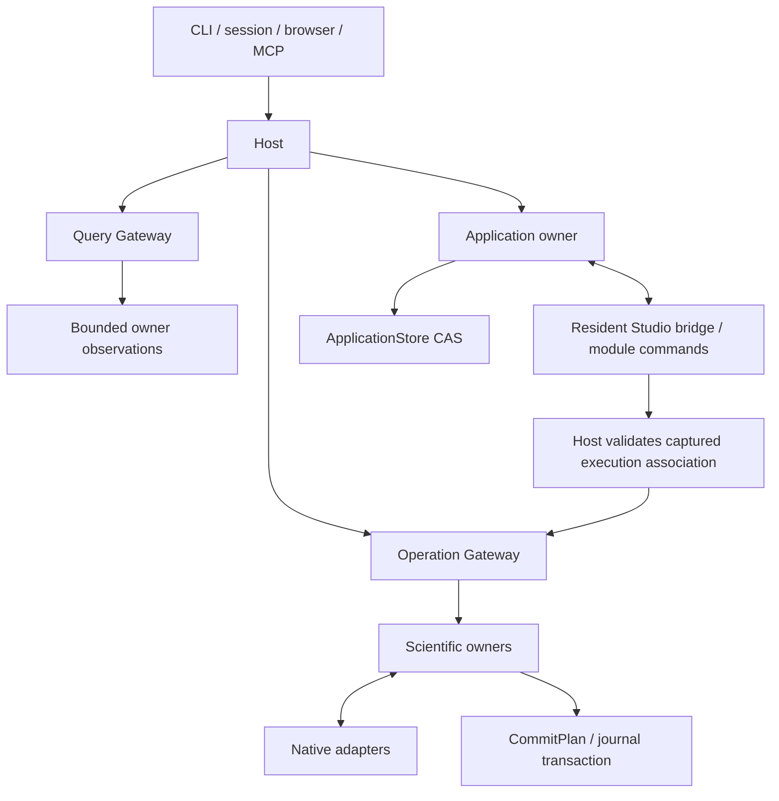

# Rho architecture

**Rho owns the operable scientific workspace. External Agents own conversation
and behavior.** Human and Agent requests reach the same domain owners and return
the same underlying facts. Current delivery and verification progress are recorded
in [Status](STATUS.md); protocol descriptions here are not acceptance results.

## Authority and ownership

| Owner | Responsibility |
| --- | --- |
| External Agent platform | Conversation/session lifecycle, intent, planning, tool choice, model/provider settings, permission decisions and continuation |
| Host | Compose domains and adapters, own runtime lifetime, bind trusted local context and expose shared ports |
| Operation foundation | Capability registration, schema/scope validation, idempotency, state transitions and atomic commit discipline |
| Scientific domains | Interpret observations, validate domain preconditions and describe results and effects |
| Application | Window/context identities, synchronized documents, application commands, captures, method bindings and receipts |
| Skills | Discover methods through declared sources, preserve resource identities and resolve explicit application bindings |
| Native adapters | Interact with R, files, Git, package tools, OS processes, SSH and Slurm |
| Studio | Present state and user controls; retain documents and layout independently of panel mounts |

Agent integration is a thin boundary. Rho validates mechanical constraints and
responds to requested operations; it does not infer a new goal, construct an Agent
plan, run a competing behavior loop or introduce a second approval decision.
Conversation content is not an authority source or a parallel Rho database.
The current Agent transport is MCP; ACP or other Agent adapters must follow the
same boundary. Scientific state and capabilities should be discoverable through
the shared Host, with no Agent-specific handler bypass.

## Request paths

The five shared scientific ports are `invoke`, `getOperation`, `requestCancellation`,
`querySnapshot` and cursor-based `subscribe`. A sibling `respond_input` control
replies only to an identified pending stdin request; it neither creates an
Operation nor acquires the ordinary execution lane. JSON session names use snake_case.
The browser's `/api/host` forwards them. Shared application control, bridge,
captured-execution and method-binding requests reach the Application owner through
Host dispatch. Browser-only bridge credentials do not become Agent authority.
HTTP hosting endpoints still manage project/R selection; they do not create
another scientific operation flow. CLI/session and official MCP use the same
composition root.

Workbench connection diagnostics are ephemeral transport observations owned by
the selected Host's MCP edge registry. They retain up to 64 recent protocol
sessions and 16 live window-context references per session, with explicit
truncation. The active-session count includes open sessions omitted from bounded
detail. Client names are bounded self-reported labels, never authority. Successful
overview/context responses record only their times and native window references;
they do not prove delivery, Agent comprehension or scientific correctness.
The authenticated hosting read does not start R, create an Operation, retain
credentials/conversations/results or recover work. Replacing the selected Host
creates a fresh registry; closing a protocol session retains bounded evidence
without claiming cancellation of accepted scientific work.

### Discovery and contracts

`host.overview`, `host.catalog` and `host.describe` use the shared registry.
Overview composes bounded owner observations; their individual sources, times and
completeness remain visible. It is not an atomic scientific snapshot. Catalog
filters caller scopes before pagination and reports module availability from known
Host/native configuration. Discovery does not start R, enumerate every binding,
load packages or recover incomplete work.

Each `CapabilityDescriptor` owns its purpose, native preconditions, effects,
idempotency, cancellation/retry rules, examples and related reads. Its input schema
and concrete domain output/recovery schemas feed gateway validation, MCP tool
schemas and generated TypeScript DTOs. Query payload schemas describe `data`;
operation payload schemas describe `output`, with shared helpers constructing
transport envelopes. Dynamic R values and uninterpreted host Skill metadata are
explicitly open; known records retain typed structures. Registry checks validate
schema references, examples and registered relationships.

`next_reads` contains only bounded reads, details, records or original evidence,
with known arguments and missing identity fields. It does not prescribe a research
workflow. Typed diagnostics distinguish busy, stale session, expired observation,
changed content, exhausted budget, unavailable capability, failed execution and
uncertain outcome. Uncertainty points to original receipts/records, not replay.
File, object and help contents cannot register capabilities or change scopes.

Overview payloads are bounded to 16 KiB, catalog pages to 64 KiB (20 entries by
default, at most 50), and descriptions to 256 KiB. Query and MCP replies retain
1 MiB and 8 MiB bounds. Counts measure UTF-8 bytes, entries or cells, not tokens.
Continuation or an explicit unavailable/limit reason accompanies incomplete data.

### Commands and results

An effectful request has one OperationId. Admission binds trusted caller/principal
identity, normalized arguments, capability, target and native preconditions.
The client supplies a client request ID; retrying the same action reuses it.
Reusing the key with different input is rejected. Project-specific operations bind
the actual project scope, rather than relying on the process working directory.

A domain handler returns a CommitPlan. The foundation commits the operation
transition, domain facts and outbox events in one transaction. Adapters do not
commit their own result databases. Terminal outcomes are immutable.

A cancellation request is a request, not proof of termination. Errors and confirmed
cancellation do not imply rollback of assignments, files or remote effects. When
effects may have occurred but the outcome cannot be confirmed, retain uncertainty
and native recovery references. Reconciliation is an explicit operation; it does
not replay the original action or rewrite its terminal result.

### Workspace execution admission

The Workspace owner holds the serial R queue. Gateway admission/idempotency runs
before enqueueing; retries do not create another queue entry. Domain execution
leases keep a request Accepted while it waits, arbitrate pending cancellation with
start, and retain the native lane until the final commit finishes. A final commit
failure pauses following work. Queue controls also fence starts until their commit
finishes. They never introduce another analysis execution or approval path.

The optional Invoke transport acceptance reply preserves the default terminal
reply. Detached edge waits do not detach accepted work from the Host. Pending
requests are not replayed on restart; existing recovery distinguishes Accepted
from possibly started work. A before-start failed/cancelled commit cannot contain
scientific facts, output or effect observations.

Read/control capacity is reserved separately from waiting Invoke calls, so a full
transport queue cannot prevent observing or answering stdin.

Input replies bind the existing session, operation, native request and caller.
They bypass the execution queue, accept one answer, and carry no journal/draft
payload. Waiting for input suspends the runtime timeout, not cancellation.
The Jupyter reaper retains only its own pipe; inherited project/journal descriptors
and other reaper pipes must not keep another Host alive.

### Queries and observations

Queries perform bounded reads with source, observation time, status and completeness.
They do not create Operations, start R, or trigger crash recovery merely to read
recorded results. Read-only access to existing operation records is distinct from
opening a writer and recovering incomplete work.

Live Workspace queries respect the execution lane. A busy response leaves R alone;
the UI can retain the previous observation with its timestamp. Objects expose a
filtered directory, an observation and progressive reads through
`workspace.list_objects`, `workspace.observe_object` and `workspace.read_object`.
The shallow interfaces use the same binding/metadata implementation.

Object references bind project, principal, native session and observed paths;
directory references also bind filters and binding identities. Native requests
resolve bindings again without retaining large R object roots. Before scientific
code or tooling can execute, the bridge revokes the session's references. Failed,
cancelled and uncertain execution cannot restore them. Idle expiry is 60 seconds,
absolute expiry five minutes; metadata is bounded to 8 MiB, with at most four
directories and 32 object references per principal/session.

Ordinary vectors, atomic matrices, standard data frames/tibbles and lists support
bounded reads. Known base classes expose underlying values and attributes; other
classed/opaque values remain safe metadata. Queries do not force promises or active
bindings, or call user print, format, length, subset or conversion methods. Paths
contain exact names or one-based indices; duplicate names require indices. Pages
contain at most 200 entries/values, or 200 rows, 50 columns and 2,000 cells within
256 KiB. Long values and attributes retain text continuations. Object text positions
count one-based Unicode characters; byte budgets count UTF-8 bytes.

Live package inspection belongs to Workspace because the active R session owns
its library search order, loaded namespaces and attached packages. The bounded
`workspace.packages` query reads DESCRIPTION text and existing namespace metadata
through the same idle-only lane, without loading packages or recording an Operation.
It does not substitute a separate R process's inventory for the live session.
Grouped indexes and copy details share a bounded observation identity and original
timestamp. Continuation requests require the expected native session; the private
bridge retains only its last two observations, and expiry cannot silently resample
under an old identity. The flat query remains the default for existing callers.
Source/provenance belongs to an installed copy; repository and Remote metadata are
kept distinct from project URLs and currently configured repositories. Secret URL
components are removed before transport, and the UI validates navigation separately.
Environment retains management/realization ownership; Studio package viewing adds
no installation or environment-selection path.

`workspace.package_index` reads DESCRIPTION, static NAMESPACE declarations and help
indexes for an exact observed installation. Its file identities fence continuation;
conditional exports remain unresolved. `workspace.help` stays an explicit operation.
It locates a selected copy/topic, renders without dynamic Rd stages/examples once,
and stores a text artifact. Later pages use `output.read_text`; help documents do
not enter Plots.

Project text observations bind content hashes and native file identity. Line and
long-line fragments from `project.read_text` cannot silently combine replacements.
`project.search_text` separates scanned bytes/entries from result budgets and
retains a cursor even when a scan page finds no matches. Directory/path searches
also continue explicitly. Search results describe individual file versions, not
one atomic directory-tree snapshot; binary, encoding, size and access skips remain
visible. Filesystem text cannot stand in for an unsaved Studio draft.

Paginated summaries come from the journal. Runtime output logs contain ordered,
bounded observations and media references; they do not determine execution outcome.
A missing output event is not itself execution failure. Output storage has an
independent owner port, so historical media queries also work in a project-only
Host. Media is addressed by
OperationId and output sequence, with original bytes checked against the reference.
The Output owner supplies a bounded verified-original cache and shared read port;
page, preview and transport adapters never open scientific storage paths themselves.
Concurrent reads of the same original coalesce while caller/project checks still
precede access. Native MCP image content and original resource links derive from
`output.view`; previews/crops never create scientific results. Static SVG rendering
disables scripts and external resource reads. Original images remain unchanged.

## Native identities and concurrency

Git owns commits and index state; the filesystem owns current bytes; R owns its
live session; native environment locks describe dependencies; Slurm owns jobs.
Rho uses their identities and relevant digests instead of a global scientific
revision counter. Application-state version tokens only coordinate UI writes.

Host startup acquires an OS lease on the canonical project's `.rho/next-host.lock`
and an exclusive journal writer lock. A second database cannot create a second Host
for the same project. Lock-file existence does not prove liveness. Accepted work
retains the Host and project lease after an edge disconnects.

Host-managed Workspace, Project, Environment and process operations share the
appropriate execution lane. External editors/processes are not locked by it.
MCP sessions retain their selected Host; active work and MCP references prevent
project/R switching. A new project lease is reserved before ending the old session.
R candidates are validated before teardown; failed restart reports unavailable R
and preserves file access where possible, without claiming memory was restored.

## Persistence and recovery

| Material | Meaning |
| --- | --- |
| Operation journal | Accepted requests, immutable outcomes, committed domain facts and outbox events |
| Application SQLite store | Drafts, layouts, view positions, recent projects, preferences and unconfirmed request identities; outside scientific history |
| Runtime output files | Bounded text/display observations and original media associated with an Operation |
| Native recovery material | Process markers, receipts, staging paths and job identities needed to reconcile uncertain effects |

Draft writes use version preconditions. Concurrent windows cannot silently overwrite
one another. Acknowledgement loss requires checking the original request/state.
Restart restores synchronized application state, not R memory or the previous
in-memory editor undo stack. Reopening a view never reruns an operation.

Environment realizations use isolated libraries, verification receipts and explicit
activation in a new R session. Cleanup is explicit and reference-aware. Successful,
uncertain, active or unobservable materials are protected; quarantine and restoration
are separate from permanent purge. Native process reconciliation checks current
ownership observations instead of trusting an old PID. Scheduler reconciliation
uses native job identity and never treats a lost connection as proof of job failure.

## Application context and captured actions

Each Studio window has a resident bridge using existing module commands, independent
of panel mounts. `application.windows`, `application.context`,
`application.read_document` and `application.command_status` expose bounded summaries,
versioned text and original receipts. Commands bind window ID/incarnation, request
ID and relevant context/document/selection versions. Multiwindow discovery never
chooses an implicit current window; activation selects a view inside Studio, not
an operating-system foreground window.

The bridge renews every five seconds; a 15-second lapse makes live observations and
new commands unavailable. Offline reads require explicit synchronized-history access
and retain that source label. Commands unclaimed after 30 seconds expire. A new
window incarnation cannot pick up old pending commands. SQLite persists resource
changes and command completion in one CAS transaction. Locally applied but unsynced
and uncertain receipts remain distinct from confirmed application state.

Save/run capture exact document/selection versions, original text, base hash, path
and native session. Host retains the original Agent `CallContext` and signs an
execution association bound to the command, incarnation, capture and step. The
browser submits that association; it cannot substitute code, path or actor. Project
and Workspace work enters the existing OperationGateway.

Run File submits its captured code only after a successful save has the capture's
hash. An unchanged file, including an empty file, can use a Project hash-verification
receipt without inventing an OperationId. Input typed during save remains dirty.
After disconnection, accepted scientific work stays Host-owned; an unsubmitted next
step does not resume automatically. Reconnection inspects receipts and operation
records. Repeated associations return the original step result without duplicate
execution. Draft text stays outside scientific history until explicitly saved/run.

## Skills and effective method context

Standard local discovery reads `.agents/skills` from an explicit project-relative
working directory through its ancestors to the project root, plus
`~/.agents/skills`. It does not scan arbitrary product directories or introduce a
Rho-specific Skill package/root. Local packages use standard Agent Skills
frontmatter; scripts/resources are data during discovery and reads.

External launchers can supply `--host-skills` metadata listing exact resources they
actually discovered. The native adapter reads those packages in place, preserving
host names, directory differences, optional metadata and enabled/disabled/rejected
state. A separate trusted byte-source port supports non-filesystem hosts. Attested
host sources use their native discovery semantics while enforcing bounded YAML and
resource reads; they are not repaired, renamed or converted to local standards.
The launcher manifest is Host-private and cannot be modified through project or
Skill access to change enablement.

Every source-qualified identity remains distinct, including same-name methods.
Equivalent physical resources retain source relationships; an explicit host denial
cannot be bypassed through a local alias. Project links stay within the project;
resources stay within their declared canonical package root and outside private
data. SHA-256 identities cover the body and each resource. Body/script and source
identity/enablement changes invalidate affected observations. `skill.list` and `skill.read` disclose
metadata, manifests and exact byte/text pages progressively. They do not execute
scripts, install dependencies or grant scopes through `allowed-tools`.

Application metadata holds explicit method choices/exclusions, resource pins,
module/capability mappings, external Goal/Task/Actor references and native targets.
It does not copy external scheduling state or modify Skill files. Shared
`application.bind_method` validates known source/digest/target conditions and
ancestor exclusions before Application CAS; Host serializes validation with binding
writes. Actual resource-read receipts remain in the Application store.

`host.resolve_context` reports discoverable methods, explicit bindings, provenance,
missing capabilities and conflicts. Dependencies absent from machine-readable
application declarations remain undeclared; prose is not treated as proof of an
available environment. Method suitability and task continuation belong to the user
and external Agent. Binding changes cannot rewrite accepted scientific requests.

## Studio modules and information flow

Studio is the client composition root: it constructs owners, connects declared
ports and typed notifications, and starts, switches and stops their lifecycle.
It has no scientific state getters/setters or parallel refresh implementation.
Each owner publishes a memoized read-only snapshot through `getSnapshot/subscribe`
and exposes explicit commands. Panels use individual owner hooks; they do not
receive Studio, mutate snapshots, call HostClient or poll scientific queries.

| Client owner | Exclusive state and commands |
| --- | --- |
| Session | Canonical project, R configuration, native session, readiness and transport health |
| Operations | Persisted request identities, authoritative records and summary cursors, event position, cancellation and reconciliation |
| Console | Shared queue/stdin observation, independent view drafts, history, selection and scroll |
| Objects | Binding observations, timestamps, stale state, expansion and view-token preview demand |
| Packages | Session/observation-bound grouped index, installed-copy details, source, filters and cached pages |
| Files / Documents | Directory/search observations; independently retained editor state, captured save/run text, digests and comparisons |
| Outputs / MediaCache | Ordered stream/history observations; validated original bytes, bounded cache and injected browser URL lifetime |
| Plots | Per-view selection, following, pinning, transforms and protected-media identities |
| Layout | Built-in view instances, placement, active visibility, close/reopen and layout undo |

The built-in registry defines names, renderer keys, instance rules, menu entries
and restoration validation. Its UI renderer mapping is exhaustive. FlexLayout
is confined to the layout owner and its UI adapter; MediaCache receives protected
keys calculated by Plots from Layout's active view IDs. Visibility demand belongs
to a view token, so closing one preview cannot cancel another view of the same
binding. Closing, moving or maximizing a panel changes views, not documents,
observations, pending requests or accepted Host work.

### Establishing and consuming operation history

`operation.events_checkpoint` returns the highest journal event sequence visible
to the Host's canonical project and trusted principal, or zero. The SQLite query
and `subscribe` use the same visibility predicate before aggregation/pagination.
Project-bound operation lookup and recent summaries use the same visibility.
`operation.list_recent` supports an exact `operation_id`; that selector,
`client_request_id` and `before_cursor` are mutually exclusive. All edges reach
the Operation owner through Host registration. A checkpoint is an event position,
not a scientific state version.

Cold startup obtains a checkpoint before restoring application fragments, loading
recent records and queue/unconfirmed/pinned references, and observing native R.
Startup retries the failed stage; it cannot bypass draft or request restoration.
Only after initialization does the event lane consume sequences above that
checkpoint. An existing client reconnects from its completed page cursor; a cold
client ignores the obsolete persisted cursor and establishes a fresh baseline.
Historical browsing has its own `before_cursor` and remains available beyond the
initial 30 records.

The event lane consumes at most two pages of 100 per scheduling turn. Unknown
operation IDs are resolved through authoritative records and exact summary
queries; stable summary cursor and output sequence order all visible output.
Duplicate pages merge by identity. A confirmed null record is unreadable and
creates no display fact; failed network/parse reads retain the page cursor for
retry. Recovery never resubmits original code. Terminal output is complete only
after a ready, exhausted page whose read began after terminal was observed; an
older response cannot finish the final output drain. Temporary failures retry, while unavailable,
gap and truncation notices retain an explicit retry path.

### Scheduling, invalidation and persistence

One runtime coordinator gives control/events a 250 ms cadence and native status
observations an approximately two-second cadence. Tasks have independent in-flight
and failure state. Native Workspace observations use one serialized, coalesced
read lane; package and output pages yield between slices. Read requests time out
at ten seconds. Transient reads use 0.5, 1, 2 and then five-second retry delays;
view demand cannot erase backoff. Scientific writes have no automatic retry.
Connection status comes from Host health observations, not a Packages or media
failure. Busy responses retain cached content, original time and stale state.
Package retries retain their exact observation and request; expiry requires an
explicit Refresh to create a new observation.

Project and necessary native-session identities plus a client epoch and request
generation fence asynchronous success, error and cleanup. Epochs discard obsolete
client work; they are not sent as global scientific revisions. Project round trips,
R restarts and stop invalidate old callbacks. Stopping releases subscriptions,
read tasks, timers and Blob URLs; accepted Host operations continue independently.

Typed project/session/operation/output/file-save/visibility notifications carry
correlated identities. Recipients invalidate or query their own state. Every
Workspace terminal outcome, including failure, cancellation and uncertainty,
invalidates affected Objects, Packages and file observations. Repaint subscriptions
are separate and batched; editor/view subscriptions retain local update scope.

One application persistence coordinator combines owner fragments into the existing
SQLite `studio` record using version preconditions and 400 ms coalescing. It
retains current drafts, view/layout fields, unconfirmed request IDs and later edits
made during a write. Lost acknowledgements are reconciled with the stored state;
window conflicts preserve local content for explicit resolution. A write whose
acknowledgement was fenced by an R restart retains its original capture for this
reconciliation. Another window changing the Host's project does not replace local
drafts: the client reports the mismatch and withholds native availability until
its project matches again. A request identity
must be durably synchronized before Invoke. Stdin reply content, including
passwords, never enters these fragments, command history or logs. No migration
reader or abandoned implementation format is introduced.

Save uses `project.apply_patch` and the original file digest. Only a returned
filesystem digest matching captured content confirms the save; edits made while
saving remain dirty. Run File saves/verifies its captured text and submits that
text. Formatting applies only if the document still matches its request, otherwise
it offers comparison. CodeMirror state survives view changes within the document
owner; its DOM adapter remains in the panel.

Frontend DTOs are generated from Rust contracts. Vite produces embedded assets
from `ui/`, without a frontend CDN. Dynamic editor/component styles use a CSP nonce.
SVG is loaded as an image; HTML/widgets are not injected into the Studio document.
Resource indicators use observed native processes.

The [frontend boundary checker](../scripts/check-frontend-boundaries.mjs) validates
imports, transitive domain isolation, cycles, transport/mutation access and
FlexLayout containment with allow/reject fixtures. CI runs it with frontend units.
Visual approval and scientific/interactive evidence remain separate from these
structural checks; see [Design](RHO-DESIGN.md) and [Status](STATUS.md).

## Future multiple-runtime support — direction only

The user accepted this extension direction on 2026-09-08 and deferred implementation.
The current Host and Studio still own one live R session. Existing module boundaries
provide a foundation for multiple runtimes; they do not establish implemented or
verified multi-session or multi-version support. This section records the boundaries
future work must preserve, not new capabilities or a delivery commitment.

### Identities and ownership

| Identity | Meaning |
| --- | --- |
| Runtime definition | Selected interpreter installation and adapter, including actual paths, version and architecture |
| Environment | Dependency realization and library configuration bound to a launch |
| Workspace instance | Logical analysis session to which views and execution targets bind |
| Native session | One actual process lifetime; restart always creates a new identity |

One project Host should own multiple Workspace instances under the existing project
lease. Host owns instance creation, shutdown, restart, health and resource limits;
each Workspace owner owns its execution queue, stdin, objects and package observations.
Project files, Environment management and the Operation journal retain their current
owners. Do not create competing Hosts or independent scientific journals for the
same project merely to obtain additional R processes.

Each R instance runs in a separate native process. Multiple instances may use the
same installation or different R versions. Bind the selected R/Ark paths, R_HOME,
environment, library paths, working directory and connection/log directories per
launch, and verify the actual runtime through a startup handshake. Validate each
version/environment combination; do not assume a writable package library is safe
to share across R versions. An environment in use remains protected from cleanup.

### Routing, concurrency and views

- Every execution, query, cancellation and stdin reply must resolve an explicit
  Workspace instance and the relevant native-session precondition through the
  shared Host ports. UI selection is not an authority for an already submitted
  request. Editor execution captures its target with its code; MCP targets are
  explicit and do not follow whichever Console the user currently selects.
- Execution remains serial within one R instance and can proceed concurrently
  across instances. Replace the current shared execution/observation lane with
  instance-specific lanes and resource-appropriate project coordination. Stopping
  or blocking one instance must not stop another instance's execution or controls.
- Console, Objects and Packages models and caches are scoped to their instance.
  Views may follow a selected instance or remain pinned. Files/Documents stay
  project-owned; Plots may compare outputs across instances while retaining their
  producing operation and session identities. Switching a view does not restart R.
- Extend typed notifications, observations and lifecycle fences with instance
  identity. An instance's execution invalidates its own live observations; shared
  file effects also invalidate relevant project observations. Preserve project and
  principal visibility, event replay and deduplication through the common journal.

### Data and recovery boundaries

R memory is private to each native session. Cross-instance data transfer must be
explicit, with source identity, format and compatibility checks; equal object names
do not imply shared objects. Independent default output directories reduce file
collisions. Arbitrary R code can still write shared project files, so managed request
coordination is not a guarantee against all concurrent native writes or a rollback
mechanism.

Persist instance definitions and view bindings with drafts and history. Reconnecting
to a live instance and starting a replacement process are distinct actions. Restart
may retain the logical instance but must fence old responses and requests with a new
native-session identity; it does not restore R memory or replay unconfirmed code.

Future delivery should establish same-version multiple R sessions first, then verify
multiple R versions with their bound environments. Remote and other-language runtimes
can subsequently implement the shared lifecycle/execution/output contracts and expose
their own inspection capabilities; R package semantics are not a universal runtime
contract. Acceptance must exercise simultaneous runs, independent cancellation and
stdin, cross-instance cache isolation, restart fencing, shared-file conflicts and
version/environment identity before claiming these capabilities. Package installation
and runtime acquisition remain separate from read-only package inspection.

## Source map and dependency direction

| Location | Role |
| --- | --- |
| `crates/contract` | Wire identities and DTOs, including generated TypeScript sources |
| `crates/operation` | Operation and Query gateways, handler/journal ports and commit discipline |
| `crates/workspace`, `project`, `environment`, `execution` | Scientific owners and native port definitions |
| `crates/application`, `skills` | Application context/control and method/source ports, separate from scientific execution |
| `crates/adapters/` | SQLite, Git, R, package, process and SSH/Slurm implementations |
| `crates/host` | Concrete composition and runtime configuration |
| `crates/cli`, `mcp`, `workbench` | Transport and application entry points |
| `r/bridge`, `r/environment` | Native R execution, bounded observation and environment helpers |
| `ui/src`, `scripts/` | Studio models/views and reproducible development/verification tools |
| `.agents/skills/` | Standard method packages, read by native clients or the shared Skills owner |

Jet is a pinned external core-library dependency in `vendor/jet-core`, excluded
from the production workspace's members. Only the native R adapter depends on it.
The snapshot is generated from a checksum-pinned upstream commit plus the ordered
patches in `patches/jet`; its license and upstream identity stay separate from
Rho-original code. No Jet CLI, Lua frontend or second application is incorporated.
The standalone manifest preserves the upstream core's effective dependency settings,
while Rho's root Cargo.lock remains the production lock. See the
[maintenance workflow](../patches/jet/README.md).

Dependencies flow from edges to Host, from adapters to domains, from domains to
Operation, and from Operation to contract. Domains do not import their concrete
adapters; contract does not depend on native runtime or transport libraries.
[The architecture check](../scripts/check-architecture.mjs) enforces the allowed
production dependencies. Exact public schemas come from the live capability registry.

The independent Codex runner under `scripts/agent-interface/` is acceptance tooling.
It creates isolated projects, records actual tool traffic and checks factual and
behavioral assertions. It is not imported by the Host, an application task scheduler
or a product Agent harness. Current verification and remaining acceptance work are
reported only in [Status](STATUS.md).

## Execution boundary

The local workbench uses loopback binding, bearer authentication, Host/Origin checks,
bounded requests and restricted assets. Project-relative paths, host-owned data,
symbolic-link containment and reference integrity are validated at execution/read
boundaries. Caller/principal visibility and project scope follow each port's contract.

Native R, package scripts and commands run with the user's OS privileges. Process
supervision and recovery markers are not an adversarial filesystem/network sandbox.
Environment recovery records the original native session identity of its managed
helper family. On Darwin, protected processes may hide their environments even
when the native request succeeds. An original non-init session can exclude
rechecked init-session services from the owned fork/exec family; missing original
evidence, same-family uncertainty and positive ownership conflicts remain explicit
failures. This proof covers managed helpers, not independently delegated service
manager jobs or rollback of external effects.
Credentials remain with their existing provider; Rho does not create an Agent
credential or approval store. See [PRIVACY.md](../PRIVACY.md) and
[SECURITY.md](../SECURITY.md) for data handling and reporting.
