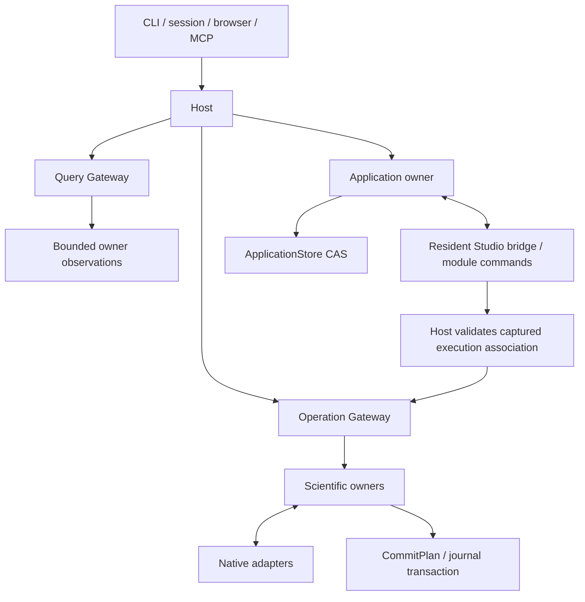

# Rho architecture

**Rho's scientific owners manage the operable workspace. External platforms or
the optional component assistant own Agent behavior.** Human and Agent requests reach the same domain owners and return
the same underlying facts. Current delivery and verification progress are recorded
in [Status](STATUS.md); protocol descriptions here are not acceptance results.

## Authority and ownership

| Owner | Responsibility |
| --- | --- |
| External Agent platform | Conversation/session lifecycle, intent, planning, tool choice, model/provider settings, permission decisions and continuation |
| Optional component assistant | Rig-driven model/tool execution within a user-initiated Application scope; engine dependencies stay in `rho-agents` |
| Host | Compose domains and adapters, own runtime lifetime, bind trusted local context and expose shared ports |
| Operation foundation | Capability registration, schema/scope validation, idempotency, state transitions and atomic commit discipline |
| Scientific domains | Interpret observations, validate domain preconditions and describe results and effects |
| Application | Window/context identities, synchronized documents, application commands, captures, method bindings, assistant authorization and durable application receipts |
| Skills | Discover methods through declared sources, preserve resource identities and resolve explicit application bindings |
| Native adapters | Interact with R, files, Git, package tools, OS processes, SSH and Slurm |
| Studio | Present state and user controls; retain documents and layout independently of panel mounts |

Agent integration is a thin boundary. Scientific owners validate mechanical
constraints and respond to requested operations; they do not infer goals, plan
Agent work, call models or introduce a second approval decision. The optional
component assistant uses Rig's existing driver in `rho-agents`, with explicit
model configuration and a user-initiated bounded request.
Conversation content is not a scientific authority source.
External scientific requests use MCP; built-in tools use the same Host gateways
directly. The optional local CLI client uses Codex app-server
or Kimi/DeepSeek Harness ACP to discover native models, open a native session, submit a user turn
and relay native output and permission choices. It supplies the current Host's
MCP connection for that session without editing the CLI's user configuration.
The CLI retains authentication, model execution, conversation history and Agent
behavior. ApplicationStore retains stable task identities, per-task CAS drafts,
submission receipts and a bounded observation cache. The Host task service is its
single writer. These records are separate from the scientific Operation journal;
opening the panel only reads task metadata. Settings Test creates an independent
diagnostic session, and only an explicit Test sends its minimal prompt. Scientific capabilities remain discoverable through
the shared Host, with no Agent-specific handler bypass.

Native client actions bind the project and synchronized Studio window. Connection
and turn request identities survive lost HTTP acknowledgements; uncertainty does
not authorize replay. Native permission requests are shown to the user and their
selected native response is forwarded unchanged. ACP options preserve their order
up to a bounded 64-choice list; invalid/oversized lists fail explicitly. Stopping or disconnecting the
Agent does not prove that already accepted scientific work stopped or rolled back.
The local MCP credential is passed privately to the owned CLI process and excluded
from browser session snapshots and diagnostic output.

DeepSeek's older launcher lacks ACP. Explicit setup can add a versioned official
DSH/ACP runtime under Rho's application-data directory without replacing the
user's `dsh`. Discovery never installs it. Each launch uses a private temporary
home with bounded copies of native settings and credentials, because the newer
native credential provider may convert the old format on startup. Only the copy
may change; it is removed when the owned client closes. Native session, storage
and attachment providers point at separate persistent component data. Rho does
not import other products' profiles or implement a credential migration itself.

## Component assistant records and authority

Application owns component conversations, CAS drafts/controllers, fixed run inputs,
model configuration references, tool intents and bounded events. They use additive
ApplicationStore tables separate from native Agent tasks and the science journal.
The engine never opens SQLite or calls an R adapter. Host composes the engine and
its narrow tool access port; all scientific reads/writes still use their real owner.
Current implementation and unimplemented integration stages are in Status.

`ComponentAgentEngine` and `ComponentRunPort` are Application interfaces; the Rig
implementation stays in `rho-agents` and the port implementation stays in Host.
Model-facing schemas are derived from current descriptors without modifying the
registry. Host-bound identity fields are removed from that schema, injected from
the accepted run, then validated against the original native schema. Dispatch
reloads the original intent and refuses altered tickets. Owner observations retain
their status, completeness, timestamp and continuation rather than only their data.

Selected component context reuses the existing composer source readers. Preview
records owner observation metadata; submission revalidates the same file/document,
package-copy or object reference before capturing bounded context in the run.
Cross-window document sources and mismatched native-session sources are refused.
Captured text and evidence are durable application records. Verified image bytes
remain transient inputs with original media references and preview digests, separate
from the text budget and store. Binary output-view fields and native input prompts
are explicitly omitted from model-facing text; projections identify that omission.

Browser-only component query/command routes observe and admit these application
records. A separate transient credential endpoint returns a reference and never
places key material in pending commands or synchronized drafts. Shared lazy HTTP
clients do not follow redirects or automatically retry model requests. Model work
retains its Host lifetime; native science and its receipts outlive dropped model
waits. Service closure participates in Workbench shutdown.

Explicit model diagnostics have their own idempotent Application records. They
use synthetic content and no scientific tool port, share the model concurrency
budget, and retain the exact configuration digest. An image diagnostic for a
different endpoint/model/credential reference does not authorize image input on
the selected configuration. Source search and diagnostic observation do not send
model requests; only the explicit Test action does.

A user request binds its project/principal, window incarnation, profile, model
configuration and native targets. Explain grants no writes; Edit binds named
documents/files; Run requires an explicit R instance and native session. Profiles
cannot turn package or environment explanation into installation or lifecycle
changes. Application control is checked by action, document version and destination.
The same already-authorized action does not ask for another approval. Query text,
Skills and model output cannot enlarge authority or select credentials.

Persist each request before scheduling and each tool intent before dispatch. Stable
request IDs cross lost acknowledgements; reusing an ID with different content fails.
Mutation deduplication also includes normalized action/target/preconditions within
the run, independent of provider call IDs. Original owner results and unresolved
intents remain durable even when text events are pruned. Receiving a tool result
does not imply scientific success. Stop fences later calls; accepted scientific
work retains its original identities and cancellation/reconciliation semantics.

Direct component R execution uses the existing accepted-operation path with the
fixed instance and native-session precondition. A Host-owned task retains the
operation even when the model future is dropped. It records acceptance, observes
the original operation, and requests cancellation only for that identity. Missing
acknowledgements are looked up by the original caller/request; they do not authorize
new code submission. Waiting for R and user input are application observations.
NeedsInput is associated with the exact original OperationId and native session.
An unrelated caller's input in the same queue cannot become the assistant's input
request. Direct R and captured-document tracking share this observation rule;
input prompts/answers remain with the native user interaction, not Agent records.

Application command receipts retain the exact document versions acknowledged by
that command. Later user changes cannot silently become the version attributed to
an earlier edit, which is necessary for subsequent authorized save/run steps.
Literal repairs can use `application_replace_text`. Application resolves one exact
match against the versioned editor text, normalizing editor line endings and
returning UTF-16 offsets for the existing EditDocument command. Missing, ambiguous
(including overlapping), read-only or stale targets never produce an edit. Model
call origins retain only tool names and argument digests; confirmed replacement
retries retain the original edit identity even after its old text is gone.
The resident bridge synchronizes the post-save draft and acknowledges the original
execution association. Application verifies its text, disk base, path and selection
against the successful capture before recording a successor document version.
Concurrent user input remains a different version; saving it does not extend the
assistant grant. Component runs retain their original request plus only these
owner-confirmed successor references.

Component document tools project the native control schema to fixed document IDs.
The Host injects versions, destinations and the original R instance/session; capture
admission checks that execution target atomically. Native application tracking
outlives the model wait and reconciles submitted SCI steps through the shared status
query. Stop cancels pending commands, fences unsubmitted steps and requests
cancellation only for accepted operations belonging to the original command.
Claimed local edits may already apply; cancellation never implies rollback.

Saved document successor references are normalized through their original save
receipts for mutation deduplication. A saved-base version change cannot turn a
duplicate failed Run File into another execution; an actual edit supplies a new
document identity for a subsequent repair.
Edit/save receipts retain exact acknowledged document summaries, including the
draft SHA-256 for subsequent reads. These summaries do not follow later edits;
the document version and saved base hash are not substitutes for that checksum.

Queue recovery remains an explicit model tool choice. Host binds Resume to this
run's confirmed failed R operation and observed native pause ID, injecting only
operation IDs already present in its durable receipts. Workspace checks that set
against the pause origin and every current, pending and reserved run under the
queue lock, including work hidden by principal filtering. Manual pauses, other
requests' failures and unconfirmed outcomes cannot be resumed by this path.
Before new component R work is admitted, Host observes the bound session's queue.
An existing pause yields bounded non-executable feedback. Application applies this
precondition after duplicate/ancestor identity resolution, so reading an original
receipt remains possible. No automatic Resume occurs. The observation does not
replace native checks or promise the queue cannot change before submission.
Model failures retain typed error categories or numeric HTTP status; provider
bodies, raw error strings and private message history are excluded.

Known-tool argument format failures produce non-executable application receipts
with an argument digest and bounded schema feedback. Rig's native Skip hook returns
that feedback to the model; neither the tool body nor a scientific owner is invoked.
These attempts consume tool/result budgets and survive reload.
Component persistence has a project-wide 64 MiB serialized-payload budget across
conversations, runs, tool receipts, settings, diagnostics and events. SQLite keeps
transactional byte/phase entries, not a second result store. Active runs, active
conversation records, pending diagnostics and unresolved tools retain bounded
completion capacity. Budget checks and event pruning occur in the same transaction
as writes; rejected admission rolls back its identities and counters. Only event
payloads are evicted. Existing oversized stores remain readable and may finish or
shrink already-accounted obligations, but cannot increase charged storage. The
limit measures UTF-8 payload and reserved receipt capacity, not SQLite page/WAL
size or the separate scientific owners' storage. Unknown tools,
attempts to override hidden targets, storage failures and exhausted budgets stop
the run instead of entering this correction path.

Run observation is serialized with service admission/finalization. A request from
a previous Host, or one with no live owning task, is reported as Interrupted
without launching a model or changing science. Explicit reconciliation persists
that interruption and records bounded, versioned owner observations alongside the
original tool receipts. Original caller/request IDs determine scientific lookups;
missing acknowledged records and unconfirmed application/SCI outcomes remain
uncertain. Repeated unchanged observations retain the same recovery version.
Reconciliation never submits, cancels or resumes a scientific step.

Explicit conversation takeover requires the observed conversation version and a
live authenticated destination window. It refuses live owning tasks. Orphan
interruption, controller replacement and clearing the stale active pointer share
one Application transaction; drafts and original run/window identities survive.
Old-window writes/stops and late model text remain fenced, while original native
facts can still be recorded. Continue must use these observations and fresh
target validation; the reconciliation/takeover commands alone do not continue work.

Explicit Continue uses `ComponentAgentStart.continuation` with the previous run ID
and observed recovery digest. Host rechecks the original owners; Application checks
the same conversation, terminal parent, unchanged digest and non-expanding grant.
Write continuation requires the original window/session, confirmed document version
lineage and current owner targets. Unresolved mutations prevent further writes; an
explicit Explain request can retain and describe their uncertainty.

Continuation history retains user requests in a bounded ancestry (at most 32 runs),
plus labeled partial assistant text, compact tool results and recovery references.
Combined history and selected sources must fit the existing context limit; user
request constraints are not silently truncated. Matching confirmed ancestor actions
become non-executable previous-result reads. They use original owner identities and
cannot invoke a scientific operation, apply an edit or resume a queue again. Queue
resume can reference confirmed ancestor failures but retains its atomic operation
set fence. A fresh Start without a continuation reference is a new explicit action
and can intentionally repeat work.

Settings persist only non-secret configuration and explicit environment/session
credential references. Remote endpoints require HTTPS; loopback HTTP is explicit.
Endpoint credentials in URLs are rejected. A disabled or unconfigured assistant
does not dispatch models. Content telemetry is disabled and reasoning is not stored.

## Native Agent tasks and continuation

`AgentTask` binds project/principal, one runtime and one Rho-created native session.
`AgentAttachment` is a short-lived connection with a controller window and generation.
`AgentTaskDraft`, `AgentCommandReceipt` and `AgentTaskEvent` live in additive typed
ApplicationStore tables. No abandoned store or external CLI session is imported.
Native session IDs enter through the adapter, never arbitrary browser input.
`/api/agents/tasks/query` performs bounded observations; `/api/agents/tasks/command`
admits a task/window/generation-bound action. `/api/agents/test` is a separate
idempotent diagnostic path. Discovery and explicit setup keep their existing routes.
The old ephemeral connect/action/sessions HTTP routes are retired.

Persist a request and input digest before starting native creation or submission.
The same request identity/content returns its receipt; altered reuse is rejected.
An unconfirmed outcome retains the submitted draft separately from subsequent edits.
Receipt queries, rather than new submissions, reconcile missing acknowledgements.
Only the operating window may edit or act. Idle takeover uses CAS; stopping takeover
first freezes submissions and verifies native quiet. A detached or uncertain process
must pass PID/start/executable/ownership-marker checks before any replacement writer.
Disconnect is subject to that same proof. A resume cannot simply relabel an uncertain
live transport as ready. Old-generation/session/turn/item events are fenced.

Every active task owns a native process; at most eight connections share a Host.
Host restart leaves attachments disconnected until explicit Resume. Codex uses the
exact thread ID, verifies cwd/ID and native idle, and reads native turn/item pages.
Kimi uses session/load with new explicit MCP settings; its native replay replaces
the observed display generation and is labeled context history. Since Kimi 0.41
ignores cwd on load, bounded exact-ID metadata (including an exact-root workspace
alias) verifies containment first. DeepSeek uses session/resume; after interruption,
resume → close → resume clears its persisted Inbox before new input. No native
resume sends a prompt, replays a permission or changes an old scientific receipt.
New input carries fresh project/window/R-session context and unresolved-turn notices.
Agent continuation never restores R memory.

ACP `session/prompt` resolves at native turn completion, including inference, tools
and permission waits; it is not a short acknowledgement. Retain that correlated
reply until native completion or transport closure, with explicit Stop available.
Do not detach a live turn after a fixed total duration. Native thinking signals
produce bounded phase observations, not retained reasoning text. Phase observations
are fenced and persisted like other observations and are never model memory.
New input also carries a bounded live Studio context (or its unavailable reason)
and the existing document/execution/media entry points. Components remain owned by
their current modules; the Agent decides how to use them.

Commit terminal states/receipts immediately; coalesce other observations at 100 ms.
Only durable cursors are exposed. Cache at most 500 events / 1 MiB text per task and
64 MiB per project, preferring eviction of inactive older observations. Task indexes,
drafts, receipts and native histories are not evicted. Binary attachments are stored
separately (8 MiB each, 32 MiB/64 attachments per task); they are not copied into the
text cache. Studio reads summaries every second and visible history at 250 ms.
Window-local selection, filters and reading positions use ApplicationPersistence,
not layout configuration. Draft conflicts retain a local copy.

Native permission callback text/diffs and streamed tool input provide bounded,
credential-scrubbed request details. Preserve native option identities and order;
Studio discloses details at the composer without inventing an approval policy.

Composer context sources use the existing read-only Host query owners. Files and
editor selections retain hashes/captures; R objects retain native session/object
references; plots retain authoritative MediaReference identities. Preview and send
both validate scope. Plugin sources register search/preview/inclusion contracts
through `AgentContextProvider`; no illustrative analysis plugin is installed.
Native images and UTF-8 files are explicit inputs, not inferred output provenance.
The native process receives a dedicated MCP-only bearer credential, which cannot
access browser task-control endpoints. User credentials/global MCP settings stay
with their native providers.

MCP `workspace.run_r` submissions default to `return_after_acceptance=true`, using the existing
gateway acceptance path. An explicit false still requests the terminal result.
Nonterminal/failed Workspace records link to `workspace.console_state` so a paused
queue is distinguishable from a running operation. Rejections use MCP error content
without falsely claiming a structured owner result; native clients must receive the
original diagnostic instead of an output-schema error. Failed committed operations
still return their schema-valid record with `isError=true`.

## Request paths

The five shared scientific ports are `invoke`, `getOperation`, `requestCancellation`,
`querySnapshot` and cursor-based `subscribe`. A sibling `respond_input` control
replies only to an identified pending stdin request; it neither creates an
Operation nor acquires the ordinary execution lane. JSON session names use snake_case.
The browser's `/api/host` forwards them. Shared application control, bridge,
captured-execution and method-binding requests reach the Application owner through
Host dispatch. Browser-only bridge credentials do not become Agent authority.
HTTP hosting endpoints still manage project/R selection; they do not create
another scientific operation flow. CLI/session and official MCP use the same
composition root.

Workbench connection diagnostics are ephemeral transport observations owned by
the selected Host's MCP edge registry. They retain up to 64 recent protocol
sessions and 16 live window-context references per session, with explicit
truncation. The active-session count includes open sessions omitted from bounded
detail. Client names are bounded self-reported labels, never authority. Successful
overview/context responses record only their times and native window references;
they do not prove delivery, Agent comprehension or scientific correctness.
The authenticated hosting read does not start R, create an Operation, retain
credentials/conversations/results or recover work. Replacing the selected Host
creates a fresh registry; closing a protocol session retains bounded evidence
without claiming cancellation of accepted scientific work.

### Discovery and contracts

`host.overview`, `host.catalog` and `host.describe` use the shared registry.
Overview composes bounded owner observations; their individual sources, times and
completeness remain visible. It is not an atomic scientific snapshot. Catalog
filters caller scopes before pagination and reports module availability from known
Host/native configuration. Discovery does not start R, enumerate every binding,
load packages or recover incomplete work.

Each `CapabilityDescriptor` owns its purpose, native preconditions, effects,
idempotency, cancellation/retry rules, examples and related reads. Its input schema
and concrete domain output/recovery schemas feed gateway validation, MCP tool
schemas and generated TypeScript DTOs. Query payload schemas describe `data`;
operation payload schemas describe `output`, with shared helpers constructing
transport envelopes. Dynamic R values and uninterpreted host Skill metadata are
explicitly open; known records retain typed structures. Registry checks validate
schema references, examples and registered relationships.

`next_reads` contains only bounded reads, details, records or original evidence,
with known arguments and missing identity fields. It does not prescribe a research
workflow. Typed diagnostics distinguish busy, stale session, expired observation,
changed content, exhausted budget, unavailable capability, failed execution and
uncertain outcome. Uncertainty points to original receipts/records, not replay.
File, object and help contents cannot register capabilities or change scopes.

Overview payloads are bounded to 16 KiB, catalog pages to 64 KiB (20 entries by
default, at most 50), and descriptions to 256 KiB. Query and MCP replies retain
1 MiB and 8 MiB bounds. Counts measure UTF-8 bytes, entries or cells, not tokens.
Continuation or an explicit unavailable/limit reason accompanies incomplete data.

### Commands and results

An effectful request has one OperationId. Admission binds trusted caller/principal
identity, normalized arguments, capability, target and native preconditions.
The client supplies a client request ID; retrying the same action reuses it.
Reusing the key with different input is rejected. Project-specific operations bind
the actual project scope, rather than relying on the process working directory.

A domain handler returns a CommitPlan. The foundation commits the operation
transition, domain facts and outbox events in one transaction. Adapters do not
commit their own result databases. Terminal outcomes are immutable.

A cancellation request is a request, not proof of termination. Errors and confirmed
cancellation do not imply rollback of assignments, files or remote effects. When
effects may have occurred but the outcome cannot be confirmed, retain uncertainty
and native recovery references. Reconciliation is an explicit operation; it does
not replay the original action or rewrite its terminal result.

### Workspace execution admission

The Workspace owner holds the serial R queue. Gateway admission/idempotency runs
before enqueueing; retries do not create another queue entry. Domain execution
leases keep a request Accepted while it waits, arbitrate pending cancellation with
start, and retain the native lane until the final commit finishes. A final commit
failure pauses following work. Queue controls also fence starts until their commit
finishes. They never introduce another analysis execution or approval path.

The optional Invoke transport acceptance reply preserves the default terminal
reply. Detached edge waits do not detach accepted work from the Host. Pending
requests are not replayed on restart; existing recovery distinguishes Accepted
from possibly started work. A before-start failed/cancelled commit cannot contain
scientific facts, output or effect observations.

Read/control capacity is reserved separately from waiting Invoke calls, so a full
transport queue cannot prevent observing or answering stdin.

Input replies bind the existing session, operation, native request and caller.
They bypass the execution queue, accept one answer, and carry no journal/draft
payload. Waiting for input suspends the runtime timeout, not cancellation.
The Jupyter reaper retains only its own pipe; inherited project/journal descriptors
and other reaper pipes must not keep another Host alive.

### Queries and observations

Queries perform bounded reads with source, observation time, status and completeness.
They do not create Operations, start R, or trigger crash recovery merely to read
recorded results. Read-only access to existing operation records is distinct from
opening a writer and recovering incomplete work.

Live Workspace queries respect the execution lane. A busy response leaves R alone;
the UI can retain the previous observation with its timestamp. Objects expose a
filtered directory, an observation and progressive reads through
`workspace.list_objects`, `workspace.observe_object` and `workspace.read_object`.
The shallow interfaces use the same binding/metadata implementation.

Object references bind project, principal, native session and observed paths;
directory references also bind filters and binding identities. Native requests
resolve bindings again without retaining large R object roots. Before scientific
code or tooling can execute, the bridge revokes the session's references. Failed,
cancelled and uncertain execution cannot restore them. Idle expiry is 60 seconds,
absolute expiry five minutes; metadata is bounded to 8 MiB, with at most four
directories and 32 object references per principal/session.

Ordinary vectors, atomic matrices, standard data frames/tibbles and lists support
bounded reads. Known base classes expose underlying values and attributes; other
classed/opaque values remain safe metadata unless a named native-storage reader
supports them. Structural size describes the exposed read space (including
formal parameters for functions and semantic members for S4 containers), without
dispatching class-defined length methods. Known S3 list storage and S4 container/sparse storage use primitive
attribute/subset access, not class accessors. Function/language source is bounded
and never evaluated. Directory samples contain at most four atomic values; named
color decoding uses already resident grDevices providers. Table sorting/filtering
is bounded to 1,000,000 rows, returns original row indices and retains the object
reference and structured slice/path. The client keeps at most 48 detail pages;
failed identity checks invalidate reuse. Queries do not force promises or active
bindings, or call user print, format, length, subset or conversion methods. Paths
contain exact names or one-based indices; duplicate names require indices. Pages
contain at most 200 entries/values, or 200 rows, 50 columns and 2,000 cells within
256 KiB. Long values and attributes retain text continuations. Object text positions
count one-based Unicode characters; byte budgets count UTF-8 bytes.

Live package inspection belongs to Workspace because the active R session owns
its library search order, loaded namespaces and attached packages. The bounded
`workspace.packages` query reads DESCRIPTION text and existing namespace metadata
through the same idle-only lane, without loading packages or recording an Operation.
It does not substitute a separate R process's inventory for the live session.
Grouped indexes and copy details share a bounded observation identity and original
timestamp. Continuation requests require the expected native session; the private
bridge retains only its last two observations, and expiry cannot silently resample
under an old identity. The flat query remains the default for existing callers.
Source/provenance belongs to an installed copy; repository and Remote metadata are
kept distinct from project URLs and currently configured repositories. Secret URL
components are removed before transport, and the UI validates navigation separately.
Environment retains management/realization ownership; Studio package viewing adds
no installation or environment-selection path.

`workspace.package_index` reads DESCRIPTION, static NAMESPACE declarations and help
indexes for an exact observed installation. Its file identities fence continuation;
conditional exports remain unresolved. `workspace.help` stays an explicit operation.
It locates a selected copy/topic, renders without dynamic Rd stages/examples once,
and stores a text artifact. Later pages use `output.read_text`; help documents do
not enter Plots.

`workspace.read_help` is the corresponding Query for read-only investigation.
It requires the observed copy, native session and package index file identities;
continued UTF-8 pages also require the returned help database identities. It uses
only resident utils/tools bindings and reports unavailable instead of loading a
provider. File changes reject continuation. It does not invalidate object handles,
execute dynamic Rd/examples, create scientific records or append output artifacts.

Project text observations bind content hashes and native file identity. Line and
long-line fragments from `project.read_text` cannot silently combine replacements.
`project.search_text` separates scanned bytes/entries from result budgets and
retains a cursor even when a scan page finds no matches. Directory/path searches
also continue explicitly. Search results describe individual file versions, not
one atomic directory-tree snapshot; binary, encoding, size and access skips remain
visible. Filesystem text cannot stand in for an unsaved Studio draft.

Paginated summaries come from the journal. Runtime output logs contain ordered,
bounded observations and media references; they do not determine execution outcome.
A missing output event is not itself execution failure. Output storage has an
independent owner port, so historical media queries also work in a project-only
Host. Media is addressed by
OperationId and output sequence, with original bytes checked against the reference.
The Output owner supplies a bounded verified-original cache and shared read port;
page, preview and transport adapters never open scientific storage paths themselves.
Concurrent reads of the same original coalesce while caller/project checks still
precede access. Native MCP image content and original resource links derive from
`output.view`; previews/crops never create scientific results. Static SVG rendering
disables scripts and external resource reads. Original images remain unchanged.

## Native identities and concurrency

Git owns commits and index state; the filesystem owns current bytes; R owns its
live session; native environment locks describe dependencies; Slurm owns jobs.
Rho uses their identities and relevant digests instead of a global scientific
revision counter. Application-state version tokens only coordinate UI writes.

Host startup acquires an OS lease on the canonical project's `.rho/next-host.lock`
and an exclusive journal writer lock. A second database cannot create a second Host
for the same project. Lock-file existence does not prove liveness. Accepted work
retains the Host and project lease after an edge disconnects.

Host-managed Project, Environment and process operations share the Host execution
lane. Each managed R instance owns a separate lane, so a running instance blocks
only its own executions and observations; it never holds project file reads or
another instance. External editors/processes are not locked by any lane. MCP
sessions retain their selected Host; active work and MCP references prevent project
switching. A new project lease is reserved before ending the old session. Selecting
R records the default used by sessions created afterwards and never replaces a
managed Host or its running instances; a failed candidate is rejected before
anything is recorded, preserving file access without claiming memory was restored.

## Persistence and recovery

| Material | Meaning |
| --- | --- |
| Operation journal | Accepted requests, immutable outcomes, committed domain facts and outbox events |
| Application SQLite store | Drafts, layouts, view positions, recent projects, preferences and unconfirmed request identities; outside scientific history |
| Runtime output files | Bounded text/display observations and original media associated with an Operation |
| Native recovery material | Process markers, receipts, staging paths and job identities needed to reconcile uncertain effects |

Draft writes use version preconditions. Concurrent windows cannot silently overwrite
one another. Acknowledgement loss requires checking the original request/state.
Restart restores synchronized application state, not R memory or the previous
in-memory editor undo stack. Reopening a view never reruns an operation.

Environment realizations use isolated libraries, verification receipts and explicit
activation in a new R session. Cleanup is explicit and reference-aware. Successful,
uncertain, active or unobservable materials are protected; quarantine and restoration
are separate from permanent purge. Native process reconciliation checks current
ownership observations instead of trusting an old PID. Scheduler reconciliation
uses native job identity and never treats a lost connection as proof of job failure.

## Application context and captured actions

Each Studio window has a resident bridge using existing module commands, independent
of panel mounts. `application.windows`, `application.context`,
`application.read_document` and `application.command_status` expose bounded summaries,
versioned text and original receipts. Commands bind window ID/incarnation, request
ID and relevant context/document/selection versions. Multiwindow discovery never
chooses an implicit current window; activation selects a view inside Studio, not
an operating-system foreground window.

The bridge renews every five seconds; a 15-second lapse makes live observations and
new commands unavailable. Offline reads require explicit synchronized-history access
and retain that source label. Commands unclaimed after 30 seconds expire. A new
window incarnation cannot pick up old pending commands. SQLite persists resource
changes and command completion in one CAS transaction. Locally applied but unsynced
and uncertain receipts remain distinct from confirmed application state.

Save/run capture exact document/selection versions, original text, base hash, path
and native session. Host retains the original Agent `CallContext` and signs an
execution association bound to the command, incarnation, capture and step. The
browser submits that association; it cannot substitute code, path or actor. Project
and Workspace work enters the existing OperationGateway.

Run File submits its captured code only after a successful save has the capture's
hash. An unchanged file, including an empty file, can use a Project hash-verification
receipt without inventing an OperationId. Input typed during save remains dirty.
After disconnection, accepted scientific work stays Host-owned; an unsubmitted next
step does not resume automatically. Reconnection inspects receipts and operation
records. Repeated associations return the original step result without duplicate
execution. Draft text stays outside scientific history until explicitly saved/run.

## Skills and effective method context

Standard local discovery reads `.agents/skills` from an explicit project-relative
working directory through its ancestors to the project root, plus
`~/.agents/skills`. It does not scan arbitrary product directories or introduce a
Rho-specific Skill package/root. Local packages use standard Agent Skills
frontmatter; scripts/resources are data during discovery and reads.

External launchers can supply `--host-skills` metadata listing exact resources they
actually discovered. The native adapter reads those packages in place, preserving
host names, directory differences, optional metadata and enabled/disabled/rejected
state. A separate trusted byte-source port supports non-filesystem hosts. Attested
host sources use their native discovery semantics while enforcing bounded YAML and
resource reads; they are not repaired, renamed or converted to local standards.
The launcher manifest is Host-private and cannot be modified through project or
Skill access to change enablement.

Every source-qualified identity remains distinct, including same-name methods.
Equivalent physical resources retain source relationships; an explicit host denial
cannot be bypassed through a local alias. Project links stay within the project;
resources stay within their declared canonical package root and outside private
data. SHA-256 identities cover the body and each resource. Body/script and source
identity/enablement changes invalidate affected observations. `skill.list` and `skill.read` disclose
metadata, manifests and exact byte/text pages progressively. They do not execute
scripts, install dependencies or grant scopes through `allowed-tools`.

Application metadata holds explicit method choices/exclusions, resource pins,
module/capability mappings, external Goal/Task/Actor references and native targets.
It does not copy external scheduling state or modify Skill files. Shared
`application.bind_method` validates known source/digest/target conditions and
ancestor exclusions before Application CAS; Host serializes validation with binding
writes. Actual resource-read receipts remain in the Application store.

`host.resolve_context` reports discoverable methods, explicit bindings, provenance,
missing capabilities and conflicts. Dependencies absent from machine-readable
application declarations remain undeclared; prose is not treated as proof of an
available environment. Method suitability and task continuation belong to the user
and external Agent. Binding changes cannot rewrite accepted scientific requests.

## Studio modules and information flow

Studio is the client composition root: it constructs owners, connects declared
ports and typed notifications, and starts, switches and stops their lifecycle.
It has no scientific state getters/setters or parallel refresh implementation.
Each owner publishes a memoized read-only snapshot through `getSnapshot/subscribe`
and exposes explicit commands. Panels use individual owner hooks; they do not
receive Studio, mutate snapshots, call HostClient or poll scientific queries.

| Client owner | Exclusive state and commands |
| --- | --- |
| Session | Canonical project, R configuration, native session, readiness and transport health |
| Operations | Persisted request identities, authoritative records and summary cursors, event position, cancellation and reconciliation |
| Console | Shared queue/stdin observation, independent view drafts, history, selection and scroll |
| Objects | Binding observations, timestamps, stale state, expansion and view-token preview demand |
| Packages | Session/observation-bound grouped index, installed-copy details, source, filters and cached pages |
| Files / Documents | Directory/search/project-volume observations; independently retained editor state, captured save/run text, digests and comparisons |
| Outputs / MediaCache | Ordered stream/history observations; validated original bytes, bounded cache and injected browser URL lifetime |
| Plots | Per-view selection, following, pinning, transforms and protected-media identities |
| Layout | Built-in view instances, placement, active visibility, close/reopen and layout undo |

`project.storage_status` belongs to Project and uses its canonical-root native
filesystem adapter. It returns volume total/free/available bytes through the shared
query port, without R, file scans or disk enumeration. Files owns its client
observation and freshness; the existing Coordinator schedules it. Runtime process
metrics remain with Session. Shell preferences belong to Preferences, independently
of docking. Document synchronization status compares ApplicationBridge's acknowledged
document/selection versions; it does not infer file-save success from draft sync.

The built-in registry defines names, renderer keys, instance rules, menu entries
and restoration validation. Its UI renderer mapping is exhaustive. FlexLayout
is confined to the layout owner and its UI adapter; MediaCache receives protected
keys calculated by Plots from Layout's active view IDs. Visibility demand belongs
to a view token, so closing one preview cannot cancel another view of the same
binding. Closing, moving or maximizing a panel changes views, not documents,
observations, pending requests or accepted Host work.

### Establishing and consuming operation history

`operation.events_checkpoint` returns the highest journal event sequence visible
to the Host's canonical project and trusted principal, or zero. The SQLite query
and `subscribe` use the same visibility predicate before aggregation/pagination.
Project-bound operation lookup and recent summaries use the same visibility.
`operation.list_recent` supports an exact `operation_id`; that selector,
`client_request_id` and `before_cursor` are mutually exclusive. All edges reach
the Operation owner through Host registration. A checkpoint is an event position,
not a scientific state version.

Cold startup obtains a checkpoint before restoring application fragments, loading
recent records and queue/unconfirmed/pinned references, and observing native R.
Startup retries the failed stage; it cannot bypass draft or request restoration.
Only after initialization does the event lane consume sequences above that
checkpoint. An existing client reconnects from its completed page cursor; a cold
client ignores the obsolete persisted cursor and establishes a fresh baseline.
Historical browsing has its own `before_cursor` and remains available beyond the
initial 30 records.

The event lane consumes at most two pages of 100 per scheduling turn. Unknown
operation IDs are resolved through authoritative records and exact summary
queries; stable summary cursor and output sequence order all visible output.
Duplicate pages merge by identity. A confirmed null record is unreadable and
creates no display fact; failed network/parse reads retain the page cursor for
retry. Recovery never resubmits original code. Terminal output is complete only
after a ready, exhausted page whose read began after terminal was observed; an
older response cannot finish the final output drain. Temporary failures retry, while unavailable,
gap and truncation notices retain an explicit retry path.

### Scheduling, invalidation and persistence

One runtime coordinator gives control/events a 250 ms cadence and native status
observations an approximately two-second cadence. Tasks have independent in-flight
and failure state. Native Workspace observations use one serialized, coalesced
read lane; package and output pages yield between slices. Read requests time out
at ten seconds. Transient reads use 0.5, 1, 2 and then five-second retry delays;
view demand cannot erase backoff. Scientific writes have no automatic retry.
Connection status comes from Host health observations, not a Packages or media
failure. Busy responses retain cached content, original time and stale state.
Package retries retain their exact observation and request; expiry requires an
explicit Refresh to create a new observation.

Project and necessary native-session identities plus a client epoch and request
generation fence asynchronous success, error and cleanup. Epochs discard obsolete
client work; they are not sent as global scientific revisions. Project round trips,
R restarts and stop invalidate old callbacks. Stopping releases subscriptions,
read tasks, timers and Blob URLs; accepted Host operations continue independently.

Typed project/session/operation/output/file-save/visibility notifications carry
correlated identities. Recipients invalidate or query their own state. Every
Workspace terminal outcome, including failure, cancellation and uncertainty,
invalidates affected Objects, Packages and file observations. Repaint subscriptions
are separate and batched; editor/view subscriptions retain local update scope.

One application persistence coordinator combines owner fragments into the existing
SQLite `studio` record using version preconditions and 400 ms coalescing. It
retains current drafts, view/layout fields, unconfirmed request IDs and later edits
made during a write. Lost acknowledgements are reconciled with the stored state;
window conflicts preserve local content for explicit resolution. A write whose
acknowledgement was fenced by an R restart retains its original capture for this
reconciliation. Another window changing the Host's project does not replace local
drafts: the client reports the mismatch and withholds native availability until
its project matches again. A request identity
must be durably synchronized before Invoke. Stdin reply content, including
passwords, never enters these fragments, command history or logs. No migration
reader or abandoned implementation format is introduced.

Save uses `project.apply_patch` and the original file digest. Only a returned
filesystem digest matching captured content confirms the save; edits made while
saving remain dirty. Run File saves/verifies its captured text and submits that
text. Formatting applies only if the document still matches its request, otherwise
it offers comparison. CodeMirror state survives view changes within the document
owner; its DOM adapter remains in the panel.

Frontend DTOs are generated from Rust contracts. Vite produces embedded assets
from `ui/`, without a frontend CDN. Dynamic editor/component styles use a CSP nonce.
SVG is loaded as an image; HTML/widgets are not injected into the Studio document.
Resource indicators use observed native processes.

The [frontend boundary checker](../scripts/check-frontend-boundaries.mjs) validates
imports, transitive domain isolation, cycles, transport/mutation access and
FlexLayout containment with allow/reject fixtures. CI runs it with frontend units.
Visual approval and scientific/interactive evidence remain separate from these
structural checks; see [Design](RHO-DESIGN.md) and [Status](STATUS.md).

## Multiple R instances and recovery copies

The user accepted this extension direction on 2026-09-08. The instance foundation,
native object-graph recovery copies and automatic protection are now implemented in
the Host; the Studio surface for them is not. This section states the ownership and
routing rules those capabilities must keep, and separates what was verified from what
remains direction.

### Identities and ownership

| Identity | Meaning |
| --- | --- |
| Runtime definition | Selected interpreter installation and adapter, including actual paths, version and architecture |
| Environment binding | Dependency realization and library configuration bound to a launch |
| Workspace instance | Logical analysis session to which views and execution targets bind |
| Native session | One actual process lifetime; restart always creates a new identity |

One project Host owns multiple Workspace instances under the existing project lease
and the existing scientific journal. Host owns instance creation, shutdown, restart,
health and resource limits; each Workspace owner owns its execution queue, stdin,
objects and package observations. Project files, Environment management and the
Operation journal retain their original owners. Competing Hosts or independent
scientific journals for the same project are not a way to obtain more R processes.

Each R instance runs in a separate native process. Instances may share one
installation or bind different R versions. The selected R/Ark paths, R_HOME,
environment realization, library path and checkpoint helper are bound per launch, and
the actual runtime is verified through a startup handshake. A version/environment
combination is validated at launch; a writable package library is not assumed safe to
share across R versions.

### Routing, concurrency and views

- Every execution, query, cancellation and stdin reply resolves an explicit
  Workspace instance and the relevant native-session precondition through the
  shared Host ports. A missing or stale target is rejected; the Host never infers
  whichever R a window happens to select. UI selection is not an authority for an
  already submitted request. Editor execution captures its target with its code;
  MCP targets are explicit.
- Execution is serial within one instance and concurrent across instances. Each
  instance owns its execution/observation lane, so stopping or blocking one does not
  stop another instance's execution or controls, and project file observations stay
  available during a run. Blockers name their target and reason.
- Console, Objects and Packages models and caches are scoped to their instance.
  Views may follow a selected instance or remain pinned. Files/Documents stay
  project-owned; Plots may compare outputs across instances while retaining their
  producing operation and session identities. Switching a view does not restart R.
- Typed notifications, observations and lifecycle fences carry instance identity. An
  instance's execution invalidates its own live observations; shared file effects
  also invalidate relevant project observations. Project and principal visibility,
  event replay and deduplication remain on the common journal.

### Recovery copies

A recovery copy stores object state, not a process image: one capture boundary
holding the user object graph with its shared references, plus the source project,
logical instance, native session, continuation lineage, R/platform/serialization
versions, required packages, environment fingerprint, coverage report, size and
integrity hash. Calling stacks, live connections, queued code, stdin answers and
Agent instructions are not captured and not replayed.

The native classifier inspects object internals rather than names or outer classes.
It never forces a promise, triggers an active binding or calls an unknown
serialization extension; external pointers, connections, unknown ALTREP and external
file storage are excluded explicitly, and a root object containing an unsupported
part is excluded whole rather than truncated or partly nulled. Shared-reference groups
are captured in one serialization graph, not as separate files per object.

Data streams to a private staging file, then flushes, hashes and publishes atomically
on the same filesystem. The manifest is committed through the Operation journal, and
only a successful commit makes a copy the latest. Copies live in protected local
storage: not the project's public `.RData`, not Git, not an upload. Retention keeps
the newest usable copy, the last complete copy, pinned copies and any copy in use for
recovery, within the project and global storage budgets and the free-space reserve.
Redundant automatic copies are pruned only after a complete enumeration, so an
interrupted listing cannot destroy the only recovery source.

Restore runs in a fresh candidate process and is published only after it verifies;
the original instance is unchanged on failure. A clean restart begins a new
continuation lineage, and automatic recovery selects only the newest usable copy
within the current lineage: it never splices same-named objects from different points
in time or silently falls back to older data.

Automatic protection is scheduled by the Host on an idle tick through the instance's
own maintenance lane. It starts only when no user work is waiting, yields to a new
user execution, and an in-flight capture is cancelled cooperatively rather than by
killing R. Insufficient space, an exceeded budget or an unsupported object never
pauses the scientific queue. The optional idle-release policy ends an unattended
instance only after complete protection, and never when window liveness cannot be
observed.

### Data boundaries

R memory is private to each native session. Cross-instance data transfer must be
explicit, with source identity, format and compatibility checks; equal object names
do not imply shared objects. Independent default output directories reduce file
collisions. Arbitrary R code can still write shared project files, so managed request
coordination is not a guarantee against all concurrent native writes or a rollback
mechanism.

Instance definitions and view bindings persist with drafts and history. Reconnecting
to a live instance and starting a replacement process are distinct actions. Restart
retains the logical instance but fences old responses and requests with a new
native-session identity; it does not restore R memory or replay unconfirmed code, and
it does not reload the objects a clean restart cleared.

### Lifecycle and observation boundaries

A stop fences new native readers before awaiting already admitted reads. Active
operations and explicit consumer holds remain blockers. Opening and restoration
forward cooperative cancellation to their original child operations, await the
native handshake, and retain uncertainty until candidate termination is confirmed.
A cancellation request received after successful publication does not revoke success.

Recovery catalogs carry exact counts and bounded name previews; full coverage comes
from the immutable original operation. Restore notices use that original operation
and its source copy, never the presence of a later partial capture. An explicitly
selected replacement installation must still match the saved R version, architecture
and native package/environment validation; this is not a compatibility bypass.

Recovery capture and metadata controls do not invalidate object/package observations.
An in-progress multi-page copy may wait for native idleness on the same reference;
scientific invalidation, expiry, disconnect or cancellation rejects it before clipboard
publication. Waiting for a read never starts R or reruns scientific code.

Environment retention follows original committed recovery manifests, including when
all sessions are stopped. Deleted copies release references; incomplete bookkeeping
blocks cleanup rather than guessing the references disappeared. Settings observations
publish server defaults and project storage accounting so UI inheritance and storage
figures do not depend on client constants.

Quit stops local work through the existing per-session owners and confirms their
termination. Workbench accepts its hosting-only quit request only for the reviewed
project after every local native receipt is clear, and then fences new launches.
Closing a browser view does not invoke this path. Current executed evidence and
release limits are recorded in [Status](STATUS.md).

Remote interactive runtimes, cross-language process recovery, automatic environment
installation and lossless recovery of arbitrary external resources remain out of
scope. Package installation and runtime acquisition remain separate from read-only
package inspection.

## Source map and dependency direction

| Location | Role |
| --- | --- |
| `crates/contract` | Wire identities and DTOs, including generated TypeScript sources |
| `crates/operation` | Operation and Query gateways, handler/journal ports and commit discipline |
| `crates/workspace`, `project`, `environment`, `execution` | Scientific owners and native port definitions |
| `crates/application`, `skills` | Application context/control and method/source ports, separate from scientific execution |
| `crates/adapters/` | SQLite, Git, R, package, process and SSH/Slurm implementations |
| `crates/host` | Concrete composition and runtime configuration |
| `crates/agent-client` | Bounded native Codex app-server / Kimi and DeepSeek ACP clients; no scientific handlers or Agent behavior loop |
| `crates/agents` | Optional Rig integration; only Application/contract ports, no scientific owners or native adapter dependencies |
| `crates/cli`, `mcp`, `workbench` | Transport and application entry points |
| `r/bridge`, `r/environment` | Native R execution, bounded observation and environment helpers |
| `ui/src`, `scripts/` | Studio models/views and reproducible development/verification tools |
| `.agents/skills/` | Standard method packages, read by native clients or the shared Skills owner |

Jet is a pinned external core-library dependency in `vendor/jet-core`, excluded
from the production workspace's members. Only the native R adapter depends on it.
The snapshot is generated from a checksum-pinned upstream commit plus the ordered
patches in `patches/jet`; its license and upstream identity stay separate from
Rho-original code. No Jet CLI, Lua frontend or second application is incorporated.
The standalone manifest preserves the upstream core's effective dependency settings,
while Rho's root Cargo.lock remains the production lock. See the
[maintenance workflow](../patches/jet/README.md).

Dependencies flow from edges to Host, from adapters to domains, from domains to
Operation, and from Operation to contract. Domains do not import their concrete
adapters; contract does not depend on native runtime or transport libraries.
[The architecture check](../scripts/check-architecture.mjs) enforces the allowed
production dependencies. Exact public schemas come from the live capability registry.

The independent Codex runner under `scripts/agent-interface/` is acceptance tooling.
It creates isolated projects, records actual tool traffic and checks factual and
behavioral assertions. It is not imported by the Host, an application task scheduler
or a product Agent harness. Current verification and remaining acceptance work are
reported only in [Status](STATUS.md).

## Execution boundary

The local workbench uses loopback binding, bearer authentication, Host/Origin checks,
bounded requests and restricted assets. Project-relative paths, host-owned data,
symbolic-link containment and reference integrity are validated at execution/read
boundaries. Caller/principal visibility and project scope follow each port's contract.

Native R, package scripts and commands run with the user's OS privileges. Process
supervision and recovery markers are not an adversarial filesystem/network sandbox.
Environment recovery records the original native session identity of its managed
helper family. On Darwin, protected processes may hide their environments even
when the native request succeeds. An original non-init session can exclude
rechecked init-session services from the owned fork/exec family; missing original
evidence, same-family uncertainty and positive ownership conflicts remain explicit
failures. This proof covers managed helpers, not independently delegated service
manager jobs or rollback of external effects.
Native CLI credentials remain with their provider. Component assistants use
explicit credential references or Host-memory keys, never a persisted raw key or
another approval store. See [PRIVACY.md](../PRIVACY.md) and
[SECURITY.md](../SECURITY.md) for data handling and reporting.
