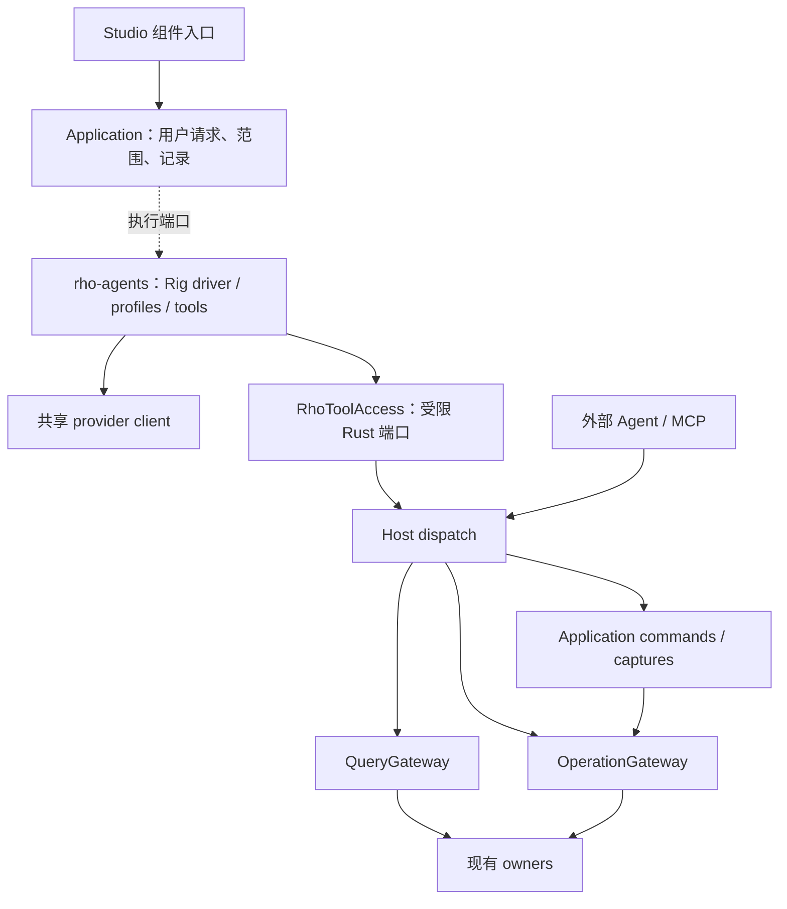

# Rho 内置组件 Agent：实施计划

原计划日期：2026-09-12，原代码基线：`3f0d2d70`。2026-09-14 统一 Agent 修订纳入本计划。
状态：**已授权实施；当前实现与验收结论以 STATUS 为准**。

本文定义具体实施范围；接入与运行证据以 STATUS 为准。统一 Agent 界面与 A20 人工交接
已由用户审阅授权；后续新增交互按项目规则另行审阅。
需求依据是用户提供的架构评议及后续讨论，最终约束为：采用现成 Agent 引擎，
避免自研循环，把组件作为统一 Agent 的上下文入口，并共享 Rho 的真实科研系统。
实施进度只记录在 [STATUS](STATUS.md)，本文件不追加完成历史。

## 1. 实施结论与第一版完成定义

采用 **Rig 的现成 AgentRunner + 一个 `rho-agents` 集成 crate + 组件配置**。
Rho 负责上下文、授权范围、工具入口、应用记录与 UI；Rig 负责模型/工具循环和流式驱动。
使用现有 Tokio、Serde/Schemars、tracing、ApplicationStore 与 rusqlite。

第一版完整范围：

1. Objects、Packages、Plots、Documents、Console/Workspace、Files/Project、
   Environment/R Sessions 七类入口都有可用的组件助手。
2. 所有入口共享模型连接和一个助手呈现区域；按需创建运行，不为每个面板常驻一个进程。
3. 支持有证据的解释、代码建议、授权范围内修改草稿、保存并运行、核验输出。
   只完成只读演示不算整个第一版完成。
4. 支持流式反馈、停止、预算、过期上下文、并发窗口冲突、断线与 Host 重启后的核实。
5. Codex/Kimi/DeepSeek 的 Rho 接入边界继续工作；第三方 Agent 自身能力不属于独立验收范围。
   关闭或未配置内置 Agent 时，科研工作台完整可用。
6. 一条真实闭环可以完成：选中失败执行 → 解释错误 → 在授权下修改脚本 →
   保存并在明确会话运行 → 读取真实图像 → 在 Plots 中定位 → 返回证据链接。

采用以下默认产品选择，实施时不必重新进行技术选型：

- 用户主动发起；浏览对象、切换面板、启动 Rho 不触发模型请求。
- 先提供用户配置的远程模型服务，以及已有本地推理服务的连接。
  “内置”指引擎内置；第一版不承诺附带权重或免配置离线推理。
- 每次运行固定一个明确模型；不自动转发到第二家服务。
- A20 人工交接草稿已由用户审阅授权并实现；实际验证范围以 Status 为准。
  不运行 Agent 互相聊天、递归委派或后台长期目标。
- Environment 助手负责解释版本、依赖与恢复条件，保留现有包管理产品边界。
  本计划不开放安装、升级、清理环境或切换运行环境的自动操作。

## 2. 必须明确改变的架构边界

原代码基线将 Agent 行为交给外部平台；当前 [Architecture](ARCHITECTURE.md) 和根
`AGENTS.md` 已允许可选的内置 Agent，保持以下所有权边界：

> 科研 owners 负责观察、解释原生状态、执行与恢复。Agent 行为由外部平台或可选的
> 内置组件助手负责。内置助手复用 Rig 驱动，通过同一套受校验的 Host 端口工作。
> 科研 owners、Operation、运行时适配器不承担 Agent 规划或模型调用。

授权归属也随之明确：外部任务仍由原生平台决定权限；内置任务的授权范围由
Application 的用户发起记录确定，科研层只执行机械校验。同一已授权动作不增加第二次批准。
模型不能修改自己的工具范围、目标窗口、用户身份或模型服务设置。

继续保留以下规则：

- Owner 是相应领域的解释与协调者；文件、R 和作业仍可能受到外部修改。
- 所有科研写操作进入现有 OperationGateway，查询进入 QueryGateway。
- Application 命令继续使用窗口、文档版本和捕获关联；不让模型直接操作浏览器 DOM。
- 采用现有 `workspace_instance_id`、原生 `session_id`、文档版本和文件摘要。
  不添加全局 scientific revision，也不把示意的 generation 名称强行替换现有身份。
- 使用已有 `Accepted / Running / Reconciling / Succeeded / Failed / Cancelled / Uncertain`。
  不为接入 Rig 重写科研操作状态机。
- Agent 对话是应用记录，科研成功仍由原始 Operation、原生状态和产物证明。
- 内置 Agent 不直接依赖 R、Git、SQLite、SSH 适配器，也不通过本机 MCP/HTTP 绕一圈。

补充两处材料中的概念校正：当前 R 的常驻执行由 Workspace 的 R 适配器完成，
并非必须通过 `Execution` 模块；Objects/Plots 等组件 profile 也不意味着新建同名后端 owner。

## 3. 技术选型及已核实的事实

| 位置 | 决定 | 依据与限制 |
| --- | --- | --- |
| Agent 引擎 | 首个验证版本锁定 `rig = "=0.42.0"` | 使用公开 facade，不照搬旧版 rig-core 包别名示例；P0 验证当前工具链与具体 features |
| 循环与流式执行 | `AgentRunner` 的现成 driver | 不手写 Thought/Tool/Observation 循环；应用生命周期记录不等于自研 Agent 状态机 |
| 动态工具 | `DynamicTool`、`ToolContext` | 从既有能力描述生成工具，并注入 Host 可信上下文 |
| 持久化 | 现有 `rho-sqlite` / rusqlite | 不新增 sqlx，不启用 Rig 的独立 SQLite memory store |
| 内部调用 | Rust 端口 → Host dispatch | 保留校验与调用者；不直接调用 handler/runtime |
| 外部协议 | 现有 `rho-mcp` | 本轮不升级 rmcp，不给组件助手另开 MCP server |
| 模型 | Rig 支持的 provider，经实际协议验证后启用 | 第一版落地一个兼容服务配置和一个本地 endpoint 配置；模型 ID 不写死 |
| 本地模型加载 | 后续独立工作 | 不引入 Python sidecar、mistral.rs 权重管理或 GPU 调度作为首版依赖 |

2026-09-12 通过 Context7 与版本化官方文档核实：

- [Rig 0.42 facade](https://docs.rs/rig/0.42.0/rig/) 区分可移植核心与 classic Agent runtime。
  首版只启用实际使用的引擎/网络功能，不引入向量库、搜索代理等附加集成。
- [AgentRunner](https://docs.rs/rig-agent/0.42.0/rig_agent/agent/runner/struct.AgentRunner.html)
  提供 stream、hooks、tool_context、tool_concurrency 与 max_turns。
  `max_turns` 计算模型调用总数，包含初始调用、重试和续接，不能误当成工具调用数。
- [ToolContext](https://docs.rs/rig-agent/0.42.0/rig_agent/tool/struct.ToolContext.html)
  的类型化输入和结果元数据不发送给模型，适合承载可信调用上下文。
- [DynamicTool](https://docs.rs/rig-agent/0.42.0/rig_agent/tool/struct.DynamicTool.html)
  是已发布接口；具体构造与 JSON Schema 兼容性在 P0 编译验证。
- [AgentRun](https://docs.rs/rig-agent/0.42.0/rig_agent/agent/run/struct.AgentRun.html)
  有可序列化运行状态。这不证明 Rho 科研调用能安全自动续跑；首版不持久化并自动回放它。

以上是制定计划时的文档证据；后续编译和真实模型验证结果只记录在 STATUS。
已有 Kimi/GLM 的接入观察只描述当时的原生 CLI 路线，不是第三方 Agent 的独立能力认证，
也不证明同一服务能被 Rig 直接调用。
P0 必须验证流式工具、多模态和取消行为，不能用“OpenAI-compatible”标签代替验收。

## 4. 模块与依赖设计



Host 负责装配实现与生命周期；上图不是要求每个 domain 再新增 Host 业务函数。

拟修改位置：

| 文件/模块 | 具体工作 |
| --- | --- |
| `crates/agents/`，包名 `rho-agents`（新增） | `lib.rs` 接入 Application 执行端口；`registry.rs`/`profiles.rs` 定义角色；`tools.rs` 转换工具；`context.rs` 整理模型上下文；`runner.rs` 包装 Rig driver；`provider.rs` 构造 provider |
| `crates/contract/src/component_agent.rs`（新增） | 请求、来源引用、授权范围、运行摘要、事件和设置 DTO；不暴露 Rig 类型 |
| `crates/application/src/component_agents.rs`（新增） | 组件会话、请求准入、CAS、运行/工具记录、查询与停止语义；定义执行器/工具访问/记录端口 |
| `crates/adapters/sqlite/` | 给 ApplicationStore 增加组件助手表与事务实现，沿用当前项目/principal 可见性 |
| `crates/host/src/component_agents.rs`（新增） | 装配服务；实现受限工具端口；连接项目、会话及 Host 生命周期 |
| `crates/host/src/agent_context.rs` | 提取可复用的来源验证/媒体读取；对原生输入转换继续保留其原有出口 |
| `crates/workbench/src/component_agents.rs`（新增） | 经过现有认证和窗口校验的薄路由 |
| `ui/src/component-agents.ts`、`component-agent-ports.ts`（新增） | 单一客户端状态模型、范围、事件游标、草稿和请求命令 |
| `ui/src/host-client.ts`、`studio.ts`、组件 renderer | transport 接线、生命周期、Ask 入口和共享助手视图；面板不直接发请求 |
| `ui/src/panels/` 与设置页 | 共用已有输入、上下文、活动和证据呈现组件；内置助手设置 |
| Cargo workspace、架构/前端 boundary checker、governance | 注册新 crate、允许依赖、源区域和对应检查 |

依赖方向：`rho-agents → rho-application + rho-contract`；
`rho-host → rho-agents`；`rho-sqlite → rho-application` 保持不变。
Application 仅持有执行端口定义，不依赖具体引擎。Rig 类型仅存在于 `rho-agents` 内部。
不会新增 `AgentGateway`、科研 `AgentOperation`、跨 Agent bus 或并行事实库。

### 为什么不把 Builtin 塞进现有 AgentProvider

目前 `AgentProvider` 是 Codex/Kimi/Deepseek 原生程序枚举。
`AgentTask`、`AgentAttachment`、`StoredAgentTask` 分别包含原生会话、连接、进程所有权、
原生 quiet/resume 等语义；AgentTaskEvent 也要求原生会话身份。

首版新增 Application 内的组件助手记录与端口，保留原生任务模型。
复用窗口控制、草稿 CAS、请求摘要和可组合 UI 的机制；不复制整份原生任务服务。
统一的是日常入口和显示组件，不是伪造 PID/native_session_id 或先重写所有外部接入。

现有 `AgentContextReader::query` 将非 ready 转为错误并只取 data，不能直接作为
通用模型工具出口。新工具端口保留完整 QuerySnapshot，包括状态、来源、时间、完整性和续读。

## 5. 七个组件 profile 与实际工具范围

新请求的 profile 只标识入口与初始来源，不再决定权限、工作方式或预算。
所有入口按同一权限策略使用 Host 实际提供的工具；工具引用共享注册表，
不复制另一套科研 schema，也不编造不存在的 `objects.compare`。下表描述各入口的初始上下文。

| Profile / 入口 | 用户场景 | 读取与动作 |
| --- | --- | --- |
| Objects | 解释结构、大小、维度，比较两个已选对象 | `workspace.list_objects/observe_object/read_object`；解释和比较先使用有界观察；用户要求的后续脚本工作由统一任务处理 |
| Packages | 解释版本、安装副本、函数用法或来源 | `workspace.packages/package_index/read_help`；查看不加载/附加包，不安装/更新，不从当前仓库推断安装历史 |
| Plots | 解释选中图、比较两张图、查产生它的执行 | `workspace.list_outputs/read_output`、`output.view`、原操作；显示原始媒体引用，有视觉能力才做图像判断 |
| Documents | 解释选区、改写函数、修复代码 | `application.read_document/context`；获授权后 EditDocument/Save/RunFile，保留文档版本与捕获 |
| Console / Workspace | 解读错误，定位失败队列，运行明确代码 | runtime/console 状态、原操作、包与有界对象观察；按任务需要选择 `workspace.run_r` 或 captured Run；只控制本次关联操作 |
| Files / Project | 找相关脚本、解释项目、完成一段跨组件分析 | `project.list_directory/read_text/search_text`、原操作与所选来源；按任务需要 Open/Create/Edit/Save/Run 文档；不默认开放任意进程/SSH |
| Environment / R Sessions | 解释会话版本、环境绑定、恢复副本限制 | `environment.observe`、运行会话/恢复目录的既有查询；可定位到管理页；生命周期和包管理变更仍不属于 Rho Agent 工具范围 |

新权限路径下所有入口共享相关查询和文档/执行能力；例如 Objects 入口可以打开或创建
项目脚本，编辑、保存并在原先绑定的 R 会话运行，无需切换工作模式。
Core Packages 的只读查看边界不因入口统一而改变；正常授权 R 分析可以使用已安装包，
包括 library() 和 namespace 调用，不能借此安装/更新/移除包或修改 library 配置。
所有入口可在范围内读取 `host.describe`、`host.resolve_context`、`skill.list/read` 和
原始 Operation。具体能力的可用性与参数以 Host 注册表为准；恢复/会话查询沿用其真实名称。
Packages 等缺少活 R 的场景应解释不可用原因，不启动另一个 R 来填补观察。
模型工具名若需将点转换为下划线，记录可逆映射并检查重名；最终校验仍用真实 capability ID。
Provider 需要展开 `$ref`、限制 schema 深度或去掉不支持的展示关键字时，只生成派生 schema，
不修改 Host 原始契约；派生失败就标记该工具不可用。调用时对完整输入再次按 Host schema 校验。
由 Host 注入的身份/目标字段不允许被模型参数覆盖，原始字段与实际送模字段的映射可检查。

### 授权方式

输入区保留 Ask / Auto approval / Full access，不提供 Explain/Edit/Run 工作模式。
`ComponentAgentGrant.permission_policy` 与工作类型分离；旧 `mode` 字段只保留当前受支持
记录的读取及原恢复语义，不做废弃数据导入。

执行 Agent 在正常任务处理中通过 `rho_task_intent` 一次解释当前原始请求：绑定 request ID，
引用原文，列出有限 create/edit/save/execute 动作与明确 document ID 或项目相对路径。
Application 核验并冻结该 intent；它不是前端模式，也不调用另一个模型做审批。
后续业务工具不接受自由 scope、authorized 布尔值或批准绕过参数。来源、附件、Skill 正文
和工具结果不是用户请求，不可变为 intent 的授权依据。

Ask 复用原请求明确授权的动作，对额外有副作用的动作显示具体待决请求。Auto 使用确定性
规则，覆盖已绑定项目内的文档创建、修改、保存和指定 R 会话执行；额外的未匹配动作才询问。
Full access 放行当前支持范围内的其他动作，仍不能绕过机械校验。回复绑定原 action digest、
请求和控制窗口；不同参数不能复用答复，Stop 后不能释放旧待决动作。

Application 记录有效策略、固定模型、来源和目标范围；科研 owner 只校验身份、schema、
路径、文档版本、R 会话及原生前置条件，不另加批准。明确“修复、保存并运行”不逐工具重问。
仅解释请求的 intent 不包含写入授权；额外动作由明确策略规则或具体用户答复处理。

未预选的文件通过 Application Open/Create 获取原生文档回执并登记有限目标，再执行 Edit/Save。
文件落盘复用 Application Save 和已有 Project 操作。`workspace.run_r` 仍具有真实 R 副作用；
权限策略、进程监督和恢复记录都不是操作系统文件或网络沙箱。

## 6. 一次运行的具体协议

当前实现沿用下列 DTO/端口流程；这些应用接口不是新的科研能力：

1. Studio 以稳定 `request_id` 发 `ComponentAgentStart`：组件、用户文本、当前窗口引用、
   来源引用、模型配置引用、有效权限策略。请求去重的身份在发送前可靠保存。
2. Application 验证项目/principal、窗口 incarnation/控制权、允许范围、已有运行与预算，
   持久化规范化请求与摘要后返回 `run_id`。同 ID 同内容返回原记录，内容不同拒绝。
3. 服务从现有 owners 读取上下文，记录实际观察来源。模型看到必要内容；Host 可信 CallContext
   留在 ToolContext，调用者标为 Agent，principal 继承已认证用户，工具范围取交集。
4. Registry 以用户授权、权限策略及当前能力可用性生成本次 ToolSet；组件 profile 提供上下文。
   首版一轮内工具调用串行。
   不把公共模型参数设计成可任填的 HostRequest、scope 或当前窗口。
5. Rig AgentRunner 驱动多轮。模型发起工具时，RhoToolAdapter 再验证范围、身份与原生前置条件，
   先记录工具意图，再调共享端口。长 R 操作先得到 accepted receipt，后续只观察原 Operation。
6. 结果保留原始错误、busy/stale/uncertain、产物身份和续读信息，再交给模型。
   UI 工具状态来自记录；流出的“我完成了”不构成科研成功。
7. 回答与有类型的 evidence references 一起存入 Application。
   UI 的成功标记必须关联已核实的终态；解释性结论仍标为模型推断。

HTTP 控制面使用 `/api/agents/components/query`（运行、事件、回执、设置等只读观察）和
`/command`（start、stop、权限答复、完整 draft/control、configure）；专用 `/credential`
处理密钥写入，`/context` 与 `/context/search` 预览来源，`/test` 发起独立测试。
`/asset/upload` 上传实际附件，`/asset` 按授权身份读取。Continue 是 Start 中的显式引用，
并非另一个秘密传输或科研执行入口。
端点属于 Application 控制，不把模型推理登记成科研 Operation，也不让外部 MCP 默认触发内置模型。
复用 loopback、bearer、Origin、窗口与项目检查；原 MCP 专用凭证不能控制这些端点。

### 上下文与证据

每次绑定 canonical project、principal、window/incarnation、组件/view、
`workspace_instance_id` 和 `session_id`（适用时）、文档/选区版本、文件摘要、对象观察、媒体引用。
来源不存在、过期或权限不足时保留原因。点击发送之后切换面板，不会改变已接受请求的目标。
后续每次工具执行仍核实当前状态，不把“开始时检查过”当作全程有效。

不发送全局 Environment、整个大表或完整库列表。按问题读取小块；长文本与大表继续使用 owners
的分页规则。图像从 Output owner 的已验证原件/预览读取，不能把本机存储路径交给 provider 抓取。
Skills 只读取已声明和可访问的源，正文作为方法上下文；不会调用 Rig 的文件 loader 扫描私有目录。

Evidence references 复用 OperationId、MediaReference、ApplicationDocumentRef、观察引用和文件摘要。
回答不拥有对象/产物副本，也不新增 PROV 数据库。过期的对象引用可用于解释历史，但不能当作活引用调用。

## 7. 应用记录、停止和恢复

ApplicationStore 保留以下应用记录；native task、Rho conversation 和科学 journal 的所有权分开：

| 记录 | 关键字段与事务 |
| --- | --- |
| Component conversation / draft | project、principal、title/archive、controller、独立 draft CAS；text/context/assets/下一请求 grant 一次保存；不绑定面板挂载 |
| Run | run/request ID、输入摘要、入口、模型快照、权限策略、冻结 intent、精确目标、context/assets refs、Host incarnation、状态、usage、终态原因 |
| Tool receipt | run + 模型调用序号 + tool_call_id、参数摘要、稳定 client_request_id、application command/Operation ID、原始结果引用、未确认阶段 |
| Bounded events | sequence、run_id、文本片段/工具/状态/证据、时间；终态即时提交，其余合并；游标只指向已持久化事件 |

普通同会话下一轮带入有界历史：最多八轮/24 KiB，前用户文本、回答和 owner refs 均有单项上限，
截断和不完整状态明确标记。不带入原工具结果 JSON、binary、旧 grant 或 frozen intent；新请求的
原文是本轮授权依据。显式 Continue 则复用已核验的原 intent 和结果，不能扩大范围。
原 R instance/session 仍要有效，不要求它等于窗口当前选中的 Console。

科学 journal 与 ApplicationStore 不假设跨库原子事务。
通过“工具意图先落盘 → 使用同一稳定请求 ID → 记录关联回执 → 查原始结果”跨越崩溃窗口。
Rig 原生会话状态不进入长期数据库格式。新增表采用 additive schema change，
保留当前有效原生任务记录，不添加废弃实现的数据导入。

运行展示状态使用 Queued、Running、Waiting for R、Waiting for permission、Needs input、Stopping、Completed、
Stopped、Failed、Interrupted 等应用状态；科学操作终态始终分开显示。
Completed 表示助手运行完成，不能覆盖失败/不确定的科学证据。

| 时点/事件 | 行为与验收依据 |
| --- | --- |
| 工具意图尚未落盘失败 | 不 dispatch；不得执行一个无法追踪身份的写操作 |
| 意图已存，dispatch 前崩溃 | 先查同 request ID 的 owner 回执；只有确认原请求未提交才允许显式继续，不猜测 |
| R 已接受，但回执丢失 | 查同 request/Operation，不提交第二段代码；不能把超时转换成新请求 |
| Application Open/Create 已 Applied，组件回执未写完 | Reconcile 从原 owner 回执恢复精确 path/ref，跟随已确认文档后继并核对当前版本；Continue 不重复创建，用户后续改稿保留为不确定 |
| Tool 已完成，模型回答丢失 | 保留实际结果；显式 Continue 可基于原结果做新模型调用，不回放工具 |
| 模型用新 call ID 重复请求相同 mutation | 不仅做 call ID 去重；对同 run、同规范化动作/目标/前置条件识别可疑重复，返回原记录；有意重复需新的明确动作身份 |
| 页面断线/关闭 | 已接受运行由 Host 管理；重连观察原 run；默认不自动取消科学操作 |
| Stop | 先禁止后续模型/工具 dispatch；停止模型等待；对本次绑定的活动/排队 Operation 按现有取消协议处理并核实；绝不停止同会话的其他工作 |
| 模型请求取消后 | provider 可能已处理或计费；本地拒收旧代输出，不宣称远端已撤回 |
| Host 崩溃 | 非终态 run 标 Interrupted；显式 Continue 先核实 tools/科学操作和新上下文，不自动恢复 AgentRun |
| R 重启/文档变化 | 原请求目标失效，拒绝继续写入；保留提案及旧证据，不悄悄改投当前会话 |
| 两窗口/重新控制 | CAS 与 controller generation 排除旧窗口写入/停止；模型晚到回包按原代隔离 |
| stdin | 显示现有原生输入请求交给用户；不让模型代填秘密，不把输入写入 Agent 历史 |
| Quit / 关闭内置功能 | fence 新运行和晚到工具，处理关联操作后使用原有 Quit 保护链；接受过的科研记录不随开关删除 |

科学调用一经接受，必须由 Host 保持所有权；取消 Rig future 不得同时丢弃对原操作的跟踪。
所有带副作用步骤都必须通过上述持久回执门，不能只依赖 prompt、Rig hook 或内存去重。

## 8. 模型设置、预算与退化

第一版设置字段：启用开关、provider 类型、base URL、model ID、图像/工具能力的验证状态、
凭证引用、当前请求预算。只接受明确配置的 endpoint，不扫描原生 CLI 的私有认证。
用户未配置时展示入口及配置引导，普通工作台无错误弹窗、无模型请求。

2026-09-14 用户要求 API key 默认随本机 Rho 配置文件持久保存，重启后继续使用。
保存位置在用户的本地应用配置目录，独立于项目与版本管理文件；界面显示掩码及保存状态，
支持替换、移除。取消密钥有效期选择和每次启动重新输入的要求。环境变量引用可作为可选方式。
原始密钥不进入会话记录、Studio 同步片段、日志或 evidence；无需另建凭证保险库才能保存。
当前实现以 `LocalFile { key_id }` 引用用户配置中的 `rho/model-credentials.json`。
它是普通本地 JSON 文件，采用锁、原子替换和操作系统文件权限；Rho 不另建加密保险库。
设置和会话只存引用。已接受运行捕获本次密钥，替换或移除不会暗中改变它；新请求使用新设置。
现有 Session 引用保留原 Host 内存生命周期，环境变量引用仍可选，均不改变新的默认保存方式。
远程 endpoint 使用 HTTPS；已有本地服务可显式使用 loopback HTTP。

Test 由用户明确触发，使用固定的非项目内容，验证模型连接、schema/tool-call 与流式模式；
图像支持另有明确的合成图验证。失败保留诊断，不假装支持，不自动安装服务或模型。
“已安装 Kimi CLI”不能被解释成“已有可读取的 provider API Key”。

发往模型的内容在发送前可从上下文预览看见；明确标示所选服务。
流式推理仅呈现忙闲阶段，不持久化私密 reasoning；内容 tracing 默认关闭，保留耗时与 usage。
模型输出、文档、包帮助和图内文字均视作数据，不能改变执行范围。

当前服务端预算如下；修改策略或来源入口不会改变运行预算：

| 限制 | 默认 | 规则 |
| --- | --- | --- |
| 模型资源 | Chat/Test 合计准入 10、执行并发 2；每 conversation 1 个活动运行；Test 类最多准入 1 个 | Test 包含排队状态；两个测试不能占满两个执行槽；超额保留原请求身份并明确返回忙碌 |
| 模型调用 | 每运行 12 | 包括失败格式修复；预算耗尽保留已有结果，不重新起循环 |
| 工具调用 | 每运行 16；并发 1 | 页数和字节另外计量；禁止无限 tool batch |
| 单模型请求上下文 | 64 KiB 文本上限，并满足实际模型 token 上限 | 两种限制取更严格值；UTF-8 字节不能冒充 tokens |
| 单运行工具文本累计 | 256 KiB | 已有 owner 限制仍生效；截断标注并保留续读 |
| 输出/图像 | 每模型调用 2,048 输出 tokens；至多 2 张图，每张最多 2 MiB | 受 provider 更小限制约束；缺视觉能力拒绝看图结论 |
| 时限 | 每模型请求最长 120 s；运行计算/观察活动最多 10 min | 等待用户输入单独标记；到期停止新工具并按 Stop 处理已有操作，不制造成功/自动重试 |
| 留存 | 每运行最多 500 事件 / 1 MiB；项目组件记录 64 MiB；Continue 祖先最多 32 个运行 | 沿用受限应用观察理念；活动和未确认回执不得因事件淘汰丢失 |

新运行统一采用 12/16/10 分钟，历史按 mode 区分的预算不再是新任务入口。
用户附件实际上传到 Application 资产存储：UTF-8 文本每份最多 32 KiB，PNG/JPEG 每张最多
2 MiB；发送时附件与来源合计最多 16 项，两类图像合计最多两张。共享资产存储按任务/会话
隔离，最多 64 份 / 32 MiB，送模前校验原字节和 hash。`Scientific` 与 `Attachment` typed
origin 区分原生图和用户上传，不给附件伪造 MediaReference。

usage 保留提供者 source 与 session_total/turn_total/context_window scope；相同观测的
新 total 替换旧值而不是求和，缺失 token、缓存或 reasoning 计数保持 unknown。
没有价格证据不估算费用。Scientific work 单独读原 Operation/Outputs，不把 Agent Ready
当作科学完成；外部新任务按 `task:<id>` 精确归因，旧 `local-mcp` 任务显示归因不可用。
过载、网络失败或模型不可用时，用户仍能编辑、运行、查看、保存和恢复 R。

## 9. Studio 交互提案与设计门

2026-09-14 用户要求撤销内置/外置界面分区。沿用原来的 **Agent** 面板，
在 Agent 选择菜单中增加 **Rho**，与 Codex、Kimi、DeepSeek Harness 并列。
任务列表、对话布局和输入框统一；模型设置进入 **Settings → Agents → Rho**。
组件 **Ask about…** 入口附带当前选择，用户仍能查看、移除或补充上下文。
来源不会静默切换任务的 Agent，也不会改变已接受运行的目标。
后端保留各自的会话、执行与恢复机制；现有任务保留名称、历史、草稿和原生权限。

界面显示：问题/来源 → 当前活动 → 解释或代码提案 → 真实执行与证据。
权限选择沿用 Agent 的 Ask / Auto approval / Full access 等选项。
解释、编辑、运行由 Agent 按需求决定，不作为用户输入前必须选择的模式。
不显示 Rust trait、Operation envelope 等实现概念。
对象比较、图像证据打开、文档修改沿用现有组件命令。

独立 Built-in Assistant 评审页已按要求删除。所有相关设计归入原来的
[Agent · 工作区任务设计评审](https://app.paper.design/file/01M1XBMB0B5QB82XMDV0Z6VHET/6-2)：
A03/A08 展示统一选择和 Rho 新任务；A15–A19 展示对象来源、编辑运行证据、
双图比较、统一模型设置及窄面板恢复。具体约定见 [Design 第 18 节](RHO-DESIGN.md#18-rho-in-the-unified-agent-panel--review-revision)。
当前源码已接统一 task projection、会话/输入框和设置；执行与视觉验收结论见 Status。
共同投影从原 native/Rho owners 读取，不建立第三套任务或结果库。A20 人工交接草稿
已由用户审阅授权并实现；实现与验证结论仍以 Status 为准。
设计验收检查 320 px 组件区域以及 600/1024/1440/1920 px 窗口，使用真实长度内容。
产品文案用英文，中文输入保留已修复的原生 IME 组合行为。

## 10. 分阶段实施和可评审交付

以下保留原 P0–P5 的依赖和验收门；原串行估计为 **17–26 个开发日**，不是当前剩余工期。
本轮统一任务、权限、凭据、附件、归因和展示修订仍按相应验收门核验；当前进度只见 Status。
数百行可以做演示，不能据此估算可靠持久化、取消、模型设置和七组件验收。

| 阶段 | 工作与交付 | 退出门 | 估计 |
| --- | --- | --- | --- |
| P0：Rig 可行性 | 在隔离试验中锁定 0.42；现成 runner + 动态只读工具 + ToolContext + 假 provider；测 build/features、流式、回调、取消、schema、图像与 max_turns | G0：不自研循环即可满足工具意图持久化/调用身份注入；fake tests 全过；一个实际配置服务的工具/图像 smoke 有独立记录，缺配置明确未验证 | 1–2 日 |
| P1：边界与应用基础 | 更新架构规则；新 crate/contract/ports/store；run 与 tool receipt 准入、去重、模型配置及禁用路径 | G1：无模型也可测试全部准入与隔离；新表不影响原生 Agent 数据；依赖检查、契约/SQLite/应用测试通过 | 3–4 日 |
| P2：只读纵向闭环 + Paper | Objects 起步，随后 Packages/Plots；共享上下文与证据，真实模型读真实 R；在统一 Agent 评审页维护组件场景并实现共享 UI | G2：三类读取与来源定位可用；不新增科研 Operation；视图操作零模型请求；审阅与浏览器证据齐全 | 3–5 日 |
| P3：授权执行闭环 | Documents、Console/Workspace、Files/Project；Edit/Save/captured Run、直接受限 R 执行；原操作等待/失败与图像核验；Environment/R Sessions 解释入口 | G3：七入口可用；真实失败→修复→运行→图闭环；越权、过期草稿和跨会话请求均拒绝且不产生副作用 | 4–6 日 |
| P4：恢复与资源纪律 | Stop、超时、重复模型 call、崩溃点、重连、双窗口、输入等待、禁用/Quit；预算和事件淘汰 | G4：每个崩溃窗口最多一次科研 dispatch；所有不确定状态保留；不取消他人工作，核心分析可独立运行 | 3–4 日 |
| P5：完整验收与文档 | 回归第三方 Agent 接入边界、科学与 Studio 能力；Rho 七 profile 场景、内置助手真实模型验收、性能比较、使用说明 | G5：下节矩阵全部有合适范围的证据；未测项如实列出；构建和安装/发布明确分开 | 3–5 日 |

P0 若发现具体 provider 或必要 Rig hook 不能满足约束，先记录最小复现并调整适配方式/锁定版本。
不得以失败为由悄悄改为自研 Agent、引入 Python sidecar 或跳过写操作持久化。
需要更改选型时，将可比较的实验结果带回此设计决策。

后续变更保持可单独评审的边界，不建立七套 Agent 循环，也不把新增源码等同于验收完成。

## 11. 验收矩阵与测试入口

本矩阵评估 Rho 内置助手及 Rho 负责的接入边界。第三方 Agent 的能力、回答质量、
图像识别与其独立生命周期不属于 Rho 的独立验收范围。Rho 负责接入身份、协议传递、
权限、草稿、回执、Rho 自身恢复和原生用量的如实呈现，这些契约可以使用确定性协议
fixtures 验证。Kimi 图片回答等第三方表现不阻塞 Rho 完成；已经产生的日志与失败记录
仍按原事实保留，不改判为通过。针对 Rho 内置助手的真实模型验证仍按其明确范围记录。

| ID | 必须证明什么 | 权威证据 |
| --- | --- | --- |
| A01 | Rig 被复用，依赖不泄漏 | 锁定 Cargo.lock；P0 编译；architecture allow/reject fixtures；其他 owners 无 Rig import |
| A02 | 关闭/未配置时没有模型开销 | fake provider 请求计数为 0；正常编辑/执行/查看测试与打开组件网络记录 |
| A03 | 内外 Agent 同一科研事实 | 同一 fixture 的 direct-port/MCP 查询逐字段核对（排除明确不同的时间/传输字段）；同一操作读回一致 |
| A04 | 权限、冻结 intent 与原生范围约束真实生效 | 故意构造 run_r、泛化 application.control、路径越界、改 session、Skill 注入；拒绝后检查 journal/文件/R 没有目标副作用 |
| A05 | 状态与范围持续准确 | busy、expired、partial、R restart、文档版本变化；不能拼接新旧观察或覆盖后来输入 |
| A06 | 写入不盲目重放 | 对 intent 前后、accepted 前后、tool result 前后注入崩溃；统计原生执行/文件追加次数与回执身份；含模型新 call ID 重复动作 |
| A07 | Stop 与 Quit 后果准确 | 排队、运行、stdin、provider 静默、晚到工具、另一个 session 同时执行；核实真正终态与未受影响工作 |
| A08 | 产物与结论有来源 | 真实合成图/对象与 manifest 摘要；仅保存文件却无 Plots 产物时不能宣称已显示；误报成功不能变成 UI 成功 |
| A09 | 七 profile 完整 | 每个入口至少一条成功、一条不可用/范围不足场景；包含无预选文档的通用任务与 Objects→脚本闭环，包/环境管理边界保持不变 |
| A10 | 交互可用 | Paper 审阅；Chrome 的窄/正常/宽、键盘、IME、上下文固定、多窗口、关闭重开、外部任务切换及截图 |
| A11 | Provider 与数据处理 | 假服务收到的请求不含 secrets/私有身份；远程/本地连接测试分记；图像能力失败不冒充成功；内容 telemetry 关闭 |
| A12 | 资源与历史有界 | 超并发、超调用、超 byte/token、巨大工具批次、事件上限；控制读取仍可响应；回执与活动引用不被淘汰 |
| A13 | 旧能力不回归 | 原生 CLI 接入的确定性协议 fixtures、MCP、R 运行、包/对象观察、Rho 恢复与草稿的既有测试；没有导入或改写原生用户配置 |

对应测试位置：`crates/agents/tests/`、`crates/host/tests/component_agents.rs`、
`ui/tests/component-agents.test.ts`、`ui/e2e/component-agents.spec.ts`。
新增 `scripts/test-component-agents.mjs`：默认 fake provider；`--real-model` 为显式真实模型验收，
使用临时项目/Host，输出原始模型请求摘要、工具轨迹、Operation 回读、图像摘要与判定。
后端与脚本现已实现；`--real-sources` 还会运行真实 R 来源、文档修复、Continue 和生成图像验收。
统一 UI 已有单元/Chrome 测试入口；A20 设计已审阅授权，交接测试随实现补齐。各项实际执行记录以 Status 为准。

A03 的 `crates/mcp/tests/component_fact_parity.rs` 使用真实 R、本地 HTTP 假模型和
真实 Rig 驱动，对比内置工具、直接 Host、MCP 的原生操作与查询结果；仅排除观察时间。
测试同时核对只新增一次执行、后续读取不新增科学事件，已纳入 `scripts/test-real-r.mjs`。

历史基线为七入口各一例，加两条修复/运行场景，各重复三次，共 27 次。
该证据只覆盖当时版本，不能替代本轮独立权限、统一前端、动态目标和附件的验证。
当前 `scripts/test-component-matrix.mjs` 定义 11 类场景、每类三次，共 **33 次**：
原七入口与两条修复，加 `generic-new-task`（无预选文档创建脚本）和 `objects-script`
（Objects 入口打开未选脚本）。真实模型路径使用 Ask 策略和冻结原任务 intent，
不切 Explain/Edit/Run；保留旧模式的必要兼容单测。

33 场景矩阵目前仅完成定义，尚未执行：可用模型密钥尚未提供。历史 27 次结果继续作为旧基线。
越权、重复执行、错误目标或伪造产物任一发生都不能计为通过。只测一个 provider 时仅描述
该 provider 的证据；本地服务独立记录，不能挪用远程结果。

完整入口为 `node scripts/test-component-matrix.mjs --run`。运行前配置 `RHO_ARK`、
`RHO_R_HOME`、`RHO_COMPONENT_MODEL_BASE_URL`、`RHO_COMPONENT_MODEL_ID`、
`RHO_COMPONENT_MODEL_PROTOCOL` 和 `RHO_COMPONENT_MODEL_KEY_ENV` 指向的密钥环境变量。
默认调用与 `--self-test` 不访问模型；`--run --case=ID` 只运行指定场景，不能代表完整矩阵。
脚本串行构建/执行，固定后端源码指纹，逐次保存日志与 `target/component-matrix/*/summary.json`，
记录模型配置和密钥引用名，不记录密钥。另有独立真实模型普通 follow-up 用例，检验下一轮记得
上轮结果但不继承授权；它尚未执行，也不改变上述 33 场景矩阵计数。失败尝试保留；
该矩阵不替代 Studio、附件和性能验收。

Anthropic 兼容服务的图像排查可使用 `node scripts/test-component-image-wire.mjs --run`。
它要求已构建 `component_source_probe`，沿用上述 R/模型环境变量，并仅支持 HTTPS 根服务地址。
本地转发器保留原始请求/响应，只记录图像哈希、尺寸、块顺序和 HTTP 状态，不记录密钥、
请求头或提示词正文。该诊断不能代替直连模型矩阵。图片及来源标签位于长问题/上下文之前，
采用[官方视觉接口的建议顺序](https://platform.claude.com/docs/en/build-with-claude/vision)；
兼容服务上的效果须单独验证。

来源与修改测试在临时项目中显式使用手动恢复副本策略，排除定时自动副本对操作计数的干扰；
产品默认恢复策略保持不变。图像产物验收检查首行颜色及原始操作／输出引用，与助手的来源引用
要求一致，同时继续检查操作集合、修改次数、产物身份和没有读取源码泄露颜色。

实施期间使用现有命令，Cargo 与类型生成串行：

```sh
node scripts/governance.mjs impact --changed-auto
cargo test -p rho-contract --locked
cargo test -p rho-application --locked
cargo test -p rho-sqlite --locked
cargo test -p rho-host --locked
node scripts/check-architecture.mjs
npm run generate --prefix ui
npm run build --prefix ui
npm run check --prefix ui
npm run test --prefix ui
npm run check:boundaries --prefix ui
npm run test:boundaries --prefix ui
cargo build --locked
npm run test:browser --prefix ui
node scripts/test-real-r.mjs
node scripts/test-workbench.mjs --real-r
node scripts/test-mcp.mjs --real-r
node scripts/test-agent-task-recovery.mjs
cargo fmt --all --check
cargo clippy --workspace --all-targets --locked -- -D warnings
cargo test --workspace --locked -- --test-threads=1
node scripts/governance.mjs check
node scripts/test-governance.mjs
```

新增 crate 后补 `cargo test -p rho-agents --locked`。触及 Quit/会话恢复时补
`node scripts/test-r-checkpoints.mjs`；环境功能改动补 `node scripts/test-environment.mjs`。
第三方 Agent 接入回归默认使用 [Development](DEVELOPMENT.md) 的确定性协议 fixtures。
实际第三方模型运行仅用于另行明确要求的接入调查；缺少依赖或第三方回答失败如实记录，
不作为 Rho 的独立能力验收门，也不据此抹去 Rho 自身应修复的传递或记录错误。

性能使用同机同脚本对照基线：未启用时模型调用数为零；启用并运行时测打字、frame p95、
Stop 首次本地反馈、内存、provider 首 token 和工具耗时。沿用 Studio 的既定测量方法，
新增门为打字/frame p95 相对匹配基线退化不超过 10%，Stop 本地反馈不超过 250 ms；
provider 延迟单列，不把它算成 UI 卡顿，也不伪装固定模型响应时限。
P0 记录发行构建大小和依赖增量，P5 对照；不预先编造开销结论。

## 12. 计划完成审计与后续入口

| 用户材料要求 | 本计划的具体落实 |
| --- | --- |
| 各组件的小 Agent | §1、§5、P2/P3、A09：七 profile，不缩成单个聊天演示 |
| 使用现成引擎，避免重造工程 | §3、§4、G0/A01：Rig driver 与一个集成 crate |
| 内部直接调用真实能力 | §2、§6、A03/A04：共享 gateways 和 Application 捕获 |
| Owner 与 Agent 分离 | §2/§4：依赖图、原生状态与应用记录分开 |
| 工具与上下文受限、运行有界 | §5/§6/§8、A04/A05/A12 |
| 不膨胀成多 Agent 平台 | §1/§4：按需任务，A20 交接草稿已审阅授权并实现，无递归循环/私有向量库 |
| 能继续工作且真实反映执行 | §7、P4、A06/A07/A08 |
| 适配当前仓库而非空泛技术清单 | §4 文件级改动、§10 分阶段依赖和估算、§11 测试命令 |

原 P0–P5 依赖用于约束验收；具体完成情况和下一步入口只记录在 STATUS。
需要实施时取得的是真实模型配置与 Paper 交互审阅，不需要为普通科研查询添加新的批准层。
本计划不以附带本地权重、环境管理插件、跨平台发行或无限项目 Agent 作为隐藏前置条件。
