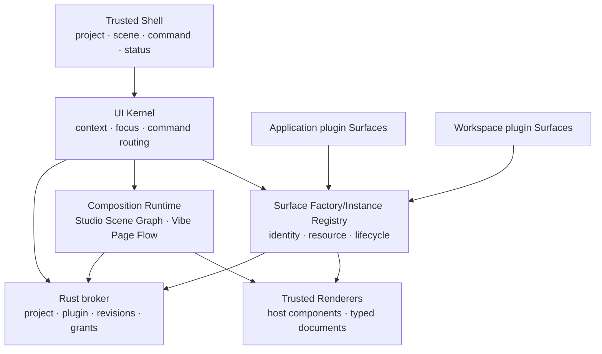

# Plugin-Native Surface Runtime

Status: proposed durable architecture; implementation authority exists only
through `docs/plans/active-2026-08-21-rsr-full-construction-plan.md`

Date: 2026-08-21

Change class: D3 because this introduces a shared UI contribution protocol,
command-routing boundary, focus model, and durable layout schema. Future
implementation risk is R3 because plugin lifecycle, project switching,
revisioned persistence, focus authority, and trusted security surfaces meet at
this boundary. This document remains the architecture source; the active
construction contract records implementation authorization, sequencing, and
accepted evidence.

Working name: **Rho Surface Runtime (RSR)**.

## Decision Summary

Rho should stop treating Editor, Agent, Environment, Evidence, Git, Help,
Console, Problems, Viewer, and Check project as hard-coded panes in one IDE
grid. They should become registered **Surfaces** hosted by a trusted UI kernel.

The trusted kernel owns:

- project and plugin identity;
- surface registration and teardown;
- the user-owned layout graph;
- command resolution and consequence text;
- focus, keyboard, accessibility, theme, and responsive behavior;
- trusted approvals, credentials, updates, permissions, and destructive
  confirmation;
- persistence, revision checks, project isolation, and recovery.

A plugin may contribute a typed Surface and typed Commands. It may not mutate
the root DOM, inject global CSS, imitate trusted UI, choose screen geometry, or
persist layout directly. The user can place any available Surface into any
compatible location in a Scene. This is the intended meaning of “free layout”.

The new product vocabulary is:

```text
Capability   what the component can do
Surface      one visual, focusable projection of that capability
Command      one typed user intent with availability and consequence
Studio       a spatial workbench composition grammar
Scene        a user-owned Studio arrangement of Surface instances
Vibe         a document-flow composition grammar
Page         a systematic Vibe document containing content and Surface blocks
Context      the current project, selection, task, artifact, run, or finding
```

Agent is a Surface, not a second top-level application mode. Ask/Plan/Act remain
broker policy inside the Agent Surface and are not layout concepts.

## Evidence From The Current UI

The annotated 2026-08-21 screenshot exposes one structural cause behind many
local visual problems:

1. the top bar mixes brand, menus, project, branch, posture, layout preset,
   restart, interrupt, Run, and Check project at nearly equal weight;
2. `Human / Agent` and `Code / Analyze / Agent` duplicate the word Agent while
   describing different state machines;
3. the editor toolbar reserves permanent width for many low-frequency actions;
4. the right column uses a long first-level tab row for unrelated domains;
5. the Agent timeline renders many visible state and deletion controls inside
   every conversation object;
6. attachments, model, Agent mode, submission, and status compete around one
   composer;
7. almost every available operation becomes a visible button instead of a
   contextual command;
8. the major regions are understandable, but each region accumulates its own
   independent navigation and action grammar.

The implementation confirms the problem is architectural rather than cosmetic:

- `index.html` contains a fixed top bar, left sidebar, center workspace, bottom
  Dock, and right context panel;
- layout is controlled through CSS classes and hard-coded functions such as
  `applyWorkbenchLayout`, `switchDockTab`, `switchContextTab`, and
  `applyAgentSurface`;
- project session persistence stores only three pane sizes while additional
  posture/surface state also exists in frontend-local emergency state;
- existing plugin UI can enter a Command palette, Viewer, or the single
  `plugin_details` Panel slot, but cannot become an ordinary work surface;
- first-party UI and plugin UI therefore use different composition systems.

Adding another tab, mode button, or fixed panel will make this worse. The next
frontend foundation must remove fixed placement as a component concern.

## Product Model

### Two composition grammars

RSR exposes two top-level presentation modes over the same project, runtimes,
plugin registry, Commands, Context, and Surface instances:

```text
WorkspaceMode = studio | vibe
```

**Studio** is the professional workbench. It starts from a reviewed Rho preset
and uses bounded Split/Stack composition. Users can duplicate a preset, move or
stack Surfaces, resize regions, save their own Scene, and return to the Rho
default. Studio deliberately supports dense editing and analysis without
making the fixed IDE grid the product architecture.

**Vibe** is a document-native working page. Narrative text, headings, tasks,
artifacts, charts, tables, Agent activity, decisions, and interactive plugin
Surfaces appear in one ordered flow. It is not an infinite whiteboard or a
random masonry dashboard: Sections establish reading order, a 12-column grid
controls wide layouts, and the host deterministically reflows blocks to one
column at narrow widths.

Switching Studio/Vibe changes only presentation. It does not duplicate
Workspace R, Agent history, plugin hosts, permissions, Runs, Artifacts, or
scientific state. A file, Artifact, finding, task, or plugin Surface retains one
identity and may be opened as a Studio pane or referenced by a Vibe block.

### Minimal trusted shell

The permanent window chrome contains only five conceptual controls:

1. **Project** — current project and project switching;
2. **Studio / Vibe** — the current composition grammar;
3. **Scene / Page** — current Studio layout or Vibe document;
4. **Command** — search, navigation, and the complete contextual command set;
5. **Status / primary action** — one current primary action plus interrupt or
   attention state when required.

Menus may remain as native discoverability and keyboard compatibility, but they
are projections of the same Command Registry. They are not a second command
implementation.

The default wide layout is intentionally quiet:

```text
+-----------------------------------------------------------------------+
| Project ▾  Studio | Vibe  Work ▾  Search or command…   Status · Run  |
+-----------------------------------------------------------------------+
|                                                                       |
|                 user-owned Scene / Surface Graph                      |
|                                                                       |
|       +----------------------+  +--------------------------------+    |
|       | Editor               |  | Agent / Check / Viewer         |    |
|       | surface-local title  |  | selected contextual Surface   |    |
|       | and 1-2 actions  ··· |  | title · origin · 1 action ··· |    |
|       +----------------------+  +--------------------------------+    |
|                                                                       |
+-----------------------------------------------------------------------+
| optional utility tray: Console / Logs / Problems, collapsed by default |
+-----------------------------------------------------------------------+
```

The graph may contain one Surface. A two- or three-region layout appears only
because the user opened or arranged those Surfaces, not because the shell has
three permanent columns.

### Studio/Vibe replaces duplicated mode controls

`Human / Agent` and `Code / Analyze / Agent` should converge into one
Studio/Vibe composition system after migration:

- Studio/Vibe changes composition grammar only;
- a Studio Scene changes placement and visual priority;
- a Vibe Page changes document structure and reading order;
- it does not start work, grant authority, select Ask/Plan/Act, or create a new
  Workspace R session;
- selecting or focusing a Surface determines which commands are contextual;
- built-in Studio starting Scenes may include Work, Analyze, Review, and Agent;
  users duplicate rather than silently mutate the reviewed Rho presets;
- built-in Vibe templates may include Research note, QC report, and Project
  review, but every created Page is an ordinary user-owned document layout;
- a plugin may make Surfaces available, but it cannot silently replace the
  current Scene/Page or focus itself.

The existing Human/Agent posture and Code/Analyze/Agent controls remain only in
the frozen old frontend while the new shell is constructed. They are not
projected into Studio Scenes and their layout state is not migrated. Durable
documents, drafts, conversations, scientific records, policy, and context-
preservation semantics survive the one-way frontend cutover; the old
presentation model does not.

### Surface-local action budget

Every Surface has:

- title, state, and origin;
- zero or one primary action;
- at most two visible secondary actions at ordinary desktop width;
- one overflow menu containing the rest of its contextual commands.

The shell has at most one ordinary primary action. A running operation may add
one persistent stop/interrupt action. This is a presentation budget, not a
reduction of available commands.

The Command Registry remains the complete and searchable interface. Toolbar,
menu, context menu, keyboard shortcut, command palette, Agent tool projection,
and accessibility action all resolve the same command identity rather than
implementing parallel handlers.

## Architecture



### 1. UI Kernel

The UI Kernel owns the current `UiContext`:

```text
UiContextV1 {
  project_id
  project_revision
  scene_id
  focused_surface_instance_id?
  selection?: file | range | run | artifact | object | finding | task
  workspace_health
  agent_health
  active_operations[]
}
```

Commands and Surfaces observe only bounded typed context fields. They do not
read another component's DOM or mutable frontend store.

### 2. Surface factories and instances

The registry does not register one permanent panel. It registers a **Surface
factory** that can create bounded independent view instances:

```text
SurfaceDefinitionV1 {
  surface_id
  contract_major
  label
  purpose
  renderer_kind
  scope                     // application | project
  instance_policy           // singleton | multi_instance
  instance_quota_class
  resource_kinds[]
  modes[]
  sizing_hints
  accepted_contexts[]
  commands[]
  origin
}

SurfaceModeV1 {
  mode_id
  label
  interaction_kind          // read_only | interactive
}

SurfaceSizingHintsV1 {
  min_inline
  min_block
  ideal_inline?
  ideal_block?
  max_inline?
  max_block?
  stretch_inline
  stretch_block
  presentation_classes[]    // full | compact | strip
}

SurfaceInstanceV1 {
  instance_id
  surface_id
  project_id
  plugin_id
  package_digest
  activation_generation
  surface_revision
  mode_id?
  resource_binding?
  runtime_binding?
  view_group_id?
  view_state                 // host-owned, bounded to 64 KiB;
                             // focus, selection, viewport, local draft only
  lifecycle_state
}

ResourceBindingV1 {
  resource_kind              // project_file | artifact | run |
                             // workspace_console | task | finding | object
  resource_id                // typed ID or normalized project-relative path
  resource_revision?
}

RuntimeBindingV1 {
  runtime_provider_id
  runtime_instance_id
  runtime_kind
  project_id
  activation_generation
  state_revision
  attach_capabilities[]
}

OpenSurfaceRequestV1 {
  surface_id
  mode_id?
  resource_binding?
  runtime_binding?
  instance_disposition       // reuse_exact | new_instance
  placement_intent           // current | beside | stack | container
  expected_project_revision
  expected_layout_revision
}
```

`SurfaceDefinitionV1` is therefore a factory contract, not a visual singleton.
The host allocates every `instance_id`; a plugin cannot forge, reuse, or select
another instance. `reuse_exact` may focus an existing instance with the same
factory and caller-selected binding key. `new_instance` creates an independent view even
when the resource is the same.

`singleton` permits one project instance. `multi_instance` permits any number
admitted by the current project resource budget, including repeated instances
with the same resource and the same mode. Resource or mode equality never
implies deduplication. `reuse_exact` is an explicit caller preference, not a
factory invariant.

Instance quotas are technical resource budgets, not layout geometry. The host
computes them from encoded Scene size, live DOM/view cost, plugin Host memory,
payload leases, and runtime/service policy. A plugin may declare a lower
quota class but cannot raise host limits. Hidden Stack members remain instances
but may be suspended under host memory pressure.

Sizing values are bounded logical-pixel hints, not geometry authority. A
plugin may say that a status Surface works as a short intrinsic strip or that a
plot needs a meaningful minimum size. The user still chooses placement and may
resize within safe minimum/accessibility constraints. The layout solver, not
the plugin, chooses `full`, `compact`, or `strip` presentation from the actual
available rectangle.

Registration is transactional and reversible. A disabled, failed, replaced, or
stale plugin loses its Surface routes before its host is disposed. An open
layout node then shows a trusted unavailable placeholder with Remove and, when
valid, Repair/Enable actions; it never routes to a different plugin silently.

### 2b. Scaling and shared authority

RSR distinguishes four independent scaling dimensions:

1. **view scaling** — many Surface instances from one definition;
2. **resource scaling** — each instance binds a different file, Artifact, Run,
   object, finding, task, or plugin-defined mode—or deliberately repeats the
   same binding;
3. **runtime scaling** — instances may share one authoritative service/runtime
   or bind an explicitly isolated runtime capability;
4. **event scaling** — the plugin Host admits a bounded number of concurrent or
   queued Surface events.

Creating another UI instance never implies creating another Workspace R,
Agent R, process, credential scope, network client, file model, or plugin Host.
Those require their own declared capability and authority.

#### Console example

Any number of Console instances admitted by resource policy is valid. Each has independent
input draft, history position, scroll, filters, and optional origin/channel
view. Every Console explicitly binds one attachable runtime instance selected
from the broker-owned Runtime Registry.

- several Consoles may bind the same runtime, while others bind different R,
  Python, remote, or future runtime instances exposed through reviewed runtime
  providers;
- the Console factory cannot attach to Agent R, a credential-bearing internal
  process, or any runtime that does not declare the exact console-attach
  capability;
- submissions are ordered by the selected runtime's execution lane;
- each run records the originating Console instance without making that
  instance the run authority;
- every Console may show all output for its runtime or an instance-local
  filtered/channel projection;
- interrupt, restart, busy/idle, state revision, and project identity are truth
  of the bound runtime, not of the Console Surface;
- closing one Console removes only that view and its local draft/scroll state.

Opening a Console does not create a runtime implicitly. `runtime.create`,
attach, detach, stop, and dispose are separate broker-owned commands and
policies. Closing the last Console does not stop a persistent runtime; an
ephemeral leased runtime follows its reviewed lease/confirmation policy.

This supports four perspectives over one Workspace R, four Consoles attached
to four different runtimes, or any intentional combination without confusing
visual multiplicity with runtime authority.

#### File source and preview example

A file-capable plugin may expose `source`, `preview`, `diff`, `outline`, or any
other mode, or it may expose separate Surface definitions for those views. RSR
does not define a privileged Source/Preview pair and does not require the same
plugin to provide both.

Opening two files creates two arbitrary instances. Opening one file twice in
Preview, twice in Source, or in any mix of identical/different modes is equally
valid under `multi_instance`. No resource-and-mode tuple is automatically
unique.

Content sharing is a separate resource-provider contract. Two instances may
share one broker/document-session text model, or a preview plugin may consume
only an immutable file/revision snapshot. The Surface Runtime does not assume
either. When a view claims correspondence to source content, its output must
bind an exact content/resource revision and show stale when that revision
changes. Cursor, preview scroll, selected heading, zoom, focus, and other view
state remain instance-local unless a user explicitly links them through a
`view_group_id`.

#### Plugin Host event scaling

Multi-instance UI does not silently widen the accepted Phase 2 Guest ABI
concurrency. Initially, workspace-plugin Surface events enter a fair
per-plugin queue and retain the current one-active-call-per-plugin Host limit.
Every event carries exact project, digest, activation generation, instance,
Surface revision, resource revision, and deadline. A slow instance cannot
overwrite another instance's state, and queue limits fail visibly instead of
growing without bound.

True concurrent guest calls require a later contract-major change with
per-instance cancellation, memory/fuel budgets, fairness, teardown, and crash
tests. Application-plugin Surfaces may use existing broker services with their
already accepted concurrency contracts; the UI layer does not redefine them.

### 3. Studio layout container

Studio provides a recursive layout container, not a fixed Grid catalog. The
same primitive represents one pane, an asymmetric two-pane split, a tiny
status strip beside a large plot, a deeply nested dashboard, or a user-created
four-by-four arrangement:

```text
LayoutNodeV1 =
  Container { axis, children[] }
  Stack { active_instance_id, instances[] }
  Surface { instance_id }

LayoutChildV1 {
  child: LayoutNodeV1
  basis                     // auto | intrinsic | fixed | fraction | minmax
  value?
  min?
  max?
  resizable
  collapse_priority?
}

SceneStateV1 {
  scene_id
  label
  root: LayoutNodeV1
  focused_surface_instance_id?
  utility_tray?: Stack
}
```

Rules:

- there is no semantic row, column, symmetry, or four-by-four limit;
- recursive horizontal/vertical Containers produce arbitrary asymmetric
  layouts, while Stack overlays sibling instances in one rectangle;
- `auto` and `intrinsic` allow a small plugin to occupy a content-sized strip;
  `fraction`, `fixed`, and `minmax` support user-directed proportions;
- dragging a boundary updates the two adjacent child bases under exact layout
  revision and the declared/user-safe minimums; it does not rewrite siblings;
- the encoded Scene is bounded to 1 MiB, depth 32, 256 layout nodes, and 128
  Surface placements as an initial denial-of-service budget. These are storage
  and runtime safety limits, not a visible grid shape;
- move, insert, remove, nest, unnest, stack, duplicate, resize, close, and focus
  are revisioned layout transactions;
- user size choices override plugin ideals within safe minimum/maximum bounds;
  the host may offer Normalize/Distribute commands but never silently makes an
  asymmetric Scene symmetric;
- on narrow windows, user-authored collapse priorities and Stack alternatives
  apply before the host presents overflow; the solver never deletes or
  reorders a Surface to make it fit;
- a plugin may request `open(surface_id, context)` after an explicit user or
  authorized Agent action, but the host chooses placement from user policy;
- plugins cannot write Scene state, create overlays, force focus, or reserve a
  permanent rail;
- trusted approval, credential, permission, updater, privacy, and destructive
  confirmation UI is outside the Scene Graph.

This makes RSR a layout container rather than an IDE template engine. Studio
presets are ordinary initial container trees that users may duplicate and
change; only the immutable built-in preset remains resettable.

### 3b. Vibe Page Flow

Vibe uses an ordered, bounded document tree:

```text
VibePageV1 {
  page_id
  label
  sections[]
  focused_block_id?
}

VibeSectionV1 {
  section_id
  heading?
  layout                    // flow | grid
  blocks[]
}

VibeBlockV1 =
  RichText | Callout | Divider |
  FileExcerpt | ArtifactRef | FindingRef | TaskRef |
  SurfaceRef | CommandRef

VibeGridPlacementV1 {
  block_id
  row_start                 // 1..256; explicit for deterministic overlap checks
  column_start              // 1..12
  column_span               // 1..12
}
```

Rules:

- document order is authoritative for keyboard, accessibility, narrow reflow,
  export, and Agent context;
- maximum 64 Sections and 256 blocks per Page, depth 6, and 24 live Surface
  blocks; large data remains a bounded reference/view, not inline payload;
- a Surface block references an exact Surface instance and typed Context; it
  does not copy plugin state or create another plugin host;
- one live interactive Surface instance appears in at most one active
  placement. Repeating a view creates another instance; a repeated read-only
  mirror is an explicit bounded snapshot block, not a second DOM mount;
- plugins may provide Surface content and optional block-size hints, but the
  host validates explicit row plus 12-column placement, rejects overlap, and
  owns responsive collapse;
- text and plugin blocks share one baseline grid, spacing scale, typography,
  origin treatment, and action budget;
- Vibe Pages cannot host trusted approvals, credentials, permission grants,
  updater UI, or destructive system confirmation inside document content;
- no plugin or Agent may silently insert, reorder, resize, or remove blocks.
  Every Page mutation is an explicit user edit or a separately reviewed
  proposal with exact before/after revision.

Vibe therefore feels like an authored scientific page rather than a dashboard:
the user reads top-to-bottom, while selected Sections can use a systematic grid
to place a plot beside interpretation, a table beside filters, or an Agent task
beside evidence.

### 4. Renderer lanes

RSR supports two initial renderer lanes:

1. **Trusted host component adapter** for application plugins such as Editor,
   Console, Agent, Environment, Git, and Check project. Existing DOM and state
   can be mounted through adapters during migration.
2. **Declarative plugin Surface document** for workspace plugins. This extends
   the accepted trusted-renderer principle without granting HTML/DOM access.

The existing `ViewerDocumentV1` remains unchanged for read-only results. A new
interactive contract is additive:

```text
SurfaceDocumentV1 {
  title
  revision
  blocks[]
}

SurfaceBlockV1 =
  Row | Column | Grid | Tabs |
  Text | Code | KeyValue | Table | Notice | ArtifactImageRef |
  Field | Select | List | Group | CommandButton

SurfaceEventV1 {
  instance_id
  expected_surface_revision
  control_id
  event_kind
  bounded_value?
  expected_project_revision
}
```

The trusted renderer owns element creation, labels, keyboard order, validation
display, theme, and disabled/busy states. `CommandButton` names a declared
Command; it contains no callback or script. An event returns either a new
bounded document or a typed command result after stale identity is rechecked.
The plugin owns bounded content grouping and interaction semantics inside its
Surface through Row/Column/Grid/Tabs descriptors; the renderer owns actual CSS,
minimum sizes, responsive collapse, focus order, and accessible roles.

Raw HTML, JavaScript, CSS, SVG events, iframe/WebView custom applications, and
remote UI resources remain out of the initial contract. A future sandboxed
custom-renderer lane requires a separate threat model and authorization; it is
not implied by “plugin has its own UI”.

### 5. Command Registry

```text
CommandDefinitionV1 {
  command_id
  label
  purpose
  input_schema
  consequence
  availability_predicate_id
  placement_tags[]          // palette, surface-local, primary-candidate
  origin
}

CommandRegistrationV1 {
  definition
  activation_generation
  availability              // presentation state, never execution admission
}
```

Placement tags are host-reviewed hints, not authority. The UI Kernel evaluates
availability against typed current context and chooses visible placement under
the action budget. Destructive, credential, approval, permission, update, and
Workspace mutation commands retain their existing trusted admission and
confirmation contracts.

No plugin command gets a top-level button, default status, global shortcut, or
automatic invocation merely by declaring a tag.

The Wave 2 registry is bounded by both command count and encoded bytes. One
invalid, duplicate, or over-budget workspace-plugin command is omitted without
making first-party commands or the UI snapshot unavailable. Application and
workspace-plugin registrations are sorted by exact command identity; plugin
registrations retain package digest and activation generation. Menus, keyboard
gestures, command search, top chrome, and Surface-local actions only filter this
one registry. The Wave 2 transport exposes no generic execution endpoint.

The broker-facing UI snapshot has its own process-local monotonic revision.
Identical semantic snapshots reuse one immutable cached object; project A/B/A
never reuses an earlier snapshot revision. Snapshot construction is serialized
against the project transition gate and includes only bounded project identity,
Context, split Workspace/Agent health, active operation summaries, selection,
and command registrations. Selection is ephemeral until the project UI profile
owner lands and is accepted only with exact project, project revision, and
snapshot revision. It is never an execution grant.

An instance-local invocation binds `command_id`, optional `instance_id`, exact
resource and Surface revisions, project revision, and layout/Page revision.
Thus `Close`, `Duplicate view`, `Open beside`, `Source`, `Preview`, `Apply
filter`, and `Clear this Console` affect the intended instance or resource
without turning the command definition itself into a singleton.

## State And Persistence Ownership

Layout is local user preference, not project scientific truth and not plugin
state. The broker owns a versioned, project-scoped UI profile:

```text
ProjectUiProfileV1 {
  schema_version
  project_id
  revision
  active_mode                    // studio | vibe
  active_studio_scene_id?
  active_vibe_page_id?
  studio_scenes[]
  vibe_pages[]
  surface_instance_specs[]
  last_focused_surface_instance_id?
}
```

Requirements:

- state lives in Rho's application data, not `.rho/plugins`, project files,
  Workspace R, Agent R, or browser-only local storage;
- project A and B cannot share instances, context references, revisions, or
  plugin generation identity even when paths and plugin IDs match;
- a plugin package update never rewrites layout state directly;
- persisted instance specs contain only factory/mode/resource bindings,
  durable runtime-attachment intent, and host-owned presentation state. Live
  runtime generation IDs are re-resolved after restart rather than trusted
  from disk. Plugin-private runtime state is not persisted unless a separate
  bounded plugin-storage contract is authorized;
- missing/disabled Surface instances become explicit placeholders;
- stale or failed persistence leaves the last durable Scene truthful and does
  not claim a move/close/save completed;
- application crash/reopen reconstructs only current enabled exact plugin
  routes and validates every referenced instance;
- a layout export/import or project-shared Scene file is deferred. It must not
  be guessed from local state or silently committed to a project.

Current `PanelSizes`, posture, layout presets, and frontend-only surface state
are intentionally not migrated. The new UI profile starts from the immutable
`Rho Studio` preset and restores only separately authoritative documents,
drafts, conversations, runtime/scientific records, and plugin lifecycle state.
This removes historical layout ambiguity rather than guessing ownership.

## Plugin Lifecycle And Layout

### Enable

1. validate and activate the exact plugin package under existing Phase 2 rules;
2. transactionally register Commands and Surface definitions hidden;
3. publish routes with exact project/digest/generation identity;
4. show the Surface in the command/search interface;
5. open it only after explicit user action or an already-authorized typed
   workflow requests it.

### Disable, failure, and project switch

1. close contribution routing before host teardown;
2. cancel or reject pending Surface events for every exact instance;
3. replace every affected open instance with an origin-labelled unavailable
   placeholder while leaving unrelated instances intact;
4. preserve the user's Scene structure until they remove or repair the
   placeholder;
5. never move focus to Editor, Console, body, or another plugin implicitly;
6. reject late results by project, digest, generation, instance, Surface
   revision, and project revision.

### Update and rollback

An accepted exact package update keeps a Surface instance only when the new
package declares a compatible `surface_id` and contract major. Otherwise the
instance becomes a placeholder. Cached rollback reconstructs fresh routes and
revalidates the Scene; it never revives an old live host or focus handle.
Closing one instance never disables its plugin, removes sibling instances, or
disposes a shared resource model still referenced elsewhere.

## Mapping The Annotated UI To RSR

| Screenshot area | Current problem | RSR outcome |
| --- | --- | --- |
| 1 top bar | unrelated controls have equal weight | Project, Studio/Vibe, Scene/Page, command search, one primary action/status |
| 2 mode groups | Human/Agent and Code/Analyze/Agent overlap | one Studio/Vibe switch plus Scene/Page selector; Agent policy remains inside Agent Surface |
| 3 editor toolbar | many permanent icon buttons | one primary action, up to two secondary actions, overflow and command search |
| 4 right tabs | unrelated domains share one crowded level | ordinary Surfaces in a user-owned Stack; no permanent domain rail |
| 5 conversation card | status and destructive actions stay exposed | typed activity summary; destructive/rare commands in overflow |
| 6 composer | five control families compete | text/attachment/send remain visible; model and policy move to one context disclosure |
| 7 overall density | every operation becomes a button | one Command Registry with contextual projection and action budgets |
| 8 region clarity | good macro-regions, excessive local chrome | Studio uses Surface regions; Vibe uses ordered content/Surface blocks |

## Complete Construction Direction

The first component remains **Check project**, because its rule engine and
result UI have clear typed boundaries and low ambient authority. RSR should be
proven with one real vertical component rather than an empty framework rewrite.

The complete continuous program is implemented through the owner-authorized
active contract
`docs/plans/active-2026-08-21-rsr-full-construction-plan.md`. Its dependency
order is new React/Vite shell, pure RSR contracts, Command/Context kernel,
Surface instances, Studio container, Runtime/Resource registries, durable UI
profile, workspace-plugin Surfaces, Check project, ProseMirror Vibe, remaining
domain Surfaces, one-way cutover, legacy deletion, and hardening.

The old frontend is frozen during construction. It is neither wrapped as a
Surface nor maintained as a runtime compatibility mode. Repository integration
boundaries stay buildable and automatically verified, but the program has no
planned manual product pauses between them.

## Verification And Failure Matrix

Pure contract tests must cover:

- normal, empty, maximum, just-over-limit, malformed, duplicate, cyclic, and
  excessive-depth Scene graphs;
- unknown Surface, wrong project, stale project/layout/Surface revision,
  changed digest/generation, missing plugin, and incompatible contract major;
- project A/B/A with identical plugin and Surface IDs;
- transactional registration failure, persistence failure, crash/reopen,
  disable, uninstall, update failure, accepted update, and rollback;
- bounded document/event payloads and hostile text/markup/bidi/control input;
- no raw handle, credential, root DOM, Tauri, Workspace, process, or path
  projection.

Multi-instance tests must cover:

- singleton and multi-instance policies with resource/mode equality never
  forcing reuse;
- `reuse_exact` versus `new_instance`, duplicate-view admission, instance caps,
  project caps, queue caps, fair ordering, cancellation, and one-instance
  failure without sibling teardown;
- deeply nested asymmetric Containers, fixed/fraction/intrinsic/minmax sizing,
  drag boundaries, compact strips, hidden Stack members, suspend/resume,
  close-one/keep-siblings, and focus/scroll isolation;
- multiple Console instances deliberately sharing and not sharing runtime
  instances, with interrupt/restart truth isolated to each exact binding;
- repeated identical file/mode instances, separate Source/Preview providers,
  optional shared content models, and stale revision rejection only when a view
  claims correspondence to an exact source revision;
- disable, crash, update, rollback, project switch, and reopen with multiple
  exact instances and unavailable placeholders;
- no live interactive instance mounted twice and no cross-project instance,
  resource, draft, viewport, queue result, or focus reuse.

Vibe-specific tests cover document order, grid overlap, invalid spans, narrow
reflow, block/Section bounds, exact Surface references, stale Page edits,
proposal rejection, deterministic export order, and plugin teardown
placeholders without reordering unrelated content.

Frontend/browser tests must cover:

- loading, empty, ready, busy, warning, failure, stale, unavailable, and
  placeholder states;
- open, split, stack, move, focus, close, undo or truthful non-undo recovery;
- keyboard-only surface navigation and command invocation;
- focus and scroll survival across background refresh and plugin teardown;
- action-budget enforcement and complete command-palette discoverability;
- 1440x900, 1280x720, 1024x700, and 900x700 without page overflow;
- long Unicode project/plugin/surface names and text overflow;
- trusted approval/credential/update/permission UI remaining outside plugin
  layout and visibly distinct;
- exact debug-app workflow before any installed candidate.

State mutation requires success, rejection, stale/conflict, persistence
failure, cancellation, restart/recovery, and two-project isolation evidence.

## Authority And Cross-Review

- the accepted Phase 2 and P2-3 contracts remain authoritative for plugin
  identity, activation, permission, Guest ABI, lifecycle, origin labelling,
  typed ViewerDocument rendering, and prohibition of raw DOM/global CSS/trusted
  UI spoofing;
- RSR adds a future `ui.surface.*` contract. It does not reinterpret existing
  `ui.panel.*` or `ui.viewer.*`, and cannot be implemented by silently widening
  their accepted contract;
- Phase 2.5 owns Agent-authored plugin evolution. It may produce a candidate
  Surface declaration later but cannot activate it, mutate a Scene, or bypass
  RSR review and existing plugin grants;
- the Human/Agent posture design and Agent-first adaptive work surface retain
  current presentation authority only in the frozen old frontend until the RSR
  cutover. Their layout-only state is retired rather than migrated; Agent
  policy, durable content, and context-preservation invariants survive;
- interface modernization retains visual tokens, accessibility styling, and
  current installed acceptance obligations. RSR owns future composition, not a
  competing theme;
- workbench focus stability remains authoritative: background truth updates
  never acquire focus or replace the user's reading position;
- project session/store contracts own durable project identity. RSR requires a
  separately reviewed versioned UI-profile owner and migration before durable
  Scene writes;
- Workspace R, Agent R, Runs, Artifacts, Environment, Git, Evidence, approvals,
  credentials, update, and file mutation keep their existing authorities.

## Non-Goals

This proposal does not authorize:

- a React, Vue, Lit, or other framework rewrite as the plugin ABI;
- arbitrary plugin web applications, remote code, iframe/WebView UI, root DOM,
  CSS, or direct Monaco access;
- plugin-controlled geometry, automatic focus, top-level buttons, global
  shortcuts, trusted dialogs, security wording, or destructive styling;
- marketplace, publisher, signature, catalog, or distribution work;
- Agent-authored activation, autonomous layout mutation, or UI self-repair;
- a second project/session/layout persistence authority;
- changing scientific execution, approval, credential, or Provider policy;
- retaining the legacy layout as a shipped compatibility mode after cutover;
- version, NEWS, installed-app, release, CI, or multi-platform claims from this
  proposal alone.

The host implementation uses React 19.2.7, TypeScript, Vite 8.2.2, and
ProseMirror as recorded in the full construction plan. Surface, Command,
Resource, Runtime, Scene, and Page wire contracts remain implementation-library
independent.

## Product Decisions Recommended For Authorization

1. adopt Surface, Studio Scene, and Vibe Page as the future composition
   vocabulary;
2. adopt Studio and Vibe as two composition grammars over the same Surface and
   Command runtime;
3. treat Agent as a Surface and retain Ask/Plan/Act only as policy;
4. define Studio layout as user-owned bounded Split/Stack composition, never
   plugin-owned geometry;
5. define Vibe as ordered Sections plus a validated 12-column grid, never an
   infinite canvas or random masonry dashboard;
6. keep declarative trusted rendering as the initial workspace-plugin UI lane;
7. make Check project the first dual-mode Surface and pluginized rule component;
8. keep Studio Scenes and Vibe Pages local and project-scoped initially; defer
   sharing/export;
9. construct the new frontend separately, perform one cutover, and delete the
   old fixed shell without a shipped compatibility toggle;
10. treat every plugin Surface declaration as a bounded factory supporting
    explicit multi-instance/resource/mode/runtime binding rather than one
    panel;
11. make Studio a recursive layout container with arbitrary asymmetric,
    draggable, intrinsic, fixed, and fractional sizing rather than a fixed
    Grid vocabulary;
12. keep runtime identity/authority and plugin Host concurrency independent
    from visual instance count, with every Console binding an exact attachable
    runtime.

Implementation is now authorized through the active construction contract.
Each wave remains one bounded integration package; passing its continuous gate
activates the next dependency without another product-decision pause.

## Version, NEWS, And Release

The proposal changes no implementation, application version, R package
version, schema, or `NEWS.md`. Any user-visible RSR implementation requires a
fresh named development candidate before distribution. Any durable UI-profile
schema requires its own migration/recovery evidence. CI, multi-platform,
installed-app, signing, publication, and release acceptance remain separately
gated.
