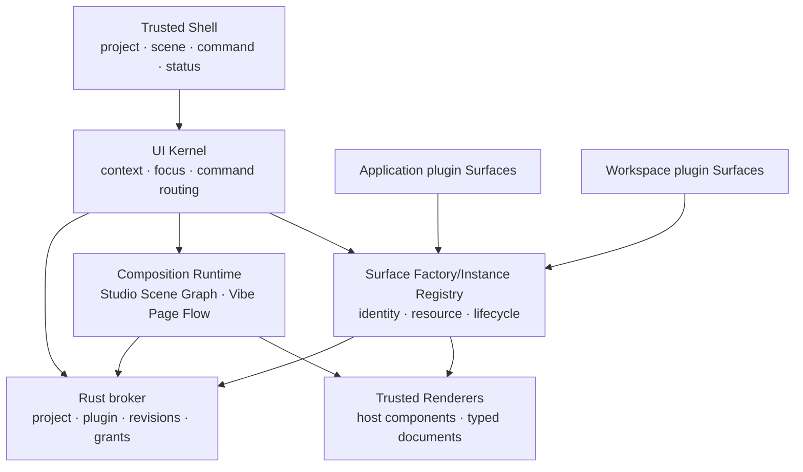

# Plugin-Native Surface Runtime

Status: proposed architecture; implementation is not authorized

Date: 2026-08-21

Change class: D3 because this introduces a shared UI contribution protocol,
command-routing boundary, focus model, and durable layout schema. Future
implementation risk is R3 because plugin lifecycle, project switching,
revisioned persistence, focus authority, and trusted security surfaces meet at
this boundary. This proposal itself changes documentation only.

Working name: **Rho Surface Runtime (RSR)**.

## Decision Summary

Rho should stop treating Editor, Agent, Environment, Evidence, Git, Help,
Console, Problems, Viewer, and Check project as hard-coded panes in one IDE
grid. They should become registered **Surfaces** hosted by a trusted UI kernel.

The trusted kernel owns:

- project and plugin identity;
- surface registration and teardown;
- the user-owned layout graph;
- command resolution and consequence text;
- focus, keyboard, accessibility, theme, and responsive behavior;
- trusted approvals, credentials, updates, permissions, and destructive
  confirmation;
- persistence, revision checks, project isolation, and recovery.

A plugin may contribute a typed Surface and typed Commands. It may not mutate
the root DOM, inject global CSS, imitate trusted UI, choose screen geometry, or
persist layout directly. The user can place any available Surface into any
compatible location in a Scene. This is the intended meaning of “free layout”.

The new product vocabulary is:

```text
Capability   what the component can do
Surface      one visual, focusable projection of that capability
Command      one typed user intent with availability and consequence
Studio       a spatial workbench composition grammar
Scene        a user-owned Studio arrangement of Surface instances
Vibe         a document-flow composition grammar
Page         a systematic Vibe document containing content and Surface blocks
Context      the current project, selection, task, artifact, run, or finding
```

Agent is a Surface, not a second top-level application mode. Ask/Plan/Act remain
broker policy inside the Agent Surface and are not layout concepts.

## Evidence From The Current UI

The annotated 2026-08-21 screenshot exposes one structural cause behind many
local visual problems:

1. the top bar mixes brand, menus, project, branch, posture, layout preset,
   restart, interrupt, Run, and Check project at nearly equal weight;
2. `Human / Agent` and `Code / Analyze / Agent` duplicate the word Agent while
   describing different state machines;
3. the editor toolbar reserves permanent width for many low-frequency actions;
4. the right column uses a long first-level tab row for unrelated domains;
5. the Agent timeline renders many visible state and deletion controls inside
   every conversation object;
6. attachments, model, Agent mode, submission, and status compete around one
   composer;
7. almost every available operation becomes a visible button instead of a
   contextual command;
8. the major regions are understandable, but each region accumulates its own
   independent navigation and action grammar.

The implementation confirms the problem is architectural rather than cosmetic:

- `index.html` contains a fixed top bar, left sidebar, center workspace, bottom
  Dock, and right context panel;
- layout is controlled through CSS classes and hard-coded functions such as
  `applyWorkbenchLayout`, `switchDockTab`, `switchContextTab`, and
  `applyAgentSurface`;
- project session persistence stores only three pane sizes while additional
  posture/surface state also exists in frontend-local emergency state;
- existing plugin UI can enter a Command palette, Viewer, or the single
  `plugin_details` Panel slot, but cannot become an ordinary work surface;
- first-party UI and plugin UI therefore use different composition systems.

Adding another tab, mode button, or fixed panel will make this worse. The next
frontend foundation must remove fixed placement as a component concern.

## Product Model

### Two composition grammars

RSR exposes two top-level presentation modes over the same project, runtimes,
plugin registry, Commands, Context, and Surface instances:

```text
WorkspaceMode = studio | vibe
```

**Studio** is the professional workbench. It starts from a reviewed Rho preset
and uses bounded Split/Stack composition. Users can duplicate a preset, move or
stack Surfaces, resize regions, save their own Scene, and return to the Rho
default. Studio deliberately supports dense editing and analysis without
making the fixed IDE grid the product architecture.

**Vibe** is a document-native working page. Narrative text, headings, tasks,
artifacts, charts, tables, Agent activity, decisions, and interactive plugin
Surfaces appear in one ordered flow. It is not an infinite whiteboard or a
random masonry dashboard: Sections establish reading order, a 12-column grid
controls wide layouts, and the host deterministically reflows blocks to one
column at narrow widths.

Switching Studio/Vibe changes only presentation. It does not duplicate
Workspace R, Agent history, plugin hosts, permissions, Runs, Artifacts, or
scientific state. A file, Artifact, finding, task, or plugin Surface retains one
identity and may be opened as a Studio pane or referenced by a Vibe block.

### Minimal trusted shell

The permanent window chrome contains only five conceptual controls:

1. **Project** — current project and project switching;
2. **Studio / Vibe** — the current composition grammar;
3. **Scene / Page** — current Studio layout or Vibe document;
4. **Command** — search, navigation, and the complete contextual command set;
5. **Status / primary action** — one current primary action plus interrupt or
   attention state when required.

Menus may remain as native discoverability and keyboard compatibility, but they
are projections of the same Command Registry. They are not a second command
implementation.

The default wide layout is intentionally quiet:

```text
+-----------------------------------------------------------------------+
| Project ▾  Studio | Vibe  Work ▾  Search or command…   Status · Run  |
+-----------------------------------------------------------------------+
|                                                                       |
|                 user-owned Scene / Surface Graph                      |
|                                                                       |
|       +----------------------+  +--------------------------------+    |
|       | Editor               |  | Agent / Check / Viewer         |    |
|       | surface-local title  |  | selected contextual Surface   |    |
|       | and 1-2 actions  ··· |  | title · origin · 1 action ··· |    |
|       +----------------------+  +--------------------------------+    |
|                                                                       |
+-----------------------------------------------------------------------+
| optional utility tray: Console / Logs / Problems, collapsed by default |
+-----------------------------------------------------------------------+
```

The graph may contain one Surface. A two- or three-region layout appears only
because the user opened or arranged those Surfaces, not because the shell has
three permanent columns.

### Studio/Vibe replaces duplicated mode controls

`Human / Agent` and `Code / Analyze / Agent` should converge into one
Studio/Vibe composition system after migration:

- Studio/Vibe changes composition grammar only;
- a Studio Scene changes placement and visual priority;
- a Vibe Page changes document structure and reading order;
- it does not start work, grant authority, select Ask/Plan/Act, or create a new
  Workspace R session;
- selecting or focusing a Surface determines which commands are contextual;
- built-in Studio starting Scenes may include Work, Analyze, Review, and Agent;
  users duplicate rather than silently mutate the reviewed Rho presets;
- built-in Vibe templates may include Research note, QC report, and Project
  review, but every created Page is an ordinary user-owned document layout;
- a plugin may make Surfaces available, but it cannot silently replace the
  current Scene/Page or focus itself.

During compatibility migration, existing Human/Agent posture and Code/Analyze/
Agent presets are projected as legacy Scenes. Their context-preservation and
execution-policy semantics remain intact until an authorized cutover removes
the old controls.

### Surface-local action budget

Every Surface has:

- title, state, and origin;
- zero or one primary action;
- at most two visible secondary actions at ordinary desktop width;
- one overflow menu containing the rest of its contextual commands.

The shell has at most one ordinary primary action. A running operation may add
one persistent stop/interrupt action. This is a presentation budget, not a
reduction of available commands.

The Command Registry remains the complete and searchable interface. Toolbar,
menu, context menu, keyboard shortcut, command palette, Agent tool projection,
and accessibility action all resolve the same command identity rather than
implementing parallel handlers.

## Architecture



### 1. UI Kernel

The UI Kernel owns the current `UiContext`:

```text
UiContextV1 {
  project_id
  project_revision
  scene_id
  focused_surface_instance_id?
  selection?: file | range | run | artifact | object | finding | task
  workspace_health
  agent_health
  active_operations[]
}
```

Commands and Surfaces observe only bounded typed context fields. They do not
read another component's DOM or mutable frontend store.

### 2. Surface factories and instances

The registry does not register one permanent panel. It registers a **Surface
factory** that can create bounded independent view instances:

```text
SurfaceDefinitionV1 {
  surface_id
  contract_major
  label
  purpose
  renderer_kind
  scope                     // application | project
  instance_policy           // singleton | per_resource | multi_instance
  default_instance_limit
  hard_instance_limit
  resource_kinds[]
  variants[]
  accepted_contexts[]
  commands[]
  origin
}

SurfaceVariantV1 {
  variant_id
  label
  resource_kind
  interaction_kind          // read_only | interactive
}

SurfaceInstanceV1 {
  instance_id
  surface_id
  project_id
  plugin_id
  package_digest
  activation_generation
  surface_revision
  variant_id
  resource_binding?
  view_group_id?
  view_state                 // host-owned, bounded to 64 KiB;
                             // focus, selection, viewport, local draft only
  lifecycle_state
}

ResourceBindingV1 {
  resource_kind              // project_file | artifact | run |
                             // workspace_console | task | finding | object
  resource_id                // typed ID or normalized project-relative path
  resource_revision?
}

OpenSurfaceRequestV1 {
  surface_id
  variant_id
  resource_binding?
  instance_disposition       // reuse_exact | new_instance
  placement_intent           // current | beside | stack | grid_cell
  expected_project_revision
  expected_layout_revision
}
```

`SurfaceDefinitionV1` is therefore a factory contract, not a visual singleton.
The host allocates every `instance_id`; a plugin cannot forge, reuse, or select
another instance. `reuse_exact` may focus an existing instance with the same
factory, variant, and resource. `new_instance` creates an independent view even
when the resource is the same.

`singleton` permits one project instance. `per_resource` permits one instance
per exact resource-and-variant key, so one file may have simultaneous Source
and Preview instances without duplicating either exact view. `multi_instance`
permits duplicate views such as four Console instances. Effective limits are
computed by trusted host policy; a plugin declaration may request a lower
limit but cannot raise the host cap.

The default workspace-plugin limit is eight live instances per Surface
definition and the hard host limit is sixteen. Application plugins may receive
a separately reviewed higher default under the same project-wide cap. A Studio
composition may retain 32 live instances and show at most 16 simultaneously;
the project-wide live cap is 64. Hidden Stack members remain instances but may
be suspended under host memory policy.

Registration is transactional and reversible. A disabled, failed, replaced, or
stale plugin loses its Surface routes before its host is disposed. An open
layout node then shows a trusted unavailable placeholder with Remove and, when
valid, Repair/Enable actions; it never routes to a different plugin silently.

### 2b. Scaling and shared authority

RSR distinguishes four independent scaling dimensions:

1. **view scaling** — many Surface instances from one definition;
2. **resource scaling** — each instance binds a different file, Artifact, Run,
   object, finding, task, or view variant;
3. **runtime scaling** — instances may share one authoritative service/runtime
   or bind an explicitly isolated runtime capability;
4. **event scaling** — the plugin Host admits a bounded number of concurrent or
   queued Surface events.

Creating another UI instance never implies creating another Workspace R,
Agent R, process, credential scope, network client, file model, or plugin Host.
Those require their own declared capability and authority.

#### Console example

Four Console instances in a 4x4 Studio Grid are valid. Each has independent
input draft, history position, scroll, filters, and optional origin/channel
view. All four bind the same `workspace_console` resource and the same
broker-owned Workspace R execution coordinator unless a separately authorized
multi-runtime capability exists.

- submissions are globally ordered by the Workspace execution lane;
- each run records the originating Console instance without making that
  instance the run authority;
- every Console may show all output or an instance-local filtered projection;
- interrupt, restart, busy/idle, state revision, and project identity remain
  Workspace-global truth;
- closing one Console removes only that view and its local draft/scroll state.

Four Consoles are therefore four working perspectives over one scientific
runtime, not four silently divergent R sessions.

#### File source and preview example

The file-view factory may expose variants such as `source`, `preview`, `diff`,
and `outline`. Opening two files creates two instances with different resource
bindings. Opening one file as source beside preview creates two instances with
the same normalized project-relative resource and revision but different
variants.

Both instances share the one broker/document-session content model. Source
cursor, preview scroll, selected heading, and zoom remain instance-local.
Preview output is explicitly bound to the document content revision; an
outdated render shows stale rather than pretending to match the latest source.
Two source instances may share the same Monaco text model while keeping
independent cursor, selection, viewport, and focus state.

#### Plugin Host event scaling

Multi-instance UI does not silently widen the accepted Phase 2 Guest ABI
concurrency. Initially, workspace-plugin Surface events enter a fair
per-plugin queue and retain the current one-active-call-per-plugin Host limit.
Every event carries exact project, digest, activation generation, instance,
Surface revision, resource revision, and deadline. A slow instance cannot
overwrite another instance's state, and queue limits fail visibly instead of
growing without bound.

True concurrent guest calls require a later contract-major change with
per-instance cancellation, memory/fuel budgets, fairness, teardown, and crash
tests. Application-plugin Surfaces may use existing broker services with their
already accepted concurrency contracts; the UI layer does not redefine them.

### 3. Scene Graph

The first layout contract is a bounded tiling graph, not free-form absolute
coordinates:

```text
LayoutNodeV1 =
  Split { axis, ratio, first, second }
  Grid { rows, columns, cells[] }
  Stack { active_instance_id, instances[] }
  Surface { instance_id }

GridCellV1 {
  row                       // 1..4
  column                    // 1..4
  row_span                  // 1..4
  column_span               // 1..4
  child: LayoutNodeV1
}

SceneStateV1 {
  scene_id
  label
  root: LayoutNodeV1
  focused_surface_instance_id?
  utility_tray?: Stack
}
```

Rules:

- maximum depth 8, 64 nodes, and 32 live Surface instances per Scene;
- Grid supports at most four rows by four columns and sixteen simultaneously
  visible cells; cells may contain a Surface or Stack and may span rows/columns
  without overlap;
- split ratios are clamped and minimum Surface sizes are host policy;
- move, split, grid, stack, duplicate, close, and focus are revisioned layout
  transactions;
- a plugin may request `open(surface_id, context)` after an explicit user or
  authorized Agent action, but the host chooses placement from user policy;
- plugins cannot write Scene state, create overlays, force focus, or reserve a
  permanent rail;
- trusted approval, credential, permission, updater, privacy, and destructive
  confirmation UI is outside the Scene Graph.

This gives users layout freedom while keeping security, accessibility, narrow
viewport behavior, and recovery deterministic.

### 3b. Vibe Page Flow

Vibe uses an ordered, bounded document tree:

```text
VibePageV1 {
  page_id
  label
  sections[]
  focused_block_id?
}

VibeSectionV1 {
  section_id
  heading?
  layout                    // flow | grid
  blocks[]
}

VibeBlockV1 =
  RichText | Callout | Divider |
  FileExcerpt | ArtifactRef | FindingRef | TaskRef |
  SurfaceRef | CommandRef

VibeGridPlacementV1 {
  block_id
  column_start              // 1..12
  column_span               // 1..12
}
```

Rules:

- document order is authoritative for keyboard, accessibility, narrow reflow,
  export, and Agent context;
- maximum 64 Sections and 256 blocks per Page, depth 6, and 24 live Surface
  blocks; large data remains a bounded reference/view, not inline payload;
- a Surface block references an exact Surface instance and typed Context; it
  does not copy plugin state or create another plugin host;
- one live interactive Surface instance appears in at most one active
  placement. Repeating a view creates another instance; a repeated read-only
  mirror is an explicit bounded snapshot block, not a second DOM mount;
- plugins may provide Surface content and optional block-size hints, but the
  host validates the 12-column placement and owns responsive collapse;
- text and plugin blocks share one baseline grid, spacing scale, typography,
  origin treatment, and action budget;
- Vibe Pages cannot host trusted approvals, credentials, permission grants,
  updater UI, or destructive system confirmation inside document content;
- no plugin or Agent may silently insert, reorder, resize, or remove blocks.
  Every Page mutation is an explicit user edit or a separately reviewed
  proposal with exact before/after revision.

Vibe therefore feels like an authored scientific page rather than a dashboard:
the user reads top-to-bottom, while selected Sections can use a systematic grid
to place a plot beside interpretation, a table beside filters, or an Agent task
beside evidence.

### 4. Renderer lanes

RSR supports two initial renderer lanes:

1. **Trusted host component adapter** for application plugins such as Editor,
   Console, Agent, Environment, Git, and Check project. Existing DOM and state
   can be mounted through adapters during migration.
2. **Declarative plugin Surface document** for workspace plugins. This extends
   the accepted trusted-renderer principle without granting HTML/DOM access.

The existing `ViewerDocumentV1` remains unchanged for read-only results. A new
interactive contract is additive:

```text
SurfaceDocumentV1 {
  title
  revision
  blocks[]
}

SurfaceBlockV1 =
  Row | Column | Grid | Tabs |
  Text | Code | KeyValue | Table | Notice | ArtifactImageRef |
  Field | Select | List | Group | CommandButton

SurfaceEventV1 {
  instance_id
  expected_surface_revision
  control_id
  event_kind
  bounded_value?
  expected_project_revision
}
```

The trusted renderer owns element creation, labels, keyboard order, validation
display, theme, and disabled/busy states. `CommandButton` names a declared
Command; it contains no callback or script. An event returns either a new
bounded document or a typed command result after stale identity is rechecked.
The plugin owns bounded content grouping and interaction semantics inside its
Surface through Row/Column/Grid/Tabs descriptors; the renderer owns actual CSS,
minimum sizes, responsive collapse, focus order, and accessible roles.

Raw HTML, JavaScript, CSS, SVG events, iframe/WebView custom applications, and
remote UI resources remain out of the initial contract. A future sandboxed
custom-renderer lane requires a separate threat model and authorization; it is
not implied by “plugin has its own UI”.

### 5. Command Registry

```text
CommandDefinitionV1 {
  command_id
  label
  purpose
  input_schema
  consequence
  availability_predicate_id
  placement_tags[]          // palette, surface-local, primary-candidate
  origin
}
```

Placement tags are host-reviewed hints, not authority. The UI Kernel evaluates
availability against typed current context and chooses visible placement under
the action budget. Destructive, credential, approval, permission, update, and
Workspace mutation commands retain their existing trusted admission and
confirmation contracts.

No plugin command gets a top-level button, default status, global shortcut, or
automatic invocation merely by declaring a tag.

An instance-local invocation binds `command_id`, optional `instance_id`, exact
resource and Surface revisions, project revision, and layout/Page revision.
Thus `Close`, `Duplicate view`, `Open beside`, `Source`, `Preview`, `Apply
filter`, and `Clear this Console` affect the intended instance or resource
without turning the command definition itself into a singleton.

## State And Persistence Ownership

Layout is local user preference, not project scientific truth and not plugin
state. The broker owns a versioned, project-scoped UI profile:

```text
ProjectUiProfileV1 {
  schema_version
  project_id
  revision
  active_mode                    // studio | vibe
  active_studio_scene_id?
  active_vibe_page_id?
  studio_scenes[]
  vibe_pages[]
  surface_instance_specs[]
  last_focused_surface_instance_id?
}
```

Requirements:

- state lives in Rho's application data, not `.rho/plugins`, project files,
  Workspace R, Agent R, or browser-only local storage;
- project A and B cannot share instances, context references, revisions, or
  plugin generation identity even when paths and plugin IDs match;
- a plugin package update never rewrites layout state directly;
- persisted instance specs contain only factory/variant/resource bindings and
  host-owned presentation state. Plugin-private runtime state is not persisted
  unless a separate bounded plugin-storage contract is authorized;
- missing/disabled Surface instances become explicit placeholders;
- stale or failed persistence leaves the last durable Scene truthful and does
  not claim a move/close/save completed;
- application crash/reopen reconstructs only current enabled exact plugin
  routes and validates every referenced instance;
- a layout export/import or project-shared Scene file is deferred. It must not
  be guessed from local state or silently committed to a project.

Current `PanelSizes` may be migrated once into a `Legacy Workbench` Studio
Scene. The migration may map only known built-in panels. Unknown or inconsistent state
falls back to a default Scene while preserving the old session snapshot for
recovery; it must not guess historical plugin ownership.

## Plugin Lifecycle And Layout

### Enable

1. validate and activate the exact plugin package under existing Phase 2 rules;
2. transactionally register Commands and Surface definitions hidden;
3. publish routes with exact project/digest/generation identity;
4. show the Surface in the command/search interface;
5. open it only after explicit user action or an already-authorized typed
   workflow requests it.

### Disable, failure, and project switch

1. close contribution routing before host teardown;
2. cancel or reject pending Surface events for every exact instance;
3. replace every affected open instance with an origin-labelled unavailable
   placeholder while leaving unrelated instances intact;
4. preserve the user's Scene structure until they remove or repair the
   placeholder;
5. never move focus to Editor, Console, body, or another plugin implicitly;
6. reject late results by project, digest, generation, instance, Surface
   revision, and project revision.

### Update and rollback

An accepted exact package update keeps a Surface instance only when the new
package declares a compatible `surface_id` and contract major. Otherwise the
instance becomes a placeholder. Cached rollback reconstructs fresh routes and
revalidates the Scene; it never revives an old live host or focus handle.
Closing one instance never disables its plugin, removes sibling instances, or
disposes a shared resource model still referenced elsewhere.

## Mapping The Annotated UI To RSR

| Screenshot area | Current problem | RSR outcome |
| --- | --- | --- |
| 1 top bar | unrelated controls have equal weight | Project, Studio/Vibe, Scene/Page, command search, one primary action/status |
| 2 mode groups | Human/Agent and Code/Analyze/Agent overlap | one Studio/Vibe switch plus Scene/Page selector; Agent policy remains inside Agent Surface |
| 3 editor toolbar | many permanent icon buttons | one primary action, up to two secondary actions, overflow and command search |
| 4 right tabs | unrelated domains share one crowded level | ordinary Surfaces in a user-owned Stack; no permanent domain rail |
| 5 conversation card | status and destructive actions stay exposed | typed activity summary; destructive/rare commands in overflow |
| 6 composer | five control families compete | text/attachment/send remain visible; model and policy move to one context disclosure |
| 7 overall density | every operation becomes a button | one Command Registry with contextual projection and action budgets |
| 8 region clarity | good macro-regions, excessive local chrome | Studio uses Surface regions; Vibe uses ordered content/Surface blocks |

## First Component And Migration Plan

The first component remains **Check project**, because its rule engine and
result UI have clear typed boundaries and low ambient authority. RSR should be
proven with one real vertical component rather than an empty framework rewrite.

No work package below is active until the owner authorizes it.

### RSR-0 — Shared contracts and compatibility adapter

- define bounded Surface, Command, Studio Scene, Vibe Page, and event contracts
  in a module that is independent of the frontend renderer;
- define singleton/per-resource/multi-instance factory policy, resource and
  variant bindings, open disposition, instance/view-state bounds, and the
  separate runtime-authority rule;
- add validators, projection fixtures, and lifecycle simulations;
- wrap the existing fixed workbench as one `Legacy Workbench` Studio Scene with no
  visible behavior change;
- register existing first-party commands through one compatibility Command
  Registry while retaining current handlers;
- stop before persistence migration or new plugin UI.

### RSR-1A — Usable Studio composition

- ship one reviewed `Rho Studio` preset through the Scene Graph;
- let the user duplicate, rename, split, stack, resize, close, and reset a
  custom Scene while the built-in preset remains immutable;
- adapt existing Editor, Agent, Context, and utility Dock regions without
  changing their scientific or focus behavior;
- support Split, Stack, and non-overlapping Grid layouts up to four-by-four;
- retain one command that returns to the exact legacy layout;
- stop before multi-instance resource adapters, Vibe, layout sharing, or raw
  workspace-plugin UI.

### RSR-1B — Multi-instance vertical slice

- make File view and Console registered Surface factories rather than single
  pane identities;
- prove two different files, and one file as side-by-side source/preview,
  through shared canonical document models and independent view state;
- prove four Console instances in one Studio Grid share one Workspace R
  execution/state authority while preserving independent drafts, filters,
  focus, and scroll;
- enforce per-definition/project/Scene caps, fair plugin event queueing,
  close-one/keep-siblings, suspend/resume, restart, and unavailable
  placeholders;
- stop before adding another runtime/session capability or widening Phase 2
  guest-call concurrency.

### RSR-2 — First dual-mode component: Check project

- register `project.check` as one typed Command;
- register `project.check.results` as an application-plugin Surface;
- move the current Check project trigger out of permanent top chrome and make
  it the primary contextual command only when the project context permits;
- open findings as the dominant Surface, with source/evidence actions routed
  through Commands;
- keep the trusted check orchestrator, project snapshot, execution admission,
  and finding renderer authoritative;
- allow workspace plugins to contribute bounded check rules, not layout or
  trusted result claims;
- open the same result as a Studio Surface or as a systematic Project review
  Vibe Page containing summary, finding, evidence, and remediation blocks;
- prove disable/update/rollback, stale result, project A/B isolation, and
  unavailable placeholder behavior;
- stop before general-purpose Vibe authoring or migrating Agent.

### RSR-3 — Vibe authoring foundation and shell reduction

- make Section/flow/grid block editing revisioned and keyboard accessible;
- support text, references, and live Surface blocks under one layout system;
- reduce permanent chrome to Project, Studio/Vibe, Scene/Page, command search,
  and status/primary action;
- preserve document order across wide/narrow layouts and deterministic export;
- keep Page mutation user-owned and proposals reviewable;
- stop before collaborative/shared Pages or plugin-provided templates.

### RSR-4 — Agent Surface in both modes

- mount Agent timeline and composer as one Surface;
- remove duplicate Agent posture/layout controls only after state and focus
  compatibility tests pass;
- keep Ask/Plan/Act, approvals, Agent dependency health, cancellation, and
  model routing unchanged;
- reduce the composer to attachment, text, and send, with model/policy in one
  disclosure;
- render the same Agent task as a Studio Surface or a Vibe task/activity block
  without creating separate conversations or execution state.

### RSR-5 — First-party surface migration

- migrate Editor/Viewer, Console/Logs/Problems, Environment, Evidence, Git,
  Help, and Runs one vertical slice at a time;
- delete fixed grid/tab code only after the equivalent Surface passes exact
  behavior, focus, narrow-layout, restart, and project-switch acceptance;
- never keep two persistent authorities for the same layout state.

## Verification And Failure Matrix

Pure contract tests must cover:

- normal, empty, maximum, just-over-limit, malformed, duplicate, cyclic, and
  excessive-depth Scene graphs;
- unknown Surface, wrong project, stale project/layout/Surface revision,
  changed digest/generation, missing plugin, and incompatible contract major;
- project A/B/A with identical plugin and Surface IDs;
- transactional registration failure, persistence failure, crash/reopen,
  disable, uninstall, update failure, accepted update, and rollback;
- bounded document/event payloads and hostile text/markup/bidi/control input;
- no raw handle, credential, root DOM, Tauri, Workspace, process, or path
  projection.

Multi-instance tests must cover:

- singleton, per-resource, and multi-instance policies;
- `reuse_exact` versus `new_instance`, duplicate-view admission, instance caps,
  project caps, queue caps, fair ordering, cancellation, and one-instance
  failure without sibling teardown;
- a four-by-four Studio Grid, overlapping/invalid cells, hidden Stack members,
  suspend/resume, close-one/keep-siblings, and focus/scroll isolation;
- four Console instances sharing one Workspace execution/state authority and
  preserving global interrupt/restart truth;
- two files in one viewer factory, plus one file source/preview variants sharing
  one content model and rejecting a stale preview revision;
- disable, crash, update, rollback, project switch, and reopen with multiple
  exact instances and unavailable placeholders;
- no live interactive instance mounted twice and no cross-project instance,
  resource, draft, viewport, queue result, or focus reuse.

Vibe-specific tests cover document order, grid overlap, invalid spans, narrow
reflow, block/Section bounds, exact Surface references, stale Page edits,
proposal rejection, deterministic export order, and plugin teardown
placeholders without reordering unrelated content.

Frontend/browser tests must cover:

- loading, empty, ready, busy, warning, failure, stale, unavailable, and
  placeholder states;
- open, split, stack, move, focus, close, undo or truthful non-undo recovery;
- keyboard-only surface navigation and command invocation;
- focus and scroll survival across background refresh and plugin teardown;
- action-budget enforcement and complete command-palette discoverability;
- 1440x900, 1280x720, 1024x700, and 900x700 without page overflow;
- long Unicode project/plugin/surface names and text overflow;
- trusted approval/credential/update/permission UI remaining outside plugin
  layout and visibly distinct;
- exact debug-app workflow before any installed candidate.

State mutation requires success, rejection, stale/conflict, persistence
failure, cancellation, restart/recovery, and two-project isolation evidence.

## Authority And Cross-Review

- the accepted Phase 2 and P2-3 contracts remain authoritative for plugin
  identity, activation, permission, Guest ABI, lifecycle, origin labelling,
  typed ViewerDocument rendering, and prohibition of raw DOM/global CSS/trusted
  UI spoofing;
- RSR adds a future `ui.surface.*` contract. It does not reinterpret existing
  `ui.panel.*` or `ui.viewer.*`, and cannot be implemented by silently widening
  their accepted contract;
- Phase 2.5 owns Agent-authored plugin evolution. It may produce a candidate
  Surface declaration later but cannot activate it, mutate a Scene, or bypass
  RSR review and existing plugin grants;
- the Human/Agent posture design and Agent-first adaptive work surface retain
  current presentation authority until an RSR cutover is explicitly
  authorized. RSR proposes that their layout-only state become legacy Scenes;
  Agent policy and context-preservation invariants survive;
- interface modernization retains visual tokens, accessibility styling, and
  current installed acceptance obligations. RSR owns future composition, not a
  competing theme;
- workbench focus stability remains authoritative: background truth updates
  never acquire focus or replace the user's reading position;
- project session/store contracts own durable project identity. RSR requires a
  separately reviewed versioned UI-profile owner and migration before durable
  Scene writes;
- Workspace R, Agent R, Runs, Artifacts, Environment, Git, Evidence, approvals,
  credentials, update, and file mutation keep their existing authorities.

## Non-Goals

This proposal does not authorize:

- a React, Vue, Lit, or other framework rewrite as the plugin ABI;
- arbitrary plugin web applications, remote code, iframe/WebView UI, root DOM,
  CSS, or direct Monaco access;
- plugin-controlled geometry, automatic focus, top-level buttons, global
  shortcuts, trusted dialogs, security wording, or destructive styling;
- marketplace, publisher, signature, catalog, or distribution work;
- Agent-authored activation, autonomous layout mutation, or UI self-repair;
- a second project/session/layout persistence authority;
- changing scientific execution, approval, credential, or Provider policy;
- removing the legacy layout before equivalent Surfaces are accepted;
- version, NEWS, installed-app, release, CI, or multi-platform claims from this
  proposal alone.

The host implementation may move from the current monolithic JavaScript toward
TypeScript/ES modules and component boundaries, but the Surface and Command
protocol must remain implementation-library independent. Choosing a rendering
library is a later engineering detail, not the foundation contract.

## Product Decisions Recommended For Authorization

1. adopt Surface, Studio Scene, and Vibe Page as the future composition
   vocabulary;
2. adopt Studio and Vibe as two composition grammars over the same Surface and
   Command runtime;
3. treat Agent as a Surface and retain Ask/Plan/Act only as policy;
4. define Studio layout as user-owned bounded Split/Stack composition, never
   plugin-owned geometry;
5. define Vibe as ordered Sections plus a validated 12-column grid, never an
   infinite canvas or random masonry dashboard;
6. keep declarative trusted rendering as the initial workspace-plugin UI lane;
7. make Check project the first dual-mode Surface and pluginized rule component;
8. keep Studio Scenes and Vibe Pages local and project-scoped initially; defer
   sharing/export;
9. preserve a complete legacy Studio Scene until the migrated surface set is
   accepted;
10. treat every plugin Surface declaration as a bounded factory supporting
    explicit multi-instance/resource/variant policy rather than one panel;
11. support a four-by-four Studio Grid while keeping runtime authority and
    plugin Host concurrency independent from visual instance count.

Implementation begins only after the owner approves one bounded work package,
the proposal is renamed or handed off to an active contract, and cross-review
conflicts are resolved at that exact slice.

## Version, NEWS, And Release

The proposal changes no implementation, application version, R package
version, schema, or `NEWS.md`. Any user-visible RSR implementation requires a
fresh named development candidate before distribution. Any durable UI-profile
schema requires its own migration/recovery evidence. CI, multi-platform,
installed-app, signing, publication, and release acceptance remain separately
gated.
