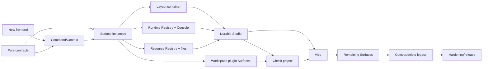

# Rho Surface Runtime Full Construction Plan

Status: active complete construction program; Wave 4 is the current integration
package

Date: 2026-08-21

Authorization: the owner explicitly authorized autonomous execution of the
complete plan on 2026-08-21, with no repeated product-decision pauses between
waves. This authorization does not collapse the waves into one unreviewable
change: each wave remains a bounded, buildable integration package with its
own focused evidence, contract review, documentation reconciliation, and
scoped commit. After a wave passes its continuous gate, the next dependency is
activated automatically under the same explicit authorization.

Current integration package: **Wave 4 — Recursive Studio layout container**.

Wave 4 acceptance owner: this active contract. Acceptance requires a recursive,
user-authored, revisioned Studio container over the Wave 3 Surface instances,
with arbitrary asymmetry, intrinsic strips, nesting, Stack composition,
pointer/keyboard resize, transactional edits, undo/redo, and no visible grid
shape cap. Placement may never become resource, runtime, plugin, or execution
admission.

Owning design:
`docs/design/proposed-2026-08-21-plugin-native-surface-runtime-design.md`

Change class: D3 shared UI/runtime/plugin architecture. Implementation risk is
R3 because layout persistence, project identity, plugin lifecycle, runtime
attachment, focus authority, and user-visible execution meet in one program.

## Program Intent

Build the new Rho frontend as one continuous product program optimized for
rapid iteration and advanced interaction design. Do not turn the current fixed
IDE layout into a permanent compatibility layer and do not require a product
decision pause between construction waves.

The repository must remain buildable at integration boundaries, but these are
continuous automated gates, not manual stop points. When a gate passes, work
continues to the next dependency automatically. A failed safety or truth gate
blocks integration because the baseline must remain honest, not because the
program needs repeated user authorization.

The end state is:

- one new React/TypeScript frontend rather than continued growth of
  `desktop/dist/app.js`;
- one shared Surface Factory/Instance, Command, Resource, and Runtime model;
- Studio as a fully user-authored recursive layout container with immutable
  starting presets;
- Vibe as an ordered scientific document containing text, references, and live
  plugin Surfaces;
- explicit runtime binding for every Console instance;
- arbitrary repeated resource/mode views without implicit uniqueness or
  Source/Preview coupling;
- trusted plugin rendering and existing Phase 2 isolation preserved;
- old fixed shell deleted after one cutover, not maintained indefinitely.

## Compatibility And Cutover Policy

Rapid iteration does not mean guessing or losing user data. It does mean
distinguishing durable scientific/user content from disposable presentation
assets.

Preserve:

- project identity and normalized project roots;
- project files and unsaved document drafts;
- active/open document identities where still valid;
- Workspace R, Runs, Artifacts, Agent conversations, approvals, Environment,
  Git, Evidence, and plugin lifecycle truth;
- exact plugin package/digest/generation and grant identity;
- current source and Viewer payload bounds.

Do not preserve as product contracts:

- current top-bar groups, element IDs, fixed left/right/Dock DOM, CSS grid
  classes, or tab hierarchy;
- `PanelSizes`, `posture`, `humanPreset`, `agentSurface`, or
  `agentWorkSurface` as future layout concepts;
- a runtime switch that keeps both old and new shells after cutover;
- old mock implementation structure;
- one-panel-per-plugin assumptions;
- compatibility mappings from every old layout state into Studio/Vibe.

Development uses a separate new frontend entry while the old frontend is
frozen. The cutover changes Tauri to the new build output, removes old shell
code, and relies on source-control rollback rather than shipping two frontends.
The new first launch uses the immutable `Rho Studio` preset. Old pane sizes and
posture are ignored. Document drafts and project content are restored through
their existing authoritative records.

## Selected Frontend Stack

Current documentation was checked through Context7 on 2026-08-21.

### React 19.2.7 + TypeScript

- `createRoot` owns the new desktop renderer;
- stable `instance_id` keys preserve Surface component identity across layout
  movement;
- `useSyncExternalStore` subscribes to cached broker snapshots rather than
  copying authoritative state into ad hoc React stores;
- React state is limited to local ephemeral interaction. Project, runtime,
  plugin, and durable layout truth remains broker-owned;
- concurrent rendering never becomes permission or execution authority.

### Vite 8.2.2

The original plan selected 8.0.10. Wave 0 advanced the exact pin to 8.2.2
before integration because the npm advisory database reports a Windows
development-server path-disclosure vulnerability through 8.0.15. The selected
minor release preserves the reviewed Vite 8 configuration contract and removes
the newly introduced high-severity dependency finding.

- source lives under `desktop/ui/`;
- development uses Vite HMR against browser/mock transport and the exact Tauri
  debug app;
- production emits deterministic local static assets to `desktop/dist` with
  relative paths and no CDN/runtime fetch;
- `npm ci` and the checked-in lockfile remain the package authority;
- generated `desktop/dist` becomes build output at cutover rather than the
  hand-edited source of truth.

### ProseMirror

- schema-owned nodes define Vibe documents and prevent arbitrary DOM from
  becoming document truth;
- transactions produce exact before/after Page revisions;
- custom NodeViews host trusted Surface blocks while plugin content remains
  behind the RSR renderer contract;
- JSON serialization supports deterministic local persistence and fixtures;
- collaborative editing is not activated by choosing ProseMirror.

### Deliberate non-selections

- no React layout/IDE framework owns the Scene model;
- no dashboard-grid library defines user geometry;
- no component library becomes trusted UI policy;
- no Electron, Next.js, server-side renderer, remote asset host, or second web
  application shell;
- no React component, ProseMirror NodeView, or TypeScript type becomes the
  workspace-plugin ABI.

Monaco remains the source editor. CSS custom properties, cascade layers,
container queries, ResizeObserver, and Pointer Events implement presentation
and resizing under RSR-owned contracts.

## Target Source Layout

```text
crates/rho-ui-contract/
  src/
    command.rs
    context.rs
    fixture.rs
    layout.rs
    resource.rs
    runtime.rs
    surface.rs
    vibe.rs
    validation.rs

crates/rho-extension-runtime/src/
  surface_contribution.rs
  surface_document.rs
  surface_event.rs

desktop/ui/
  index.html
  src/
    app/
    broker/
    commands/
    context/
    layout/
    runtime/
    studio/
    surfaces/
    transport/
    vibe/
    styles/
    main.tsx
  vite.config.ts
  tsconfig.json

desktop/src-tauri/src/
  commands/ui.rs
  commands/runtime.rs
  ui_profile.rs
  ui_runtime.rs
  ui_surfaces.rs
  runtime_registry.rs

scripts/
  generate-rsr-contract-fixtures.mjs
  test-rsr-contract.mjs
  test-rsr-mock-parity.mjs
  test-rsr-generated-assets.mjs
  test-rsr-cutover.mjs
```

`rho-ui-contract` is a pure crate with no Tauri, DOM, Store, Workspace R,
Agent, credential, process, or network access. It owns serializable IDs,
bounded shapes, validation, and pure transitions. `rho-extension-runtime`
depends on it for future `ui.surface.*` declarations; the contract crate never
depends on the plugin runtime, avoiding a circular authority graph.

## End-State Ownership

### UI contract

`rho-ui-contract` owns:

- Surface definitions, instances, modes, sizing hints, resource/runtime
  bindings, open requests, and lifecycle state;
- recursive Studio Container/Stack/Surface trees and pure layout mutations;
- Vibe Page/Section/Block schemas and pure Page mutations;
- Command definitions/invocations and typed UI Context;
- byte, depth, identifier, and collection bounds.

### UI runtime service

The Rust desktop service owns:

- application and workspace-plugin Surface factories;
- instance allocation and exact project/plugin/generation binding;
- runtime/resource resolution;
- Scene/Page revisions and mutation admission;
- active/inactive/suspended/placeholder instance lifecycle;
- cancellation, teardown, project switch, restart, and late-result rejection;
- transport-safe snapshots to React.

### Runtime Registry

The broker owns attachable runtime identity:

```text
RuntimeDescriptorV1 {
  runtime_provider_id
  runtime_instance_id
  runtime_kind
  project_id
  activation_generation
  state_revision
  status
  attach_capabilities[]
  persistence_class
  display_label
}
```

The existing Workspace R registers as the primary scientific runtime. Agent R
does not expose `console.attach`. Additional trusted application runtime
providers may create auxiliary local R or future runtimes. Auxiliary runtimes
are explicitly labelled and never become the authoritative Workspace R.

Runtime creation, attachment, interruption, restart, stop, and disposal are
separate commands. Opening/closing a Console never creates/stops a runtime
implicitly. Multiple Consoles may deliberately bind the same or different
runtime IDs.

Runtime supervision and recovery remain consistent with Issue #93: a runtime
provider supplies identity and lifecycle events; the UI Registry does not
invent health or recover a process itself.

### Resource Registry

Resource providers own canonical typed resource identities and revisions.
Surface instances consume bindings but do not infer sharing:

- two identical file/mode views are permitted;
- Source and Preview can be modes of one plugin or separate plugins;
- two views share a document model only when a resource provider explicitly
  exposes that model;
- immutable snapshot consumers bind exact revisions and become stale when
  their claimed revision changes;
- the layout tree never owns file content, Artifact bytes, Run truth, or
  Workspace objects.

### UI profile storage

Presentation state belongs beside the current project session store, not in
`rho-store` schema v14. Add `ProjectUiProfileStore` under the application-data
project-session family with its own versioned atomic JSON file and same-
directory recovery backup.

It stores Studio Scenes, Vibe Pages, durable instance specifications, user
sizing, active mode, and focus identity. It does not store file contents,
plugin-private state, credentials, Run/Artifact data, live runtime generations,
or authority handles.

Writes use expected revision and atomic replacement. Dragging updates local
preview state per animation frame and commits one durable transaction at
pointer release. Failed persistence restores the last durable profile and
shows an unsaved-layout error.

## Continuous Construction Waves

These waves form one complete sequence. They are integration checkpoints, not
manual product pauses. Each wave lands only with its tests and leaves the
branch runnable.

### Wave 0 — New frontend workspace and deterministic harness

Deliver:

- add `desktop/ui` with React 19.2.7, TypeScript strict mode, Vite 8.2.2,
  browser/mock transport, and deterministic test bootstrap;
- preserve the current Tauri `frontendDist` until cutover;
- add a separate new-shell development command and exact build output staging
  directory;
- establish lint/typecheck/unit/browser-preview commands;
- add one empty Rho window with project identity and startup health only;
- freeze old frontend feature work except safety defects required by the
  active branch.

Continuous gate:

- `npm ci`, typecheck, unit test, production build, deterministic asset
  inventory, no network-loaded assets, and browser smoke;
- existing desktop remains unchanged and buildable.

Wave 0 completed locally on 2026-08-21:

- `desktop/ui` now owns the React 19.2.7/TypeScript/Vite 8.2.2 source and emits
  only to ignored `desktop/rsr-dist`; Tauri still ships `desktop/dist`;
- real and mock bootstrap transports share one typed boundary over the existing
  `startup_status` and `project_state` commands;
- strict typecheck, ESLint, six Vitest cases, production build, two-build
  byte-for-byte asset comparison, no-network asset validation, and real local
  Chromium DOM smoke pass through `npm run rsr:check`;
- `npm ci --ignore-scripts`, full `npm audit` with zero findings,
  `node --check desktop/dist/app.js`, and
  `cargo check -p rho-desktop --locked` pass;
- separate contract review found and repaired unstable default-transport
  identity, project-path whitespace loss, a package-level ESM collision with
  the frozen old shell, and cross-platform harness path handling;
- no application/R-package version or `NEWS.md` change is required because the
  new shell is not shipped and no public or plugin contract changed;
- hosted, multi-platform, installed-candidate, and release checks remain
  intentionally outside the rapid local loop and are not claimed.

### Wave 1 — Pure RSR contracts

Deliver:

- create `rho-ui-contract` and add it to the workspace;
- implement bounded IDs, Surface Factory/Instance, sizing, mode, Resource,
  Runtime, Command, Studio Container, Vibe Page, and event contracts;
- implement pure validators and mutation reducers;
- serialize golden fixtures consumed by the TypeScript test suite;
- add Rust/TypeScript contract parity checks without hand-copying authority
  rules into UI rendering code.

Continuous gate:

- normal/boundary/over-limit/malformed/duplicate/stale fixtures;
- recursion and encoded-byte budgets;
- arbitrary asymmetric/nested layout fixtures including small intrinsic strips;
- no Tauri, Store, filesystem, runtime, plugin execution, or UI behavior.

Wave 1 completed locally on 2026-08-21:

- added the pure `rho-ui-contract` workspace crate with bounded typed IDs,
  Surface factories/instances/events, explicit Resource and Runtime bindings,
  Commands, UI Context, recursive Studio Containers/Stacks, Vibe Pages/grids,
  structured errors, validators, and stale-safe pure reducers;
- validators cover normal, empty, exact boundary, just-over-limit, malformed,
  duplicate, missing-reference, stale revision, project mismatch, bidi/control
  spoofing, depth, node, placement, JSON, Scene, Page, view-state, and event
  payload cases; empty Studio and Vibe authoring states remain representable;
- the golden fixture proves two Consoles sharing one exact runtime, repeated
  file/resource instances in independent Source/Preview modes, asymmetric
  fractional/minmax layout, an intrinsic status strip, and ordered Vibe grid;
- Rust emits the checked-in fixture and `test-rsr-contract.mjs` rejects any
  byte drift; nine frontend tests consume the generated JSON rather than
  copying Rust authority rules;
- `cargo test -p rho-ui-contract --locked` passed 24 tests including one
  property test, `cargo clippy -p rho-ui-contract --all-targets --locked -- -D
  warnings` passed, and `cargo test --workspace --locked` passed the complete
  local Rust workspace matrix with only the existing opt-in Keychain smoke
  ignored;
- `npm run rsr:check` passed strict TypeScript, ESLint, contract parity, nine
  Vitest cases, deterministic production assets, and real Chromium smoke;
- normal dependencies remain only `serde`, `serde_json`, and `thiserror`;
  `proptest 1.11.0` is test-only under MIT OR Apache-2.0;
- separate contract review added explicit grid `row_start` for deterministic
  overlap rejection and repaired missing empty Studio/Vibe states;
- no application/R-package version or `NEWS.md` change is required because
  this pure internal crate is not shipped as a public/plugin ABI and the active
  Tauri frontend remains unchanged.

### Wave 2 — Command, Context, and snapshot kernel

Deliver:

- implement the broker-owned UI Context snapshot;
- implement one Command Registry used by top chrome, menus, keyboard, Surface
  actions, and command search;
- build React subscription through `useSyncExternalStore` with cached immutable
  snapshots;
- separate command availability from execution admission;
- provide real and mock transports implementing one TypeScript interface;
- project project-switch, health, active operations, selection, and plugin
  origins without raw Store/coordinator structs.

Continuous gate:

- exact command identity, unavailable reasons, stale context, project A/B/A,
  snapshot caching, no tearing, and real/mock parity;
- no command gets authority from button placement or keyboard presence.

Wave 2 completed locally on 2026-08-21:

- added the bounded `UiKernelSnapshotV1`, project/health detail, exact command
  registration, registry byte budget, application command inventory, typed
  availability evaluation, and project-bound invocation-context validation to
  `rho-ui-contract`;
- added a desktop UI Kernel service that derives opaque project identity and
  broker revision, separately projects Workspace and Agent health, collects
  bounded scientific Run/render/Agent/file-change/approval operations, and
  projects exact workspace-plugin command origin, package digest, activation
  generation, input schema, status, and unavailable reason without exporting
  `Store`, coordinator, Tauri, or authority handles;
- the cache structurally reuses identical `Arc` snapshots, advances a
  process-local monotonic snapshot revision for semantic changes and A/B/A
  project sequences, clears cross-project ephemeral selection, and admits
  selection updates only against exact project, project revision, and snapshot
  revision;
- React now consumes one frozen external store through
  `useSyncExternalStore`; real Tauri and browser/mock transports implement the
  same interface, and mock state consumes the Rust-generated kernel fixture.
  Top-chrome, menu, keyboard, Surface-local, primary, and search projections
  filter this one registry; Wave 2 deliberately adds no generic command
  execution endpoint;
- invalid, unsupported-contract, schema-less, or over-budget plugin commands
  are omitted without breaking application commands, snapshot reads serialize
  against the project transition gate, failed selection projection restores
  the exact previous ephemeral selection, event-listener setup failures are
  isolated, and Agent dependency degradation remains independent from healthy
  Workspace/editor state;
- `cargo test -p rho-ui-contract --locked` passed 28 tests,
  `cargo test -p rho-desktop --locked` passed 280 tests with the existing
  opt-in macOS Keychain smoke ignored, and `cargo test --workspace --locked`
  passed the complete local Rust matrix;
- focused `rho-ui-contract` Clippy with `-D warnings` passed. The repository-
  wide Rust 1.97 Clippy run still encounters existing lints in untouched
  crates; a desktop `--no-deps` run with only those enumerated baseline lint
  classes allowed passed with `-D warnings`, leaving no new Wave 2 warning;
- `npm ci --ignore-scripts`, zero-finding `npm audit`, and
  `npm run rsr:check` passed strict typecheck, ESLint, Rust/TypeScript fixture
  parity, nine Vitest cases, deterministic assets, no network assets, and real
  local Chromium smoke. The frozen legacy `desktop/dist/app.js` syntax check
  also passed;
- separate review repaired project-switch snapshot tearing, quadratic and
  unbounded plugin command aggregation, plugin-caused shell failure,
  unsupported/missing plugin contracts, non-transactional selection failure,
  and unhandled listener setup rejection. No application/R-package version or
  `NEWS.md` change is required because Tauri still ships the frozen old
  frontend and the new kernel contract remains internal until cutover.

### Wave 3 — Surface Factory/Instance runtime

Deliver:

- add application Surface registration to the internal plugin lifecycle;
- add host-generated instance allocation, explicit `new_instance` versus
  `reuse_exact`, resource/runtime bindings, mode configuration, local view
  state, and sibling-independent close;
- implement active, hidden, suspended, failed, and placeholder states;
- bind every instance to exact project and application/plugin generation;
- expose `list/open/update/close/suspend/resume` commands and lifecycle events;
- render one synthetic application Surface repeatedly in React.

Continuous gate:

- singleton and unlimited-shape multi-instance behavior under resource budgets;
- repeated identical bindings, close-one/keep-siblings, generation replacement,
  crash, project switch, late event, suspension, and reopen;
- stable React keys preserve intended local state and never cross instances.

Wave 3 implementation evidence (completed 2026-08-21):

- `rho-ui-contract` now owns generation-bound factory registrations, bounded
  Surface Runtime snapshots and lifecycle events, explicit open/update/target
  requests, host-owned view state, technical quota classes, and placeholder
  validation. The 256-instance/2 MiB and per-cost-class limits are resource
  budgets only; no row, column, symmetry, or grid-shape rule exists;
- application Surface registration is a reversible `EffectSink` contribution
  in the existing internal extension Registry. The built-in synthetic Surface
  Playground activates in the application scope, receives the exact scope
  generation, is hidden in legacy mode, and loses routing during scope
  disposal; no parallel static factory lifecycle was introduced;
- the desktop Surface Runtime allocates opaque instance IDs and atomically
  reconciles exact project/factory generations before every operation. It
  exposes `list/open/update/close/suspend/resume`, distinguishes all five
  lifecycle states, rejects stale revisions/events, turns replaced or removed
  instances into truthful placeholders, keeps repeated identical bindings
  independent, and closes one instance without touching siblings;
- React and real/mock transports consume the same Surface command lane. The
  playground renders repeated instances with `instance_id` keys; a regression
  test proves closing one card preserves its sibling's component-local draft.
  Browser mock handlers cover all six Tauri commands;
- focused contract/runtime/desktop tests passed, including singleton and
  multi-instance resource budgets, repeated exact bindings, explicit reuse,
  generation replacement, close-event identity, crash/failure/reopen,
  hidden/suspend/resume, project A/B/A isolation, late-event rejection, and
  transactional sibling-local view-state mutation. The complete
  `cargo test --workspace --locked` matrix passed: desktop ran 287 tests with
  286 passing and the existing opt-in macOS Keychain smoke ignored;
- focused `rho-ui-contract` and `rho-extension-runtime` Clippy passed with
  `-D warnings`. Desktop `--no-deps` Clippy also passed with only the same
  enumerated pre-existing lint classes allowed. `npm run rsr:check` passed
  strict typecheck, lint, Rust/TypeScript fixture parity, 12 Vitest cases,
  deterministic production assets, and the local Chrome smoke; frozen
  `desktop/dist/app.js` syntax remains valid;
- separate review repaired replacement placeholders that were still coupled
  to a new factory origin/mode, close events that omitted the removed instance
  identity, unhandled React mutation rejection, and Chrome 151 completing
  `--dump-dom` without exiting. The browser gate now accepts only a complete
  DOM plus the existing readiness/evidence markers, then reclaims the idle
  process;
- no application/R-package version or `NEWS.md` change is required: Tauri
  still ships the frozen `desktop/dist` frontend, while Wave 3 remains an
  internal foundation for the one-way cutover.

### Wave 4 — Recursive Studio layout container

Deliver:

- implement `Container(axis, children)`, `Stack`, and `Surface` rendering;
- implement `auto`, `intrinsic`, `fixed`, `fraction`, and `minmax` child bases;
- implement arbitrary nesting, insert/move/stack/unstack/duplicate/close;
- implement pointer and keyboard boundary resizing;
- use Surface sizing hints plus CSS container queries to select full/compact/
  strip presentation;
- implement user-authored collapse priorities without silent deletion/reorder;
- build layout inspector, command-driven normalization/distribution, and undo/
  redo over pure layout transactions.

Continuous gate:

- highly asymmetric layouts, tiny strips, many uneven children, deep nesting,
  resize clamp, user override, narrow viewport, keyboard, focus and scroll;
- drag preview remains frame-paced; one durable mutation occurs on release;
- no visible grid-shape cap. Only encoded/depth/node/instance resource budgets
  apply.

### Wave 5 — Runtime Registry and multi-runtime Console

Deliver:

- register current Workspace R as an attachable primary runtime;
- add trusted internal Runtime Provider registration and a broker-managed
  auxiliary R runtime implementation under supervisor ownership;
- expose runtime list/create/attach/detach/interrupt/restart/stop commands with
  exact identity and truthful state;
- keep Agent R non-attachable;
- convert Console into a multi-instance Surface Factory requiring explicit
  `runtime_instance_id`;
- give each Console independent draft/history/filter/scroll/focus while Runs,
  execution order, busy state, interrupt and restart come from its bound
  runtime;
- origin-label outputs by runtime and Console instance.

Continuous gate:

- several Consoles sharing Workspace R;
- Consoles split across Workspace R and auxiliary runtimes;
- one runtime failure affects only bound instances;
- close Console does not stop runtime, stop runtime does not destroy layout;
- project A/B isolation, runtime restart generation, queued execution,
  cancellation, crash/recovery, and no Agent R attachment;
- Issue #93 supervisor/recovery contracts remain authoritative.

### Wave 6 — Resource Registry and unconstrained file views

Deliver:

- register normalized project-file resources and document-session models;
- convert Editor/File Viewer into Surface factories;
- allow any number of instances for different or identical files;
- allow same plugin/same mode duplicates and independent Source/Preview/Diff/
  Outline modes;
- allow Source and Preview to come from unrelated plugins;
- expose explicit optional `view_group` commands for linked scroll/selection,
  never automatic linking;
- bind preview/render claims to exact resource revisions and show stale states.

Continuous gate:

- two files, one file twice in Source, one file twice in Preview, arbitrary
  Source/Preview providers, shared-model and immutable-snapshot consumers;
- independent cursor/viewport/focus, dirty draft preservation, external reload,
  stale preview, rename/delete, project switch, and unsupported resource;
- no layout node or plugin instance becomes file-content authority.

### Wave 7 — Durable UI Profile and Studio product shell

Deliver:

- implement `ProjectUiProfileStore` with schema v1, CAS revision, atomic write,
  backup, reopen, and recovery;
- persist Studio trees, Vibe Page JSON, instance specs, active mode, user sizes,
  focus and local view state bounds;
- ship immutable `Rho Studio` preset and Duplicate/Save/Rename/Delete/Reset
  commands for user Scenes;
- build minimal new top chrome: Project, Studio/Vibe, Scene/Page, command search,
  runtime/health status, and one primary action;
- do not import old PanelSizes/posture/layout. Restore only durable documents,
  drafts, conversations, and scientific state.

Continuous gate:

- project A/B/A, spaces/Unicode paths, stale save, concurrent writes,
  serialization failure, partial file, corrupt file, backup recovery, reopen,
  missing Surface/runtime/resource placeholders, and no false saved state;
- exact default/reset behavior and no hidden old-layout authority.

### Wave 8 — Workspace-plugin Surface contract

Deliver:

- advance the workspace plugin manifest only through a new reviewed schema
  version; retain v2 discovery/lifecycle without reinterpreting Viewer/Panel;
- add `ui.surface.*` contribution kind, modes, sizing hints, input/output/event
  schemas, and effective quota projection;
- implement bounded `SurfaceDocumentV1` containers/content/controls and trusted
  React renderer;
- route instance events through exact project/digest/generation/instance/
  resource/runtime/Page/Layout revisions;
- preserve the current one-active-guest-call-per-plugin default with bounded
  fair queueing across instances;
- add local plugin-dev build/check/smoke for repeated Surface instances;
- add hostile workspace plugin fixtures.

Continuous gate:

- malformed/oversized/deep documents, markup/bidi/control spoofing, unknown
  controls/actions, raw HTML/CSS/script/iframe/Tauri attempts, queue floods,
  one slow instance, cancellation, revoke, crash, update, rollback and project
  A/B/A;
- plugin sizing remains a hint, never placement or trusted-dialog authority;
- no workspace-plugin runtime provider/process/credential authority is added.

### Wave 9 — Check project as the first pluginized core component

Deliver:

- extract the trusted Check orchestrator, immutable project snapshot, rule
  result schema, severity/evidence/remediation model, and result renderer;
- register core rules and workspace-plugin rule packs under exact origin;
- register Check command and repeatable result Surface Factory;
- allow multiple check snapshots/results open simultaneously;
- show one result in Studio and make the same typed result available to Vibe;
- preserve Check truth separately from Agent explanation;
- remove the permanent Check project top-bar button; contextual command
  resolution supplies the primary action.

Continuous gate:

- rule success/failure/timeout/malformed output, origin, stale snapshot,
  duplicate results, plugin disable/update/rollback, A/B isolation, source
  evidence navigation, and no rule-derived trusted claims;
- deterministic browser/mock and exact debug-app review.

### Wave 10 — Vibe Page engine

Deliver:

- implement ProseMirror schema for Page, Section, rich text, references,
  Commands, and Surface blocks;
- implement ordered flow and validated 12-column Section layout;
- embed trusted React Surface NodeViews without copying plugin DOM or state;
- implement insert/move/resize/remove, exact Page transactions, history, and
  keyboard navigation;
- implement Check project review as the first real Vibe Page;
- implement deterministic read-only export projection separated from live UI;
- persist Pages through `ProjectUiProfileStore`.

Continuous gate:

- schema rejection, invalid grids, deterministic order/reflow/export,
  duplicate Surface factories creating separate instances, no live instance
  mounted twice, Page stale/conflict, history, plugin teardown placeholders,
  narrow viewport, accessibility and project isolation;
- Agent/plugin proposals cannot mutate a Page without exact user review.

### Wave 11 — Agent and remaining first-party Surfaces

Deliver:

- convert Agent task/timeline/composer to repeatable Surface instances where
  product semantics permit, sharing durable conversations rather than copying
  them;
- expose Agent task/activity Vibe blocks;
- retain Ask/Plan/Act, approvals, dependency diagnostics, cancellation,
  conversation concurrency, model routing, and file-edit review;
- migrate Environment, Evidence, Git, Help, Runs, Artifacts, Problems, Plots,
  Logs, and render jobs as Surface factories;
- remove top-level domain tab assumptions and project all actions through the
  Command Registry;
- ensure small status/operation plugins can render as intrinsic strips.

Continuous gate:

- every existing domain's focused tests plus multi-instance, runtime/resource
  binding, focus stability, background refresh, project switch, unavailable,
  and narrow-layout behavior;
- no domain migration creates a second data/persistence/execution authority.

### Wave 12 — Cutover and legacy deletion

Deliver:

- point Tauri `frontendDist`/build commands at Vite production output;
- replace hand-edited `desktop/dist` source with generated assets and manifest;
- remove old `app.js`, fixed shell HTML/CSS, legacy layout functions, old mock
  structure, panel-size controls, posture/layout toggles, and obsolete UI tests;
- set `withGlobalTauri` false when the module bridge has exact coverage;
- introduce a restrictive local-only CSP compatible with Monaco, trusted
  viewers, and generated assets;
- update packaging scripts, command inventory, cache busting, AGPL/source
  artifact checks, documentation, NEWS, and version metadata;
- retain no runtime old-shell fallback.

Continuous gate:

- complete affected Rust/R/frontend matrix;
- new production asset determinism and no old-shell symbol inventory;
- browser/mock at required wide/narrow viewports;
- exact owner-named checkout `target/debug/rho-desktop` Studio, Vibe,
  multi-runtime Console, repeated file views, plugin Surface, Check project,
  Agent, project switch, restart, and recovery workflows;
- only after local acceptance, construct a fresh named application candidate.

### Wave 13 — Hardening and release handoff

Deliver:

- profile large Scenes/Pages, many Surface instances, plugin event queues,
  ProseMirror documents, Monaco views, and background broker events;
- add memory-pressure suspension, payload-lease reclamation, and explicit
  degraded states;
- finish accessibility audit, reduced motion, high zoom, Unicode/RTL-safe text
  handling, keyboard-only layout editing, and screen-reader order;
- run candidate-specific installed acceptance and release governance only after
  local product acceptance.

This wave does not reintroduce compatibility code. Defects are repaired in the
new contracts or adapters.

## Dependency Graph



Runtime and Resource tracks proceed as soon as the shared instance registry is
available. They converge before durable Studio acceptance. Vibe begins after
Studio/profile foundations and consumes the same instances; it does not fork a
second plugin or runtime system.

## Required Automated Matrix

### Rust

- `rho-ui-contract` unit/property/serde fixtures;
- affected `rho-extension-runtime` manifest, registry, contribution call,
  lifecycle, hostile document, queue and A/B tests;
- Runtime Registry/provider lifecycle, Console routing, supervisor recovery,
  stale generation and project isolation;
- Resource Registry/file revision, draft, rename/delete and A/B tests;
- Project UI Profile atomicity, CAS, backup/reopen and malformed historical
  fixtures;
- Tauri command request/response inventory and mock parity contracts;
- complete affected desktop/workspace suite.

### Frontend

- TypeScript strict check and ESLint;
- React component/unit tests with real pure reducers;
- transport contract fixtures generated from Rust;
- command/context/snapshot consistency;
- layout operations, drag/keyboard resize, intrinsic strips, asymmetry, undo/
  redo, resource budgets and persistence failures;
- multi-runtime Console and repeated file/mode views;
- Surface trusted renderer and hostile plugin content;
- ProseMirror schema, transactions, NodeViews, order, reflow and export;
- mock/Tauri command coverage kept exact.

### Browser and exact desktop

- deterministic preview URLs for Studio empty/default/custom/dense/asymmetric/
  strip layouts;
- Runtime selection/shared/different/stopped/restarted Console states;
- duplicate file/mode/source/preview/stale/missing states;
- plugin loading/ready/busy/failure/suspended/placeholder/update/rollback;
- Vibe empty/editing/embedded/failure/narrow/export states;
- focus, pointer transaction, scrolling, background refresh, long Unicode
  labels, 200% zoom and keyboard-only flows;
- exact debug binary named by the owner, never another installed Rho app.

## Performance Budgets

- drag/resize preview is animation-frame driven and never persists per move;
- a layout transaction validates without DOM traversal;
- external-store snapshots are cached and structurally shared;
- background updates rerender only subscribed Surface instances;
- hidden Stack/Vibe instances may suspend without losing durable bindings;
- large data remains paged/bounded through existing viewers;
- Page/Scene encoded bounds protect persistence and transport without imposing
  a product-visible geometric template;
- material regression in startup, typing, Monaco input, Console streaming,
  layout drag, Page editing, or memory use blocks cutover.

Exact numeric latency/memory thresholds are recorded from the first new-shell
baseline before feature work and then enforced as regression budgets. They are
not guessed in this planning document.

## Continuous Construction Rules

- each commit is contract-complete and keeps old production frontend buildable
  until Wave 12;
- no behavior is implemented simultaneously in both frontends;
- no old frontend feature backport except an urgent safety/data-loss repair;
- generated assets and lockfile changes are deterministic and reviewed;
- frontend/mock and Tauri command changes land together;
- project/runtime/resource/plugin IDs and revisions are validated at Rust
  boundaries, never only in React;
- a failing wave is repaired in place; later waves do not depend on a future
  repair commit to restore the baseline;
- local focused and affected suites run continuously. Hosted/multi-platform
  runs are excluded from the rapid inner loop and return only for the fresh
  final candidate required by release governance.

## Non-Negotiable Integration Invariants

The program has no planned manual pauses. The local integration gate rejects a
change if:

- layout work requires plugin-controlled root DOM, CSS, geometry, focus, or
  trusted-dialog placement;
- Console attachment can reach Agent R or a runtime without attach capability;
- opening/closing a Surface implicitly creates/stops a runtime;
- repeated file views introduce competing file-content authorities;
- a claimed preview cannot bind or truthfully invalidate its source revision;
- Scene/Page persistence would guess old layout/plugin ownership;
- React state becomes durable project/runtime/plugin truth;
- a workspace plugin Surface requires widening process, Provider, credential,
  or Guest ABI concurrency authority without an amended active contract;
- Vibe NodeViews can mutate documents outside ProseMirror transactions;
- project switch, plugin teardown, or runtime restart cannot reject late
  instance results deterministically;
- the new frontend cannot preserve drafts or recover truthful durable state.

These failures amend the active implementation contract and tests immediately;
they do not justify a compatibility layer around the defect.

## Version, NEWS, And Release

Activating this plan changes no application/R-package version or `NEWS.md`.

During implementation:

- internal contract/build commits do not allocate a candidate version;
- the first user-visible new-shell cutover allocates one fresh synchronized
  application development version and a consolidated `NEWS.md` entry;
- `rho.bridge` and `rho.agent` change only if their package contracts change;
- plugin Manifest schema and any exported package contract version advance
  independently with compatibility fixtures;
- no installer, publication, release, or updater claim occurs before Wave 12
  local acceptance and Wave 13 exact-candidate evidence.

## Definition Of Complete

The program is complete when:

- the Vite-built React frontend is the only shipped shell;
- old fixed layout source and compatibility toggles are deleted;
- Studio users can author arbitrary asymmetric/intrinsic/nested layouts and
  save/reset Scenes;
- Surface factories support repeated instances with independent local state;
- Console instances explicitly bind the same or different supervised runtimes;
- file-capable plugins support arbitrary repeated files and modes without
  forced Source/Preview relationships;
- workspace plugins contribute safe interactive Surfaces without raw DOM or
  new ambient authority;
- Check project is pluginized and usable in Studio and Vibe;
- Vibe mixes authored content, scientific references, Agent activity, and live
  plugin Surfaces under deterministic document order/layout;
- every migrated scientific domain retains one backend authority and passes
  project/restart/failure/recovery evidence;
- the complete local matrix and exact owner-named debug app workflow pass;
- a fresh candidate receives its separately governed installed/release
  decision.
