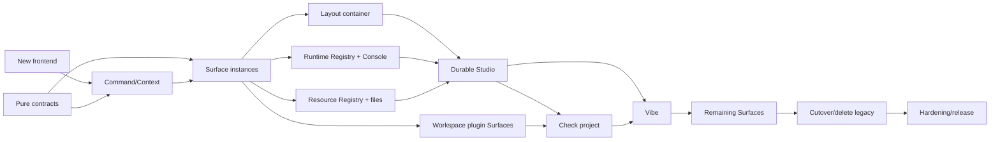

# Rho Surface Runtime Full Construction Plan

Status: implemented complete construction program; Waves 0-13 passed their
local continuous gates and the `0.4.1-dev.13` local candidate received an
explicit release decision

Date: 2026-08-21

Authorization: the owner explicitly authorized autonomous execution of the
complete plan on 2026-08-21, with no repeated product-decision pauses between
waves. This authorization does not collapse the waves into one unreviewable
change: each wave remains a bounded, buildable integration package with its
own focused evidence, contract review, documentation reconciliation, and
scoped commit. After a wave passes its continuous gate, the next dependency is
activated automatically under the same explicit authorization.

Final integration package: **Wave 13 — hardening and release handoff**, locally
accepted 2026-08-22.

2026-08-27 reconciliation note: PROJECT-TRANSITION-EPOCH-1 identified a
composition-root enforcement gap after this construction program completed.
The accepted backend project/revision/CAS architecture remains unchanged; the
implemented repair owns only session-local frontend mutation admission, quiescence
of already-admitted Studio/Surface queues, and epoch-scoped Workbench error
projection. Its implementation and evidence belong to
`implemented-2026-08-27-project-transition-epoch-repair-spec.md`; this historical
construction plan is not reactivated and does not gain a second project-
transition authority.

Wave 13 acceptance owner: this implemented contract together with the Surface,
Studio, Vibe, payload-lease, broker-event, accessibility, installed-candidate,
release and application-version contracts. Hardening may optimize or suspend
new-shell projections, but it cannot discard durable bindings, infer execution
authority from visibility, or reintroduce fixed-layout compatibility code.

Owning design:
`docs/design/accepted-2026-08-21-plugin-native-surface-runtime-design.md`

Change class: D3 shared UI/runtime/plugin architecture. Implementation risk is
R3 because layout persistence, project identity, plugin lifecycle, runtime
attachment, focus authority, and user-visible execution meet in one program.

## Program Intent

Build the new Rho frontend as one continuous product program optimized for
rapid iteration and advanced interaction design. Do not turn the current fixed
IDE layout into a permanent compatibility layer and do not require a product
decision pause between construction waves.

The repository must remain buildable at integration boundaries, but these are
continuous automated gates, not manual stop points. When a gate passes, work
continues to the next dependency automatically. A failed safety or truth gate
blocks integration because the baseline must remain honest, not because the
program needs repeated user authorization.

The end state is:

- one new React/TypeScript frontend rather than continued growth of
  `desktop/dist/app.js`;
- one shared Surface Factory/Instance, Command, Resource, and Runtime model;
- Studio as a fully user-authored recursive layout container with immutable
  starting presets;
- Vibe as an ordered scientific document containing text, references, and live
  plugin Surfaces;
- explicit runtime binding for every Console instance;
- arbitrary repeated resource/mode views without implicit uniqueness or
  Source/Preview coupling;
- trusted plugin rendering and existing Phase 2 isolation preserved;
- old fixed shell deleted after one cutover, not maintained indefinitely.

## Compatibility And Cutover Policy

Rapid iteration does not mean guessing or losing user data. It does mean
distinguishing durable scientific/user content from disposable presentation
assets.

Preserve:

- project identity and normalized project roots;
- project files and unsaved document drafts;
- active/open document identities where still valid;
- Workspace R, Runs, Artifacts, Agent conversations, approvals, Environment,
  Git, Evidence, and plugin lifecycle truth;
- exact plugin package/digest/generation and grant identity;
- current source and Viewer payload bounds.

Do not preserve as product contracts:

- current top-bar groups, element IDs, fixed left/right/Dock DOM, CSS grid
  classes, or tab hierarchy;
- `PanelSizes`, `posture`, `humanPreset`, `agentSurface`, or
  `agentWorkSurface` as future layout concepts;
- a runtime switch that keeps both old and new shells after cutover;
- old mock implementation structure;
- one-panel-per-plugin assumptions;
- compatibility mappings from every old layout state into Studio/Vibe.

Development uses a separate new frontend entry while the old frontend is
frozen. The cutover changes Tauri to the new build output, removes old shell
code, and relies on source-control rollback rather than shipping two frontends.
The new first launch uses the immutable `Rho Studio` preset. Old pane sizes and
posture are ignored. Document drafts and project content are restored through
their existing authoritative records.

## Selected Frontend Stack

Current documentation was checked through Context7 on 2026-08-21.

### React 19.2.7 + TypeScript

- `createRoot` owns the new desktop renderer;
- stable `instance_id` keys preserve Surface component identity across layout
  movement;
- `useSyncExternalStore` subscribes to cached broker snapshots rather than
  copying authoritative state into ad hoc React stores;
- React state is limited to local ephemeral interaction. Project, runtime,
  plugin, and durable layout truth remains broker-owned;
- concurrent rendering never becomes permission or execution authority.

### Vite 8.2.2

The original plan selected 8.0.10. Wave 0 advanced the exact pin to 8.2.2
before integration because the npm advisory database reports a Windows
development-server path-disclosure vulnerability through 8.0.15. The selected
minor release preserves the reviewed Vite 8 configuration contract and removes
the newly introduced high-severity dependency finding.

- source lives under `desktop/ui/`;
- development uses Vite HMR against browser/mock transport and the exact Tauri
  debug app;
- production emits deterministic local static assets to `desktop/dist` with
  relative paths and no CDN/runtime fetch;
- `npm ci` and the checked-in lockfile remain the package authority;
- generated `desktop/dist` becomes build output at cutover rather than the
  hand-edited source of truth.

### ProseMirror

- schema-owned nodes define Vibe documents and prevent arbitrary DOM from
  becoming document truth;
- transactions produce exact before/after Page revisions;
- custom NodeViews host trusted Surface blocks while plugin content remains
  behind the RSR renderer contract;
- JSON serialization supports deterministic local persistence and fixtures;
- collaborative editing is not activated by choosing ProseMirror.

### Deliberate non-selections

- no React layout/IDE framework owns the Scene model;
- no dashboard-grid library defines user geometry;
- no component library becomes trusted UI policy;
- no Electron, Next.js, server-side renderer, remote asset host, or second web
  application shell;
- no React component, ProseMirror NodeView, or TypeScript type becomes the
  workspace-plugin ABI.

Monaco remains the source editor. CSS custom properties, cascade layers,
container queries, ResizeObserver, and Pointer Events implement presentation
and resizing under RSR-owned contracts.

## Target Source Layout

```text
crates/rho-ui-contract/
  src/
    command.rs
    context.rs
    fixture.rs
    layout.rs
    resource.rs
    runtime.rs
    surface.rs
    vibe.rs
    validation.rs

crates/rho-extension-runtime/src/
  surface_contribution.rs
  surface_document.rs
  surface_event.rs

desktop/ui/
  index.html
  src/
    app/
    broker/
    commands/
    context/
    layout/
    runtime/
    studio/
    surfaces/
    transport/
    vibe/
    styles/
    main.tsx
  vite.config.ts
  tsconfig.json

desktop/src-tauri/src/
  commands/ui.rs
  commands/runtime.rs
  ui_profile.rs
  ui_runtime.rs
  ui_surfaces.rs
  runtime_registry.rs

scripts/
  generate-rsr-contract-fixtures.mjs
  test-rsr-contract.mjs
  test-rsr-mock-parity.mjs
  test-rsr-generated-assets.mjs
  test-rsr-cutover.mjs
```

`rho-ui-contract` is a pure crate with no Tauri, DOM, Store, Workspace R,
Agent, credential, process, or network access. It owns serializable IDs,
bounded shapes, validation, and pure transitions. `rho-extension-runtime`
depends on it for future `ui.surface.*` declarations; the contract crate never
depends on the plugin runtime, avoiding a circular authority graph.

## End-State Ownership

### UI contract

`rho-ui-contract` owns:

- Surface definitions, instances, modes, sizing hints, resource/runtime
  bindings, open requests, and lifecycle state;
- recursive Studio Container/Stack/Surface trees and pure layout mutations;
- Vibe Page/Section/Block schemas and pure Page mutations;
- Command definitions/invocations and typed UI Context;
- byte, depth, identifier, and collection bounds.

### UI runtime service

The Rust desktop service owns:

- application and workspace-plugin Surface factories;
- instance allocation and exact project/plugin/generation binding;
- runtime/resource resolution;
- Scene/Page revisions and mutation admission;
- active/inactive/suspended/placeholder instance lifecycle;
- cancellation, teardown, project switch, restart, and late-result rejection;
- transport-safe snapshots to React.

### Runtime Registry

The broker owns attachable runtime identity:

```text
RuntimeDescriptorV1 {
  runtime_provider_id
  runtime_instance_id
  runtime_kind
  project_id
  activation_generation
  state_revision
  status
  attach_capabilities[]
  persistence_class
  display_label
}
```

The existing Workspace R registers as the primary scientific runtime. Agent R
does not expose `console.attach`. Additional trusted application runtime
providers may create auxiliary local R or future runtimes. Auxiliary runtimes
are explicitly labelled and never become the authoritative Workspace R.

Runtime creation, attachment, interruption, restart, stop, and disposal are
separate commands. Opening/closing a Console never creates/stops a runtime
implicitly. Multiple Consoles may deliberately bind the same or different
runtime IDs.

Runtime supervision and recovery remain consistent with Issue #93: a runtime
provider supplies identity and lifecycle events; the UI Registry does not
invent health or recover a process itself.

### Resource Registry

Resource providers own canonical typed resource identities and revisions.
Surface instances consume bindings but do not infer sharing:

- two identical file/mode views are permitted;
- Source and Preview can be modes of one plugin or separate plugins;
- two views share a document model only when a resource provider explicitly
  exposes that model;
- immutable snapshot consumers bind exact revisions and become stale when
  their claimed revision changes;
- the layout tree never owns file content, Artifact bytes, Run truth, or
  Workspace objects.

### UI profile storage

Presentation state belongs beside the current project session store, not in
`rho-store` schema v14. Add `ProjectUiProfileStore` under the application-data
project-session family with its own versioned atomic JSON file and same-
directory recovery backup.

It stores Studio Scenes, Vibe Pages, durable instance specifications, user
sizing, active mode, and focus identity. It does not store file contents,
plugin-private state, credentials, Run/Artifact data, live runtime generations,
or authority handles.

Writes use expected revision and atomic replacement. Dragging updates local
preview state per animation frame and commits one durable transaction at
pointer release. Failed persistence restores the last durable profile and
shows an unsaved-layout error.

## Continuous Construction Waves

These waves form one complete sequence. They are integration checkpoints, not
manual product pauses. Each wave lands only with its tests and leaves the
branch runnable.

### Wave 0 — New frontend workspace and deterministic harness

Deliver:

- add `desktop/ui` with React 19.2.7, TypeScript strict mode, Vite 8.2.2,
  browser/mock transport, and deterministic test bootstrap;
- preserve the current Tauri `frontendDist` until cutover;
- add a separate new-shell development command and exact build output staging
  directory;
- establish lint/typecheck/unit/browser-preview commands;
- add one empty Rho window with project identity and startup health only;
- freeze old frontend feature work except safety defects required by the
  active branch.

Continuous gate:

- `npm ci`, typecheck, unit test, production build, deterministic asset
  inventory, no network-loaded assets, and browser smoke;
- existing desktop remains unchanged and buildable.

Wave 0 completed locally on 2026-08-21:

- `desktop/ui` now owns the React 19.2.7/TypeScript/Vite 8.2.2 source and emits
  only to ignored `desktop/rsr-dist`; Tauri still ships `desktop/dist`;
- real and mock bootstrap transports share one typed boundary over the existing
  `startup_status` and `project_state` commands;
- strict typecheck, ESLint, six Vitest cases, production build, two-build
  byte-for-byte asset comparison, no-network asset validation, and real local
  Chromium DOM smoke pass through `npm run rsr:check`;
- `npm ci --ignore-scripts`, full `npm audit` with zero findings,
  `node --check desktop/dist/app.js`, and
  `cargo check -p rho-desktop --locked` pass;
- separate contract review found and repaired unstable default-transport
  identity, project-path whitespace loss, a package-level ESM collision with
  the frozen old shell, and cross-platform harness path handling;
- no application/R-package version or `NEWS.md` change is required because the
  new shell is not shipped and no public or plugin contract changed;
- hosted, multi-platform, installed-candidate, and release checks remain
  intentionally outside the rapid local loop and are not claimed.

### Wave 1 — Pure RSR contracts

Deliver:

- create `rho-ui-contract` and add it to the workspace;
- implement bounded IDs, Surface Factory/Instance, sizing, mode, Resource,
  Runtime, Command, Studio Container, Vibe Page, and event contracts;
- implement pure validators and mutation reducers;
- serialize golden fixtures consumed by the TypeScript test suite;
- add Rust/TypeScript contract parity checks without hand-copying authority
  rules into UI rendering code.

Continuous gate:

- normal/boundary/over-limit/malformed/duplicate/stale fixtures;
- recursion and encoded-byte budgets;
- arbitrary asymmetric/nested layout fixtures including small intrinsic strips;
- no Tauri, Store, filesystem, runtime, plugin execution, or UI behavior.

Wave 1 completed locally on 2026-08-21:

- added the pure `rho-ui-contract` workspace crate with bounded typed IDs,
  Surface factories/instances/events, explicit Resource and Runtime bindings,
  Commands, UI Context, recursive Studio Containers/Stacks, Vibe Pages/grids,
  structured errors, validators, and stale-safe pure reducers;
- validators cover normal, empty, exact boundary, just-over-limit, malformed,
  duplicate, missing-reference, stale revision, project mismatch, bidi/control
  spoofing, depth, node, placement, JSON, Scene, Page, view-state, and event
  payload cases; empty Studio and Vibe authoring states remain representable;
- the golden fixture proves two Consoles sharing one exact runtime, repeated
  file/resource instances in independent Source/Preview modes, asymmetric
  fractional/minmax layout, an intrinsic status strip, and ordered Vibe grid;
- Rust emits the checked-in fixture and `test-rsr-contract.mjs` rejects any
  byte drift; nine frontend tests consume the generated JSON rather than
  copying Rust authority rules;
- `cargo test -p rho-ui-contract --locked` passed 24 tests including one
  property test, `cargo clippy -p rho-ui-contract --all-targets --locked -- -D
  warnings` passed, and `cargo test --workspace --locked` passed the complete
  local Rust workspace matrix with only the existing opt-in Keychain smoke
  ignored;
- `npm run rsr:check` passed strict TypeScript, ESLint, contract parity, nine
  Vitest cases, deterministic production assets, and real Chromium smoke;
- normal dependencies remain only `serde`, `serde_json`, and `thiserror`;
  `proptest 1.11.0` is test-only under MIT OR Apache-2.0;
- separate contract review added explicit grid `row_start` for deterministic
  overlap rejection and repaired missing empty Studio/Vibe states;
- no application/R-package version or `NEWS.md` change is required because
  this pure internal crate is not shipped as a public/plugin ABI and the active
  Tauri frontend remains unchanged.

### Wave 2 — Command, Context, and snapshot kernel

Deliver:

- implement the broker-owned UI Context snapshot;
- implement one Command Registry used by top chrome, menus, keyboard, Surface
  actions, and command search;
- build React subscription through `useSyncExternalStore` with cached immutable
  snapshots;
- separate command availability from execution admission;
- provide real and mock transports implementing one TypeScript interface;
- project project-switch, health, active operations, selection, and plugin
  origins without raw Store/coordinator structs.

Continuous gate:

- exact command identity, unavailable reasons, stale context, project A/B/A,
  snapshot caching, no tearing, and real/mock parity;
- no command gets authority from button placement or keyboard presence.

Wave 2 completed locally on 2026-08-21:

- added the bounded `UiKernelSnapshotV1`, project/health detail, exact command
  registration, registry byte budget, application command inventory, typed
  availability evaluation, and project-bound invocation-context validation to
  `rho-ui-contract`;
- added a desktop UI Kernel service that derives opaque project identity and
  broker revision, separately projects Workspace and Agent health, collects
  bounded scientific Run/render/Agent/file-change/approval operations, and
  projects exact workspace-plugin command origin, package digest, activation
  generation, input schema, status, and unavailable reason without exporting
  `Store`, coordinator, Tauri, or authority handles;
- the cache structurally reuses identical `Arc` snapshots, advances a
  process-local monotonic snapshot revision for semantic changes and A/B/A
  project sequences, clears cross-project ephemeral selection, and admits
  selection updates only against exact project, project revision, and snapshot
  revision;
- React now consumes one frozen external store through
  `useSyncExternalStore`; real Tauri and browser/mock transports implement the
  same interface, and mock state consumes the Rust-generated kernel fixture.
  Top-chrome, menu, keyboard, Surface-local, primary, and search projections
  filter this one registry; Wave 2 deliberately adds no generic command
  execution endpoint;
- invalid, unsupported-contract, schema-less, or over-budget plugin commands
  are omitted without breaking application commands, snapshot reads serialize
  against the project transition gate, failed selection projection restores
  the exact previous ephemeral selection, event-listener setup failures are
  isolated, and Agent dependency degradation remains independent from healthy
  Workspace/editor state;
- `cargo test -p rho-ui-contract --locked` passed 28 tests,
  `cargo test -p rho-desktop --locked` passed 280 tests with the existing
  opt-in macOS Keychain smoke ignored, and `cargo test --workspace --locked`
  passed the complete local Rust matrix;
- focused `rho-ui-contract` Clippy with `-D warnings` passed. The repository-
  wide Rust 1.97 Clippy run still encounters existing lints in untouched
  crates; a desktop `--no-deps` run with only those enumerated baseline lint
  classes allowed passed with `-D warnings`, leaving no new Wave 2 warning;
- `npm ci --ignore-scripts`, zero-finding `npm audit`, and
  `npm run rsr:check` passed strict typecheck, ESLint, Rust/TypeScript fixture
  parity, nine Vitest cases, deterministic assets, no network assets, and real
  local Chromium smoke. The frozen legacy `desktop/dist/app.js` syntax check
  also passed;
- separate review repaired project-switch snapshot tearing, quadratic and
  unbounded plugin command aggregation, plugin-caused shell failure,
  unsupported/missing plugin contracts, non-transactional selection failure,
  and unhandled listener setup rejection. No application/R-package version or
  `NEWS.md` change is required because Tauri still ships the frozen old
  frontend and the new kernel contract remains internal until cutover.

### Wave 3 — Surface Factory/Instance runtime

Deliver:

- add application Surface registration to the internal plugin lifecycle;
- add host-generated instance allocation, explicit `new_instance` versus
  `reuse_exact`, resource/runtime bindings, mode configuration, local view
  state, and sibling-independent close;
- implement active, hidden, suspended, failed, and placeholder states;
- bind every instance to exact project and application/plugin generation;
- expose `list/open/update/close/suspend/resume` commands and lifecycle events;
- render one synthetic application Surface repeatedly in React.

Continuous gate:

- singleton and unlimited-shape multi-instance behavior under resource budgets;
- repeated identical bindings, close-one/keep-siblings, generation replacement,
  crash, project switch, late event, suspension, and reopen;
- stable React keys preserve intended local state and never cross instances.

Wave 3 implementation evidence (completed 2026-08-21):

- `rho-ui-contract` now owns generation-bound factory registrations, bounded
  Surface Runtime snapshots and lifecycle events, explicit open/update/target
  requests, host-owned view state, technical quota classes, and placeholder
  validation. The 256-instance/2 MiB and per-cost-class limits are resource
  budgets only; no row, column, symmetry, or grid-shape rule exists;
- application Surface registration is a reversible `EffectSink` contribution
  in the existing internal extension Registry. The built-in synthetic Surface
  Playground activates in the application scope, receives the exact scope
  generation, is hidden in legacy mode, and loses routing during scope
  disposal; no parallel static factory lifecycle was introduced;
- the desktop Surface Runtime allocates opaque instance IDs and atomically
  reconciles exact project/factory generations before every operation. It
  exposes `list/open/update/close/suspend/resume`, distinguishes all five
  lifecycle states, rejects stale revisions/events, turns replaced or removed
  instances into truthful placeholders, keeps repeated identical bindings
  independent, and closes one instance without touching siblings;
- React and real/mock transports consume the same Surface command lane. The
  playground renders repeated instances with `instance_id` keys; a regression
  test proves closing one card preserves its sibling's component-local draft.
  Browser mock handlers cover all six Tauri commands;
- focused contract/runtime/desktop tests passed, including singleton and
  multi-instance resource budgets, repeated exact bindings, explicit reuse,
  generation replacement, close-event identity, crash/failure/reopen,
  hidden/suspend/resume, project A/B/A isolation, late-event rejection, and
  transactional sibling-local view-state mutation. The complete
  `cargo test --workspace --locked` matrix passed: desktop ran 287 tests with
  286 passing and the existing opt-in macOS Keychain smoke ignored;
- focused `rho-ui-contract` and `rho-extension-runtime` Clippy passed with
  `-D warnings`. Desktop `--no-deps` Clippy also passed with only the same
  enumerated pre-existing lint classes allowed. `npm run rsr:check` passed
  strict typecheck, lint, Rust/TypeScript fixture parity, 12 Vitest cases,
  deterministic production assets, and the local Chrome smoke; frozen
  `desktop/dist/app.js` syntax remains valid;
- separate review repaired replacement placeholders that were still coupled
  to a new factory origin/mode, close events that omitted the removed instance
  identity, unhandled React mutation rejection, and Chrome 151 completing
  `--dump-dom` without exiting. The browser gate now accepts only a complete
  DOM plus the existing readiness/evidence markers, then reclaims the idle
  process;
- no application/R-package version or `NEWS.md` change is required: Tauri
  still ships the frozen `desktop/dist` frontend, while Wave 3 remains an
  internal foundation for the one-way cutover.

### Wave 4 — Recursive Studio layout container

Deliver:

- implement `Container(axis, children)`, `Stack`, and `Surface` rendering;
- implement `auto`, `intrinsic`, `fixed`, `fraction`, and `minmax` child bases;
- implement arbitrary nesting, insert/move/stack/unstack/duplicate/close;
- implement pointer and keyboard boundary resizing;
- use Surface sizing hints plus CSS container queries to select full/compact/
  strip presentation;
- implement user-authored collapse priorities without silent deletion/reorder;
- build layout inspector, command-driven normalization/distribution, and undo/
  redo over pure layout transactions.

Continuous gate:

- highly asymmetric layouts, tiny strips, many uneven children, deep nesting,
  resize clamp, user override, narrow viewport, keyboard, focus and scroll;
- drag preview remains frame-paced; one durable mutation occurs on release;
- no visible grid-shape cap. Only encoded/depth/node/instance resource budgets
  apply.

Wave 4 implementation evidence (completed 2026-08-21):

- `rho-ui-contract` now owns project-bound Studio Runtime snapshots and typed
  insert/move/stack/unstack/close, boundary resize, basis, collapse-priority,
  axis, focus, normalize, distribute, and root edits. Pure reducers preserve
  stale-safe transactional input, arbitrary recursive/asymmetric composition,
  `auto`/`intrinsic`/`fixed`/`fraction`/`minmax` bases, host-allocated node
  identity, normalization, missing-instance pruning, and the existing encoded,
  depth, node, and placement budgets without a grid-shape limit;
- the desktop Studio Runtime owns one exact project Scene, monotonic snapshot
  and layout revisions, a bounded 64-entry undo/redo history, unplaced live
  instance inventory, project A/B isolation, and Surface availability
  reconciliation. Surface open now checks the real Studio layout revision;
  open/close/update/lifecycle commands reconcile Studio without deriving
  resource, runtime, plugin, or execution authority from placement;
- Tauri exposes `studio_scene/apply/undo/redo` and one invalidation event. The
  React and browser/mock transports remain lockstep with those commands and
  reject cross-project/stale edits before mutation. The Rust-generated golden
  fixture supplies the same Studio snapshot to both sides;
- React recursively renders Containers, Stacks, and Surface leaves with stable
  instance keys. It provides explicit unplaced inventory, independent repeated
  views, Stack tab activation without sibling destruction, tree inspector,
  axis/normalize/distribute controls, user-authored collapse priorities,
  adaptive recoverable collapse rails, CSS container-query full/compact/strip
  projection, and undo/redo. Console leaves display their exact runtime binding
  and file Source/Preview remain independent Surface modes;
- pointer resize mutates only ephemeral DOM geometry once per animation frame
  and commits one atomic two-child basis edit on release; pointer cancellation
  commits nothing. The same handle provides clamped directional-key resize.
  Tests prove pointer movement causes zero durable calls, release causes exactly
  one, keyboard causes exactly one, and closing one repeated playground
  placement preserves its sibling draft;
- pure layout tests cover asymmetry, intrinsic strips, deep nesting, exact
  node/placement budgets, composite insert/move/stack/unstack, atomic resize,
  non-resizable rejection, pruning, normalization, stale failure, and duplicate
  rejection. Desktop tests cover transactional edit/undo/redo, availability
  pruning, and project isolation;
- `cargo test --workspace --locked` passed the complete local matrix: Desktop
  ran 289 tests with 288 passing and the existing opt-in macOS Keychain smoke
  ignored. Focused `rho-ui-contract` and `rho-extension-runtime` Clippy passed
  with `-D warnings`; full desktop Clippy completed with no new Wave 4 warning
  and only the recorded pre-existing repository categories;
- `npm run rsr:check` passed strict TypeScript, ESLint, exact Rust/TypeScript
  fixture parity, 14 Vitest cases, deterministic production assets, no-network
  asset validation, and real local Chrome smoke. A 1600 x 1000 local capture
  verified the 7:3 asymmetric root, nested Console Stack, exact runtime label,
  independent Source view, intrinsic status strip, inspector, and inventory;
- cross-review found no competing persistence or authority owner: durable
  profile persistence remains Wave 7, Runtime attachment remains Wave 5,
  Resource contents remain Wave 6, and plugin rendering remains Wave 8. No
  application/R-package version or `NEWS.md` change is required because Tauri
  still ships frozen `desktop/dist`; installed-app and release acceptance are
  neither run nor claimed.

### Wave 5 — Runtime Registry and multi-runtime Console

Deliver:

- register current Workspace R as an attachable primary runtime;
- add trusted internal Runtime Provider registration and a broker-managed
  auxiliary R runtime implementation under supervisor ownership;
- expose runtime list/create/attach/detach/interrupt/restart/stop commands with
  exact identity and truthful state;
- keep Agent R non-attachable;
- convert Console into a multi-instance Surface Factory requiring explicit
  `runtime_instance_id`;
- give each Console independent draft/history/filter/scroll/focus while Runs,
  execution order, busy state, interrupt and restart come from its bound
  runtime;
- origin-label outputs by runtime and Console instance.

Continuous gate:

- several Consoles sharing Workspace R;
- Consoles split across Workspace R and auxiliary runtimes;
- one runtime failure affects only bound instances;
- close Console does not stop runtime, stop runtime does not destroy layout;
- project A/B isolation, runtime restart generation, queued execution,
  cancellation, crash/recovery, and no Agent R attachment;
- Issue #93 supervisor/recovery contracts remain authoritative.

Completion evidence (2026-08-21):

- `rho-ui-contract` now defines bounded Runtime Provider, Registry, lifecycle,
  attachment, execution and output-origin contracts. The trusted application
  plugin registers `rho.ark-r`; Workspace R is the project-persistent primary,
  auxiliary Ark R sessions use explicit leases, and Agent R exposes no
  attachable descriptor;
- Tauri exposes list/create/attach/detach/interrupt/restart/stop/execute with
  exact project, provider, instance, generation and revision admission.
  Workspace restart delegates to the existing supervisor, auxiliary sessions
  are retired only after a committed project switch or during shutdown, and an
  old-generation late completion cannot overwrite recovered truth;
- Console is a real multi-instance Surface with an explicit runtime selector.
  Each instance owns draft, bounded history, output filter, scroll state and
  origin-labelled output. Runtime busy/order/interrupt/restart remain shared by
  the bound Runtime. Restart advances generation and atomically rebinds every
  matching Console; closing a Console does not stop a Runtime and stopping an
  auxiliary Runtime leaves the Surface and Studio layout intact;
- execution queues are per Runtime. Explicit execution leases keep project
  switching blocked while running or queued without holding the project gate
  during kernel work, so Interrupt can enter. Cancellation returns a truthful
  cancelled result, crashes mark only the exact Runtime failed, and delayed old
  generations are withheld;
- Rust/TypeScript mock parity covers the eight Runtime commands. Frontend tests
  cover shared and split runtimes, independent Console state/output, restart
  rebinding, Runtime stop versus layout lifetime, Console close versus Runtime
  lifetime, and exact runtime/Console output origin. Provider lifecycle tests
  cover generation binding, reversible disposal and duplicate rollback;
- `cargo test --workspace --locked` passed the complete local matrix: Desktop
  ran 296 tests with 295 passing and the existing opt-in macOS Keychain smoke
  ignored. Focused `rho-ui-contract` and `rho-extension-runtime` Clippy passed
  with `-D warnings`; full Desktop Clippy completed with only the recorded
  pre-existing repository categories after Wave 5 warnings were removed;
- `npm run rsr:check` passed strict TypeScript, ESLint, exact generated fixture
  parity, 17 Vitest cases, deterministic production assets, no-network asset
  checks and real local Chrome smoke. An 1800 x 1100 capture verified the
  Runtime inventory, explicit Console selector, bound status/actions and
  instance-local composer in the recursive Studio scene;
- cross-review found no ownership conflict: Issue #93 still owns Workspace R
  supervision, Registry state is a projection plus auxiliary-provider lane,
  Surface placement grants no process authority, and Wave 6 alone introduces
  canonical Resource resolution. No application/R-package version or
  `NEWS.md` change is required because Tauri still ships frozen `desktop/dist`;
  installed-app and release acceptance are neither run nor claimed.

### Wave 6 — Resource Registry and unconstrained file views

Deliver:

- register normalized project-file resources and document-session models;
- convert Editor/File Viewer into Surface factories;
- allow any number of instances for different or identical files;
- allow same plugin/same mode duplicates and independent Source/Preview/Diff/
  Outline modes;
- allow Source and Preview to come from unrelated plugins;
- expose explicit optional `view_group` commands for linked scroll/selection,
  never automatic linking;
- bind preview/render claims to exact resource revisions and show stale states.

Continuous gate:

- two files, one file twice in Source, one file twice in Preview, arbitrary
  Source/Preview providers, shared-model and immutable-snapshot consumers;
- independent cursor/viewport/focus, dirty draft preservation, external reload,
  stale preview, rename/delete, project switch, and unsupported resource;
- no layout node or plugin instance becomes file-content authority.

Completion evidence (2026-08-22):

- `rho-ui-contract` now owns bounded Resource Provider registrations,
  provider-qualified project Resource identity, normalized target/revision
  admission, ready/missing/unsupported truth, shared-document versus immutable-
  snapshot reads, content/draft/save/reload/rename/delete requests, and exact
  encoded/content budgets. The generated fixture proves independent Source,
  Diff, Outline, and Preview modes and repeated bindings without implying
  uniqueness;
- application plugin lifecycle registration now treats Resource Providers as
  generation-bound reversible effects with duplicate-candidate rollback. The
  project-file provider is a separate registered authority from the Source and
  Preview Surface factories, so a Resource kind and a rendering factory are
  never assumed to share an owner;
- the desktop Resource Registry owns one normalized project-file projection and
  per-project shared document caches. Dirty A/B/A documents survive project
  switching; external edits and deletion produce stale recovery content;
  unsupported and explicitly missing resources remain truthful. Save, rename,
  and delete use exact revisions and recover the original file plus registry
  projection when project identity or later completion fails;
- Tauri and browser/mock transports implement list/resolve/read/draft/save/
  reload/rename/delete in lockstep. Source views share one document model while
  Preview views retain immutable exact-revision snapshots until explicit
  refresh. Rename rebinds every matching view without moving layout; delete
  preserves Surface placement as an unavailable Resource;
- Source and Preview are repeatable independent factories. The new shell can
  open different files, identical Source or Preview instances, and any Source/
  Diff/Outline/Preview combination. Cursor, viewport, focus, mode, and local
  state stay instance-local by default; only an explicit matching
  `view_group_id` propagates cursor/scroll view state among views of the exact
  same provider-qualified Resource;
- frontend behavior tests cover shared sibling drafts, immutable stale Preview,
  repeated identical views, explicit view-group linking, save/reload, rename,
  deletion, and unchanged Studio layout. Rust tests cover provider lifecycle,
  exact byte boundaries, provider/project/identity rejection, A/B/A recovery,
  external conflicts, unsupported/missing resolution, dirty deletion recovery,
  linked view state, Source-only revision advance, Preview staleness, and
  rename rebinding;
- `cargo test --workspace --locked` passed the complete local matrix: Desktop
  ran 304 tests with 303 passing and the existing opt-in macOS Keychain smoke
  ignored. Focused `rho-ui-contract` and `rho-extension-runtime` Clippy passed
  with `-D warnings`; `cargo check -p rho-desktop` passed after the final linked-
  view change;
- `npm run rsr:check` passed strict TypeScript, ESLint, exact generated fixture
  parity, 20 Vitest cases, deterministic production assets, no-network asset
  checks, and real local Chrome smoke. An 1800 x 1100 local capture verified a
  real Source editor, Resource inventory, explicit status/revisions and the
  recursive Studio scene;
- cross-review found one resolved ownership boundary: Resource Provider owns
  identity/content/revision, shared documents own drafts, immutable consumers
  own only their snapshot, Surface instances own view state, and Studio owns
  placement only. No application/R-package version or `NEWS.md` change is
  required because Tauri still ships frozen `desktop/dist`; installed-app and
  release acceptance are neither run nor claimed.

### Wave 7 — Durable UI Profile and Studio product shell

Deliver:

- implement `ProjectUiProfileStore` with schema v1, CAS revision, atomic write,
  backup, reopen, and recovery;
- persist Studio trees, Vibe Page JSON, instance specs, active mode, user sizes,
  focus and local view state bounds;
- ship immutable `Rho Studio` preset and Duplicate/Save/Rename/Delete/Reset
  commands for user Scenes;
- build minimal new top chrome: Project, Studio/Vibe, Scene/Page, command search,
  runtime/health status, and one primary action;
- do not import old PanelSizes/posture/layout. Restore only durable documents,
  drafts, conversations, and scientific state.

Continuous gate:

- project A/B/A, spaces/Unicode paths, stale save, concurrent writes,
  serialization failure, partial file, corrupt file, backup recovery, reopen,
  missing Surface/runtime/resource placeholders, and no false saved state;
- exact default/reset behavior and no hidden old-layout authority.

Wave 7 completed locally on 2026-08-22:

- `rho-ui-contract` now owns schema-v1 project UI Profiles, durable Surface
  instance specifications, runtime attachment intent without live generation,
  active Studio/Vibe identity, immutable Scene presets, and stale-safe pure
  mode/select/replace/duplicate/rename/delete/reset/runtime-commit mutations.
  Profiles validate exact project/reference ownership and encoded budgets;
- the desktop `ProjectUiProfileStore` writes one normalized-project-root-bound
  atomic JSON file with CAS revision and a same-directory recovery backup.
  Clean reopen, missing/corrupt-main recovery, corrupt-without-backup failure,
  spaces/Unicode roots, two-project isolation, A/B/A return, concurrent writers,
  injected pre-replace failure, and oversized serialization all have local
  regression coverage. Memory and durable state stay unchanged after a failed
  write, so the UI never reports a false save;
- Surface, Studio, Runtime attachment/detachment, and Resource rename completion
  now checkpoint in-memory state and commit one UI Profile transaction before
  publishing success. A persistence failure restores Surface/Studio/Resource
  truth. Reopen restores exact instance identities and current factory/runtime
  generations; missing factories, changed origins, and unresolved runtime
  intents become truthful placeholders while another project starts empty;
- the immutable `Rho Studio` preset seeds a recursive resizable Scene with an
  intrinsic health strip. User Scenes expose Duplicate, Save, Rename, Delete,
  and Reset without importing `PanelSizes`, posture, fixed-grid dimensions, or
  old DOM identity. Repeated file modes and Console runtime intent remain
  independent instance specifications;
- the React shell now projects Project, Studio/Vibe, Scene/Page, command search,
  one contextual command, health, and one Compose action. Secondary Scene and
  history operations are grouped. Studio renders arbitrary recursive geometry;
  Vibe renders persisted ordered narrative/reference blocks and live Surface
  references on a document canvas, with its composition inspector collapsed by
  default. Recovery diagnostics are bounded, visible, and copyable;
- Tauri and browser/mock transports expose the same nine Profile commands and
  invalidation event. Mock mutations implement CAS, Scene library semantics,
  runtime/Profile synchronization, and an explicit Vibe preview fixture. The
  Tauri command inventory now passes with 173 commands across 17 Rust files;
- `cargo test --workspace --locked` passed the complete local matrix: Desktop
  ran 310 tests with 309 passing and the existing opt-in macOS Keychain smoke
  ignored. Focused `rho-ui-contract` and `rho-extension-runtime` Clippy passed
  with `-D warnings`; repository-wide Desktop/Store Clippy remains blocked by
  pre-existing lint debt and is not claimed as a Wave 7 pass;
- `npm run rsr:check` passed strict TypeScript, ESLint, exact generated fixture
  parity, 23 Vitest cases after the final Vibe interaction test, production
  build, generated-asset checks, and real local Chrome smoke. Separate 1800 x
  1100 Studio and Vibe captures verified the compact top chrome, recursive
  Studio, document composition, and live Surface rendering;
- cross-review found no state-owner conflict: the Profile owns only durable
  presentation intent, Studio owns placement, Surface owns local view state,
  Runtime/Resource registries resolve current truth, and plugin/Agent/scientific
  authorities remain separate. Tauri still ships frozen `desktop/dist`, so no
  application/R-package version or `NEWS.md` change is required and installed-
  app/release acceptance is neither run nor claimed.

### Wave 8 — Workspace-plugin Surface contract

Deliver:

- advance the workspace plugin manifest only through a new reviewed schema
  version; retain v2 discovery/lifecycle without reinterpreting Viewer/Panel;
- add `ui.surface.*` contribution kind, modes, sizing hints, input/output/event
  schemas, and effective quota projection;
- implement bounded `SurfaceDocumentV1` containers/content/controls and trusted
  React renderer;
- route instance events through exact project/digest/generation/instance/
  resource/runtime/Page/Layout revisions;
- preserve the current one-active-guest-call-per-plugin default with bounded
  fair queueing across instances;
- add local plugin-dev build/check/smoke for repeated Surface instances;
- add hostile workspace plugin fixtures.

Continuous gate:

- malformed/oversized/deep documents, markup/bidi/control spoofing, unknown
  controls/actions, raw HTML/CSS/script/iframe/Tauri attempts, queue floods,
  one slow instance, cancellation, revoke, crash, update, rollback and project
  A/B/A;
- plugin sizing remains a hint, never placement or trusted-dialog authority;
- no workspace-plugin runtime provider/process/credential authority is added.

Wave 8 completed locally on 2026-08-22:

- Manifest V3 adds only declarative `ui.surface.*` contributions. V1/V2 retain
  their exact discovery and contribution meaning, and a V2 package cannot
  smuggle a Surface. Surface declarations validate multi/singleton instance
  policy, independent modes/resource kinds, bounded sizing hints, closed
  input/output/event schemas, and host-owned effective quota projection;
- `SurfaceDocumentV1` provides bounded row/column/grid/tab/group containers,
  literal text/code/data/table/notice/artifact content, and fixed
  field/select/command controls. Encoded bytes, depth, blocks, controls, text,
  table and option counts are bounded. Unknown/raw markup, CSS/DOM/Tauri
  shapes, bidi spoofing, invalid controls, stale identity, and oversized events
  fail closed;
- Surface events carry exact project, plugin, digest, activation generation,
  host, Surface, instance, project/Surface/document, Resource/Runtime, and
  Studio-layout-or-Vibe-Page revisions. One host-owned queue per exact project
  plugin route preserves the one-active-guest-call invariant, bounds both
  plugin and instance floods, and round-robins repeated instances. Cancellation,
  revoke, stale routes and duplicate event IDs have regression coverage;
- the desktop projects factories only from exact active ready plugin packages,
  invokes them only through the `trusted_surface` lane, validates declared
  events and same-project artifacts, verifies one current Studio or live Vibe
  placement, caches documents by exact route/revision, and drops stale caches
  and queues on update, rollback or project transition. Surface factories pass
  disable, exact update/rollback generation, and project A/B/A isolation tests;
- the React renderer maps the closed document union to trusted components and
  never uses plugin HTML or a plugin DOM root. Typed controls dispatch exact
  events per placement. Mock and Tauri transports expose the same document,
  event and invalidation contracts; two repeated instances keep independent
  IDs and literal `<script>` remains visible text rather than executable DOM;
- `rho-plugin-dev smoke-surface` now opens two logical instances for a
  multi-instance declaration, invokes the exact snapshotted no-import Guest ABI
  V2 component for each, and validates both documents. The checked-in
  `examples/workspace-plugin-surface` fixture supplies a complete local
  build/check/smoke loop; a hostile `raw_html` variant is rejected;
- `cargo test --workspace --locked` passed the complete local matrix. The
  additional final Surface update/rollback regression passed focused Desktop
  testing; Desktop now contains 315 tests including the existing opt-in macOS
  Keychain smoke. `rho-extension-runtime` ran 215 unit/integration tests and
  `rho-plugin-dev` ran 13 unit/integration tests with no failures. Focused
  Clippy for both affected crates passed with `--no-deps -D warnings`;
- `npm run rsr:check` passed strict TypeScript, ESLint, exact Rust/TypeScript
  fixtures, 24 Vitest cases, deterministic production assets, and real Chrome
  smoke. The Tauri command inventory passes with 175 commands across 18 Rust
  files. A separate 1600 x 1000 local capture verified the plugin Surface as an
  ordinary asymmetric Studio placement with text, field and command controls;
- cross-review found no authority conflict: plugin lifecycle owns exact
  executable identity, the Surface Registry owns instance truth, Studio/Vibe
  own placement only, the Project UI Profile owns durable presentation intent,
  and the declarative renderer owns no filesystem/runtime/credential power.
  Tauri still ships frozen `desktop/dist`, so no application/R-package version
  or `NEWS.md` change is required; installed-app, CI, candidate and release
  acceptance are neither run nor claimed.

### Wave 9 — Check project as the first pluginized core component

Implementation contract activated 2026-08-22:

- RA-RC2 remains the sole core rule/scanner truth. The new Check orchestrator
  captures the admitted R-family source bytes and `renv.lock` state once, then
  runs RA-RC2 current-project rules against those captured bytes. Later disk
  edits cannot change an in-flight or completed result;
- the public snapshot exposes only normalized relative paths, byte sizes,
  content digests, capture/project revisions, truncation and limitations. Raw
  source bytes remain process-local input to core rules and are never copied
  into the UI Profile or workspace-plugin input;
- `CheckResultV1` binds one result ID to one immutable snapshot, ruleset digest,
  typed status, exact application/plugin rule origin and generation, severity,
  category, human title/summary/remediation, typed evidence, coverage and
  limitations. It is bounded to 1,000 findings/4,000 evidence records/2 MiB;
- process-local Check result retention is project-scoped and bounded. A result
  Surface persists only its result ID as view state; restart or eviction shows
  an unavailable result and never reconstructs or claims the old snapshot;
- Manifest V3 adds `check.rule.*` as an additive zero-ambient-authority rule-
  pack contribution. The host supplies only the bounded public snapshot
  descriptor, supplies no live permission handles in this lane, validates the
  declared input/output schema, binds every finding to the exact accepted
  plugin digest/generation, and treats failure/timeout/malformed output as a
  typed limitation rather than core Check failure;
- `rho.check.run` is the contextual application Command. Execution still uses
  an exact Tauri admission request; Command Registry availability and placement
  tags remain presentation only. It returns a typed result, opens a new
  repeatable `rho.check-result` Surface, and ordinary Studio/Vibe placement
  transactions decide where separate instances referencing that result appear;
- the legacy `audit_reproducibility` command and frozen frontend keep their
  accepted behavior until Wave 12 deletion. The new Check lane neither rewrites
  historical audit scopes nor imports the permanent old top-bar action.

Wave 9 completed locally on 2026-08-22:

- RA-RC2 source and `renv.lock` inputs are captured once into a process-local
  immutable snapshot. The accepted current-project rules now have a captured-
  input entry point, sorted source discovery and a regression proving later
  disk changes cannot alter an in-flight result. UI/plugin projections contain
  only normalized paths, sizes, SHA-256 digests, revisions and limitations;
  raw source bytes and nullable descriptor fields never enter plugin input;
- `CheckResultV1` provides exact project/snapshot/ruleset identity, typed
  status/severity/evidence/remediation, exact application or workspace-plugin
  origin and generation, coverage and honest limitations. Snapshot/result/rule
  IDs are bounded. Aggregate retention is 32 results per project, findings are
  capped at 1,000, evidence at 4,000, encoded results at 2 MiB, and workspace
  rule execution at eight packs per Check;
- Manifest V3 adds `check.rule.*` without changing V1/V2. The trusted Check
  lane publishes only exact active packages, supplies an empty handle map even
  when the plugin owns live grants, validates declared schemas and rule-ID/
  evidence ownership, and converts malformed/unavailable packs into result
  limitations. Disable removes registration; a hostile broker request proves
  this lane cannot consume a granted project handle;
- `rho.check.run`, the repeatable `rho.check-result` Factory and two exact
  Tauri commands are wired through the Command, Surface and Check registries.
  Dirty R-family documents reject before capture with their paths. Each run
  creates a distinct result ID and independent Surface view state; missing or
  evicted results stay unavailable rather than being reconstructed;
- the React result renderer shows coverage, core/plugin provenance, actionable
  remediation and typed evidence controls. The permanent new-shell top-bar
  Check button does not exist: the contextual Command projection runs Check,
  opens a result Surface and places it through an ordinary Studio transaction.
  The same renderer remains placement-agnostic for Vibe Surface references;
- `rho-plugin-dev smoke-check` validates a zero-permission snapshotted Guest
  ABI V2 rule pack against a realistic immutable descriptor and parses its
  typed output. `examples/workspace-plugin-check` passed local build and smoke
  with result contract `rho.ui.check-rule-pack.output.v1`;
- `cargo test --workspace --locked` passed the full local Rust matrix;
  Desktop passed 317 tests with one pre-existing opt-in Keychain smoke ignored.
  Focused `rho-ui-contract`, `rho-extension-runtime`, and `rho-plugin-dev`
  Clippy passed with `--no-deps -D warnings`. A broader Desktop/Store Clippy
  invocation remains blocked by the repository's existing warning backlog and
  is not claimed;
- `npm run rsr:check` passed TypeScript, ESLint, exact generated fixtures, 26
  Vitest cases, production build/assets and real Chrome smoke. The Tauri
  inventory passes with 177 commands across 19 Rust files. Tauri still ships
  frozen `desktop/dist`, so exact new-shell debug-app review belongs to Wave 12
  cutover; no installed-app, CI, multi-platform or release acceptance is
  claimed;
- cross-review confirms RA-RC2 remains core rule truth, Check owns immutable
  orchestration/result retention, plugin lifecycle owns executable origin,
  Surface owns result view state, Studio/Vibe own placement only, and Agent
  retains explanation only. No application/R-package version or `NEWS.md`
  change is allocated before the user-visible cutover.

Deliver:

- extract the trusted Check orchestrator, immutable project snapshot, rule
  result schema, severity/evidence/remediation model, and result renderer;
- register core rules and workspace-plugin rule packs under exact origin;
- register Check command and repeatable result Surface Factory;
- allow multiple check snapshots/results open simultaneously;
- show one result in Studio and make the same typed result available to Vibe;
- preserve Check truth separately from Agent explanation;
- remove the permanent Check project top-bar button; contextual command
  resolution supplies the primary action.

Continuous gate:

- rule success/failure/timeout/malformed output, origin, stale snapshot,
  duplicate results, plugin disable/update/rollback, A/B isolation, source
  evidence navigation, and no rule-derived trusted claims;
- deterministic browser/mock and exact debug-app review.

### Wave 10 — Vibe Page engine

Implementation contract activated 2026-08-22:

- the existing `VibePageV1`/Section/block identity, ordering, 12-column grid,
  byte/node limits, and no-double-mount rules remain the pure durable schema;
  the Page engine maps those contracts to ProseMirror rather than creating a
  competing document model;
- Page edits are exact user transactions bound to project, profile, Page and
  Page revision. Insert/move/resize/remove/history operations validate a
  complete candidate before the Project UI Profile store commits it. Stale or
  rejected transactions leave both durable and live state unchanged;
- rich text is a bounded JSON tree, not raw persisted HTML. References,
  Commands and Surface blocks are typed atoms. A Surface NodeView mounts one
  trusted React renderer for one existing instance ID and never copies plugin
  DOM, lets the plugin write ProseMirror state, or mounts one live instance
  twice;
- ordered flow remains the default. A Section may opt into the existing
  validated 12-column layout with explicit spans/starts; narrow presentation
  reflows visually without rewriting durable order or grid identity;
- read-only export is a deterministic projection of accepted Page data and
  bounded Surface placeholders/snapshots. Export never serializes live React
  nodes, runtime handles, plugin DOM, credentials or hidden editor state;
- Check project review is the first authored Page template and references the
  same typed process-local Check result Surface contract. Evicted results stay
  explicitly unavailable; Page persistence does not turn them into durable
  scientific truth.

Deliver:

- implement ProseMirror schema for Page, Section, rich text, references,
  Commands, and Surface blocks;
- implement ordered flow and validated 12-column Section layout;
- embed trusted React Surface NodeViews without copying plugin DOM or state;
- implement insert/move/resize/remove, exact Page transactions, history, and
  keyboard navigation;
- implement Check project review as the first real Vibe Page;
- implement deterministic read-only export projection separated from live UI;
- persist Pages through `ProjectUiProfileStore`.

Continuous gate:

- schema rejection, invalid grids, deterministic order/reflow/export,
  duplicate Surface factories creating separate instances, no live instance
  mounted twice, Page stale/conflict, history, plugin teardown placeholders,
  narrow viewport, accessibility and project isolation;
- Agent/plugin proposals cannot mutate a Page without exact user review.

Wave 10 completed locally on 2026-08-22:

- `VibePageV1` now owns a bounded rich-text JSON tree, typed atomic references,
  exact focus, Section/Block insert/move/remove/layout transitions and a
  deterministic Markdown projection. Invalid/stale candidates, unsafe links,
  overlapping 12-column placements and duplicate live mounts fail without
  changing the accepted Page;
- Project UI Profile schema 2 adds exact Page replacement. The desktop exposes
  `ui_profile_page_apply` and `ui_profile_page_export`, requiring matching
  project, Profile, Page and Page revisions before persistent mutation or
  read-only export. Store reopen, stale rejection, injected write failure,
  recovery and project A/B/A isolation passed. Unshipped schema-1 presentation
  assets are archived and rebuilt instead of gaining a migration layer;
- the React shell uses ProseMirror only for editing transactions. Its schema
  round-trips Section identity/order, bounded rich text, grid placement and
  typed atoms; history/keymaps, formatting, block/Section insertion,
  cross-Section ordering, spans, Flow/Grid conversion and removal persist one
  complete validated candidate. Rejection restores accepted durable state;
- trusted React NodeViews mount one existing Surface instance, refresh on
  lifecycle changes, stop plugin DOM/events at the NodeView boundary and
  unmount on teardown. Missing/evicted instances remain explicit placeholders.
  Narrow presentation reflows visually to one column without rewriting Page
  order, spans or rows;
- Check project review is the first Page template. Its typed Command opens a
  distinct process-local Check-result Surface and an ordinary exact Vibe
  transaction places that instance. Export contains only accepted authored
  text and typed placeholders, never React/plugin DOM or runtime handles;
- exact dependency pins are ProseMirror model 1.25.11, state 1.4.4, view
  1.42.2, history 1.5.0, keymap 1.2.3 and commands 1.7.2. `npm run rsr:check`
  passed 31 Vitest cases, strict TypeScript/ESLint, exact fixtures, production
  assets and real Chrome smoke. The Tauri inventory passed with 179 commands
  across 19 Rust files;
- `cargo test --workspace --locked` passed; Desktop ran 320 tests with 319
  passing and its opt-in Keychain smoke ignored. Focused `rho-ui-contract`
  Clippy passed with `-D warnings`; broad Desktop Clippy remains blocked by the
  recorded pre-existing 28-source/32-test warning backlog and is not claimed;
- 1800×1100 and 640×1000 local browser captures verified ordered asymmetric
  Grid composition, live Surface embedding, compact editing controls and
  presentation-only narrow reflow. Tauri still loads the frozen old shell, so
  no installed-app/release acceptance or application/R-package version and
  `NEWS.md` change is claimed before Wave 12 cutover.

### Wave 11 — Agent and remaining first-party Surfaces

Implementation contract activated 2026-08-22:

- Agent conversations, turns, events, approvals and activity remain owned by
  their existing project-scoped backend/store contracts. A repeatable Agent
  Surface binds a conversation identity and local view state; two instances
  may show the same conversation without duplicating or forking its truth;
- new Agent task, timeline and composer Surfaces use the ordinary application
  Surface Factory/Instance lifecycle and exact project/generation/revision
  requests. Agent health failure degrades only those Surfaces and never marks a
  healthy editor, Console, Resource, Workspace or Vibe Page as failed;
- Vibe Agent blocks are typed references/projections. Agent/plugin output may
  propose content, but only an exact user Page transaction may persist or move
  a block. Surface view state contains no credential, raw approval handle or
  copied durable conversation transcript;
- Vite HMR continues against browser/mock transport. Deterministic checked-in
  build inputs and the lockfile remain authoritative; no CDN/runtime asset
  fetch or second frontend is introduced. `desktop/dist` becomes generated
  output only at the Wave 12 startup cutover, when the old shell is deleted in
  the same buildable package.

Deliver:

- convert Agent task/timeline/composer to repeatable Surface instances where
  product semantics permit, sharing durable conversations rather than copying
  them;
- expose Agent task/activity Vibe blocks;
- retain Ask/Plan/Act, approvals, dependency diagnostics, cancellation,
  conversation concurrency, model routing, and file-edit review;
- migrate Environment, Evidence, Git, Help, Runs, Artifacts, Problems, Plots,
  Logs, and render jobs as Surface factories;
- remove top-level domain tab assumptions and project all actions through the
  Command Registry;
- ensure small status/operation plugins can render as intrinsic strips.

Continuous gate:

- every existing domain's focused tests plus multi-instance, runtime/resource
  binding, focus stability, background refresh, project switch, unavailable,
  and narrow-layout behavior;
- no domain migration creates a second data/persistence/execution authority.

Wave 11 completed locally on 2026-08-22:

- the application registry now exposes Agent plus Environment, Evidence, Git,
  Runs, Artifacts, Problems, Plots, Logs, render jobs and Help as ordinary
  multi-instance trusted-host factories. The shared Surface catalog creates
  and places any factory in the active Studio Scene or Vibe Page; Problems and
  Logs declare strip quota/sizing and place with intrinsic basis rather than a
  fixed workbench region;
- a repeatable Agent Surface binds only `conversation_id`, Ask/Plan/Act and
  instance-local composer/review preferences. Conversations, turns, events and
  approvals are reloaded from existing project-scoped commands. Two instances
  bound to one conversation observe the same durable turn while keeping
  independent composers. Agent dependency failure renders an actionable local
  degraded card and does not change editor, Console, Resource or Workspace
  health;
- cancellation, retry, approval decisions, runtime retry and model routing use
  the existing Agent admission commands. File proposals are decoded only from
  the persisted `propose_file_edit` event, reviewed explicitly, read through
  the shared Resource document and applied/undone through the existing guarded
  Agent file-mutation lane. No transcript, credential, approval handle or file
  mutation truth is copied into Surface state;
- explicit `Pin to Vibe` is a user Page CAS transaction producing a typed
  `task_ref`; Agent refreshes cannot write or reorder Page state. Opening a
  Surface in Vibe likewise creates an ordinary typed `surface_ref` transaction;
- domain Surfaces adapt existing Tauri commands and stores instead of creating
  parallel data services. Runs retains guarded retry; Environment retains its
  dedicated request lane; Git, Evidence, Artifacts, Plots, Problems and render
  views remain projections of their current authorities. The Command Registry
  adds factory-opening actions and the palette uses the shared dispatcher,
  removing the need for permanent domain tabs;
- unshipped Project UI Profile schema 3 seeds an asymmetric nested
  Console/Agent Studio scene. Exact older owned presentation files are archived
  and rebuilt; no old pane/posture compatibility mapping was added. Browser/mock
  mode registers the same new application factories and deterministic domain,
  Agent and file-review behavior;
- `npm run rsr:check` passed strict TypeScript/ESLint, exact Rust/TypeScript
  fixtures, 34 Vitest cases, Vite production build, generated-asset validation
  and real Chrome smoke. Wide and narrow local captures verified repeatable
  Agent composition, explicit Console binding, intrinsic status composition and
  isolated Agent degradation;
- `cargo test --workspace --locked` passed after updating exact application
  Surface/Command registry assertions; Desktop ran 320 tests with 319 passing
  and its opt-in Keychain smoke ignored. `cargo fmt --all -- --check`, strict
  `rho-ui-contract` Clippy and `git diff --check` also passed. Contract review
  found no deviation from the accepted ownership or mutation boundaries. No
  version or `NEWS.md` change is claimed because Tauri still starts the frozen
  old shell until Wave 12; installed-app and release acceptance are likewise
  not claimed.

### Wave 12 — Cutover and legacy deletion

Deliver:

- point Tauri `frontendDist`/build commands at Vite production output;
- replace hand-edited `desktop/dist` source with generated assets and manifest;
- remove old `app.js`, fixed shell HTML/CSS, legacy layout functions, old mock
  structure, panel-size controls, posture/layout toggles, and obsolete UI tests;
- set `withGlobalTauri` false when the module bridge has exact coverage;
- introduce a restrictive local-only CSP compatible with Monaco, trusted
  viewers, and generated assets;
- update packaging scripts, command inventory, cache busting, AGPL/source
  artifact checks, documentation, NEWS, and version metadata;
- retain no runtime old-shell fallback.

Continuous gate:

- complete affected Rust/R/frontend matrix;
- new production asset determinism and no old-shell symbol inventory;
- browser/mock at required wide/narrow viewports;
- exact owner-named checkout `target/debug/rho-desktop` Studio, Vibe,
  multi-runtime Console, repeated file views, plugin Surface, Check project,
  Agent, project switch, restart, and recovery workflows;
- only after local acceptance, construct a fresh named application candidate.

Accepted evidence (2026-08-22):

- Tauri now builds and ships only deterministic Vite output from
  `desktop/dist`; the global bridge, old `app.js`/`styles.css`, fixed shell,
  copied vendor runtime and obsolete UI/source-contract tests were deleted.
  Legal source assets remain reviewed under `desktop/legal` and are copied into
  the generated distribution by the production build;
- startup now formally sequences R bootstrap, Workspace R start and saved
  project restoration before mounting the UI Kernel. Agent dependency probing
  runs afterward as an independent fault domain and emits snapshot invalidation
  when its health changes. Missing R/Workspace/project preparation failures
  retain actionable Retry/Choose Rscript diagnostics instead of mounting a
  half-prepared workbench;
- Issue #100 dependency projection distinguishes missing, too old, namespace or
  load failure, incompatible API, missing provider adapters and provider health;
  it reports resolved R/package versions and paths, CRAN-minimum mismatch,
  remediation and one copyable diagnostic without degrading a healthy Console,
  editor or Workspace R;
- the exact owner-named `/Users/xiayh/Projects/Rho/target/debug/rho-desktop`
  restored `workspace-plugin-minimal`, showed Workspace R ready, switched
  between the Studio Console/Agent scene and revisioned Vibe page, and completed
  the background Agent probe. A checked-in exact-app acceptance script rejects
  a foreign macOS `rho-desktop`, verifies the binary embeds the current generated
  entry and records its absolute path, byte size and SHA-256;
- `npm run rsr:check` passed strict TypeScript/ESLint, 36 Vitest cases, exact
  Rust/TypeScript fixtures, deterministic production assets, cutover inventory
  and real Chrome smoke. Every remaining `.mjs` source/release contract passed,
  including the 180-command Tauri inventory. `cargo test --workspace --locked`
  passed the complete workspace (Desktop: 319 passed plus one opt-in Keychain
  smoke ignored), and `cargo fmt --all -- --check` plus `git diff --check`
  passed. The R package matrix had already passed in this integration package
  and no R source changed afterward;
- contract review found no deviation from Store, project/session, Runtime,
  Resource, Agent, approval, plugin or domain ownership. User-visible cutover is
  recorded as `0.4.1-dev.12` in synchronized application metadata and `NEWS.md`.
  Hosted CI, packaging publication and release readiness were not claimed.

### Wave 13 — Hardening and release handoff

Deliver:

- profile large Scenes/Pages, many Surface instances, plugin event queues,
  ProseMirror documents, Monaco views, and background broker events;
- add memory-pressure suspension, payload-lease reclamation, and explicit
  degraded states;
- finish accessibility audit, reduced motion, high zoom, Unicode/RTL-safe text
  handling, keyboard-only layout editing, and screen-reader order;
- run candidate-specific installed acceptance and release governance only after
  local product acceptance.

Implementation contract:

- Stack mounts only its active instance. Vibe live-Surface NodeViews use a
  focus-safe viewport lease: an offscreen projection releases its React/Monaco/
  plugin-document payload after a grace period and restores from the same
  durable Surface binding when it returns. This presentation lease never writes
  lifecycle, layout, Page or execution state and never suspends a focused view;
- explicit Pause/Resume remains a user-owned Surface lifecycle transaction.
  Pausing removes the heavy renderer and releases the exact instance's cached
  plugin document and queued events; resuming re-renders from the unchanged
  binding and current exact plugin route. Failed and placeholder instances show
  distinct non-executing degraded states rather than mounting stale content;
- plugin declarative-document cache is exact-route LRU, bounded by both encoded
  bytes and entry count. Eviction drops only derived payload/provenance, never
  durable plugin, project, Page, Scene, Resource or Runtime truth. The next
  visible read revalidates the current route and reconstructs the document;
- background invalidations remain coalesced per external store and plugin event
  admission retains the bounded fair per-plugin/per-instance queue. Stress
  fixtures exercise the full Surface instance budget, large Stack/Page shapes,
  eviction, event floods and viewport reclamation without imposing a geometric
  grid maximum;
- every resize boundary is a named separator with orientation and current
  logical value. Arrow/Page/Home/End keyboard edits use the same single durable
  transaction as pointer release. DOM and CSS preserve document order at high
  zoom, use logical-direction properties, reject explicit bidi controls at
  contracts, expose live status text, and suppress nonessential motion under
  the platform preference.

Acceptance budgets are measured from the checked-in stress fixture on the
local release machine, then stored with the evidence. They guard relative
regression and bounded mounting/cache counts; they are not a product-visible
limit on Scene geometry, Page composition or repeatable instances.

This wave does not reintroduce compatibility code. Defects are repaired in the
new contracts or adapters.

Wave 13 completed locally on 2026-08-22:

- Studio Stacks now mount only their active Surface while retaining arbitrary
  tabs and durable bindings. Vibe live-Surface NodeViews use focus-safe
  800-logical-pixel viewport leases and a 12-second release grace; returning
  views reconstruct from the same current binding without writing lifecycle,
  Scene or Page state;
- revisioned Pause/Resume exposes distinct suspended, failed and placeholder
  projections. Successful Pause/Close releases only that instance's derived
  plugin document and queued UI events. The exact-route declarative-document
  cache is bounded to 16 entries and 8 MiB with LRU reclamation; plugin event
  admission remains a fair 64-event plugin/8-event instance queue;
- resize boundaries expose ARIA separator orientation/value and Arrow, Page,
  Home and End editing through the existing single Studio CAS. Visible focus,
  reduced motion, forced colours, high zoom, long-text wrapping, logical CSS
  direction and natural Arabic/Hebrew/Chinese text are supported; explicit
  bidi override controls remain rejected at the Rust contract boundary;
- the deterministic stress fixture contains more than 100 Surface instances,
  one 96-instance Stack and at least 184 multilingual Vibe blocks. Only one
  Stack renderer mounts; at 200% device scale the real-Chrome Page baseline
  reached ready in 1,905 ms with 24 viewport projections released. A 128-event
  invalidation flood produces one trailing Surface refresh, and the full
  64-event plugin queue remains bounded and round-robin;
- `npm --prefix desktop run rsr:check` passed strict TypeScript/ESLint, exact
  generated contracts/assets, 41 Vitest cases, production build, cutover
  inventory and standard plus high-zoom stress browser smoke. All 30 remaining
  Node source-contract scripts passed. `cargo test --workspace --locked`
  passed the complete workspace; Desktop ran 322 tests with 321 passing and
  the opt-in macOS Keychain test ignored. `cargo fmt --all -- --check` and
  strict Clippy for the changed `rho-ui-contract`/`rho-extension-runtime`
  crates passed. Broad Desktop Clippy still reports its pre-existing 24
  production/28 test style findings and is not claimed;
- application metadata and `NEWS.md` are synchronized at `0.4.1-dev.13`; R
  package contracts and versions are unchanged. The exact executable is
  `/Users/xiayh/Projects/Rho/target/debug/rho-desktop`, 152,096,272 bytes,
  SHA-256 `061a86974bc25c350f5a85a37da59174dc5dd4e543d7125c7699c047709c9b91`,
  embedding `assets/index-kEuWcdi4.js`;
- a fresh local-only macOS `Rho.app` was built with updater-artifact creation
  explicitly disabled, because no release private key was supplied. Its arm64
  executable has the exact same SHA-256 as the owner-named debug binary and
  reports version `0.4.1-dev.13`. The real bundled window restored
  `workspace-plugin-minimal`, showed Workspace R ready, exercised Studio
  Console/Agent, Pause/Resume payload release and the revisioned Vibe Page;
- contract review found no ownership, schema, approval, persistence, project
  isolation or authority deviation. The local development candidate is
  accepted for continued product work. Public release is **NO-GO**: it is a
  debug, linker-ad-hoc-signed bundle whose strict code-signature verification
  fails, with no notarization, signed updater artifacts, cross-platform exact
  candidate or human public-release acceptance. No tag, Draft, installer,
  update manifest or publication was created.

## Dependency Graph



Runtime and Resource tracks proceed as soon as the shared instance registry is
available. They converge before durable Studio acceptance. Vibe begins after
Studio/profile foundations and consumes the same instances; it does not fork a
second plugin or runtime system.

## Required Automated Matrix

### Rust

- `rho-ui-contract` unit/property/serde fixtures;
- affected `rho-extension-runtime` manifest, registry, contribution call,
  lifecycle, hostile document, queue and A/B tests;
- Runtime Registry/provider lifecycle, Console routing, supervisor recovery,
  stale generation and project isolation;
- Resource Registry/file revision, draft, rename/delete and A/B tests;
- Project UI Profile atomicity, CAS, backup/reopen and malformed historical
  fixtures;
- Tauri command request/response inventory and mock parity contracts;
- complete affected desktop/workspace suite.

### Frontend

- TypeScript strict check and ESLint;
- React component/unit tests with real pure reducers;
- transport contract fixtures generated from Rust;
- command/context/snapshot consistency;
- layout operations, drag/keyboard resize, intrinsic strips, asymmetry, undo/
  redo, resource budgets and persistence failures;
- multi-runtime Console and repeated file/mode views;
- Surface trusted renderer and hostile plugin content;
- ProseMirror schema, transactions, NodeViews, order, reflow and export;
- mock/Tauri command coverage kept exact.

### Browser and exact desktop

- deterministic preview URLs for Studio empty/default/custom/dense/asymmetric/
  strip layouts;
- Runtime selection/shared/different/stopped/restarted Console states;
- duplicate file/mode/source/preview/stale/missing states;
- plugin loading/ready/busy/failure/suspended/placeholder/update/rollback;
- Vibe empty/editing/embedded/failure/narrow/export states;
- focus, pointer transaction, scrolling, background refresh, long Unicode
  labels, 200% zoom and keyboard-only flows;
- exact debug binary named by the owner, never another installed Rho app.

## Performance Budgets

- drag/resize preview is animation-frame driven and never persists per move;
- a layout transaction validates without DOM traversal;
- external-store snapshots are cached and structurally shared;
- background updates rerender only subscribed Surface instances;
- hidden Stack/Vibe instances may suspend without losing durable bindings;
- large data remains paged/bounded through existing viewers;
- Page/Scene encoded bounds protect persistence and transport without imposing
  a product-visible geometric template;
- material regression in startup, typing, Monaco input, Console streaming,
  layout drag, Page editing, or memory use blocks cutover.

Exact numeric latency/memory thresholds are recorded from the first new-shell
baseline before feature work and then enforced as regression budgets. They are
not guessed in this planning document.

## Continuous Construction Rules

- each commit is contract-complete and keeps old production frontend buildable
  until Wave 12;
- no behavior is implemented simultaneously in both frontends;
- no old frontend feature backport except an urgent safety/data-loss repair;
- generated assets and lockfile changes are deterministic and reviewed;
- frontend/mock and Tauri command changes land together;
- project/runtime/resource/plugin IDs and revisions are validated at Rust
  boundaries, never only in React;
- a failing wave is repaired in place; later waves do not depend on a future
  repair commit to restore the baseline;
- local focused and affected suites run continuously. Hosted/multi-platform
  runs are excluded from the rapid inner loop and return only for the fresh
  final candidate required by release governance.

## Non-Negotiable Integration Invariants

The program has no planned manual pauses. The local integration gate rejects a
change if:

- layout work requires plugin-controlled root DOM, CSS, geometry, focus, or
  trusted-dialog placement;
- Console attachment can reach Agent R or a runtime without attach capability;
- opening/closing a Surface implicitly creates/stops a runtime;
- repeated file views introduce competing file-content authorities;
- a claimed preview cannot bind or truthfully invalidate its source revision;
- Scene/Page persistence would guess old layout/plugin ownership;
- React state becomes durable project/runtime/plugin truth;
- a workspace plugin Surface requires widening process, Provider, credential,
  or Guest ABI concurrency authority without an amended active contract;
- Vibe NodeViews can mutate documents outside ProseMirror transactions;
- project switch, plugin teardown, or runtime restart cannot reject late
  instance results deterministically;
- the new frontend cannot preserve drafts or recover truthful durable state.

These failures amend the active implementation contract and tests immediately;
they do not justify a compatibility layer around the defect.

## Version, NEWS, And Release

Activating this plan changes no application/R-package version or `NEWS.md`.

During implementation:

- internal contract/build commits do not allocate a candidate version;
- the first user-visible new-shell cutover allocates one fresh synchronized
  application development version and a consolidated `NEWS.md` entry;
- `rho.bridge` and `rho.agent` change only if their package contracts change;
- plugin Manifest schema and any exported package contract version advance
  independently with compatibility fixtures;
- no installer, publication, release, or updater claim occurs before Wave 12
  local acceptance and Wave 13 exact-candidate evidence.

## Definition Of Complete

The program is complete when:

- the Vite-built React frontend is the only shipped shell;
- old fixed layout source and compatibility toggles are deleted;
- Studio users can author arbitrary asymmetric/intrinsic/nested layouts and
  save/reset Scenes;
- Surface factories support repeated instances with independent local state;
- Console instances explicitly bind the same or different supervised runtimes;
- file-capable plugins support arbitrary repeated files and modes without
  forced Source/Preview relationships;
- workspace plugins contribute safe interactive Surfaces without raw DOM or
  new ambient authority;
- Check project is pluginized and usable in Studio and Vibe;
- Vibe mixes authored content, scientific references, Agent activity, and live
  plugin Surfaces under deterministic document order/layout;
- every migrated scientific domain retains one backend authority and passes
  project/restart/failure/recovery evidence;
- the complete local matrix and exact owner-named debug app workflow pass;
- a fresh candidate receives its separately governed installed/release
  decision.
